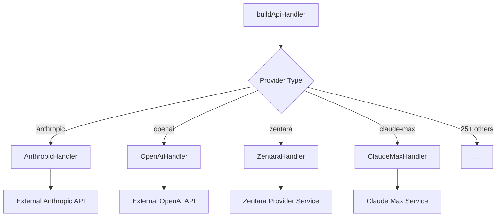
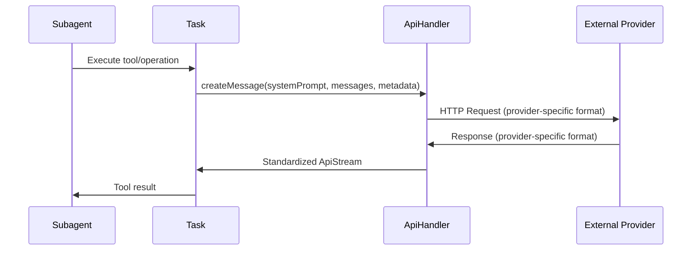

# API Integration Layer Analysis: Subagent Interaction with External Providers

## Executive Summary

The Zentara Code extension implements a sophisticated API integration layer that enables subagents to interact with 25+ external AI providers through a unified interface. This analysis examines the architecture, patterns, and mechanisms that facilitate these interactions.

## Core Architecture

### 1. Central API Handler Factory

The system uses a factory pattern centered around [`buildApiHandler()`](src/api/index.ts:80) which serves as the single entry point for creating provider-specific handlers:



**Key Findings:**
- **25+ Provider Support**: The factory supports anthropic, openai, claude-code, claude-max, glama, openrouter, bedrock, vertex, ollama, lmstudio, gemini, g-cli, deepseek, doubao, moonshot, vscode-lm, mistral, unbound, requesty, human-relay, fake-ai, xai, groq, huggingface, chutes, litellm, cerebras, sambanova, zai, fireworks, io-intelligence, zentara, and featherless
- **Unified Interface**: All providers implement the same [`ApiHandler`](src/api/index.ts:60) interface
- **Default Fallback**: Defaults to AnthropicHandler for undefined providers

### 2. Provider Implementation Patterns

#### Base Provider Architecture

The system uses two main architectural patterns:

1. **Direct Implementation**: Providers like [`AnthropicHandler`](src/api/providers/anthropic.ts:21) implement the interface directly
2. **Base Class Extension**: Many providers extend [`BaseOpenAiCompatibleProvider`](src/api/providers/base-openai-compatible-provider.ts:21) for OpenAI-compatible APIs

**AnthropicHandler Structure:**
- `client`: Anthropic SDK instance
- `createMessage()`: Main message creation method
- `completePrompt()`: Simple completion interface
- `countTokens()`: Token counting capability
- `getModel()`: Model configuration and capabilities

**BaseOpenAiCompatibleProvider Structure:**
- `client`: OpenAI SDK instance
- `createStream()`: Streaming message creation
- `createMessage()`: Non-streaming message creation
- `completePrompt()`: Simple completion interface
- `getModel()`: Model configuration

### 3. Subagent Integration Points

#### Task-Level Integration

Subagents interact with APIs through the [`Task`](src/core/task/Task.ts:346) class, which:

1. **Initializes API Handler**: `this.api = buildApiHandler(apiConfiguration)` during construction
2. **Provides Unified Interface**: Subagents use the same API interface regardless of provider
3. **Handles Configuration**: API configuration is passed from parent to subagent tasks

#### Key Integration Patterns:

```typescript
// Task constructor - API handler initialization
this.apiConfiguration = apiConfiguration
this.api = buildApiHandler(apiConfiguration)

// Usage in subagent tasks
const response = await this.api.createMessage(systemPrompt, messages, metadata)
```

## Provider-Specific Features

### 1. Reasoning Capabilities

The [`reasoning.ts`](src/api/transform/reasoning.ts) module provides provider-specific reasoning parameter transformation:

- **OpenRouter**: `effort` levels (low, medium, high, minimal)
- **Anthropic**: Beta thinking configuration
- **OpenAI**: `reasoning_effort` parameter
- **Gemini**: `ThinkingConfig` support

### 2. External API Fetchers

The [`fetchers/`](src/api/providers/fetchers/) directory contains utilities for dynamic model discovery:

- **OpenRouter**: [`getOpenRouterModels()`](src/api/providers/fetchers/openrouter.ts:96) - Fetches available models dynamically
- **LM Studio**: [`lmstudio.ts`](src/api/providers/fetchers/lmstudio.ts) - Local model discovery
- **Model Caching**: [`modelCache.ts`](src/api/providers/fetchers/modelCache.ts) - Caches model information

### 3. Timeout and Configuration Management

- **Timeout Configuration**: [`getApiRequestTimeout()`](src/api/providers/utils/timeout-config.ts:7) provides VSCode-configurable timeouts
- **Provider Options**: Each provider accepts [`ApiHandlerOptions`](src/api/index.ts) for authentication and configuration

## Subagent Interaction Patterns

### 1. Message Creation Flow



### 2. Provider Abstraction Benefits

**For Subagents:**
- **Consistent Interface**: Same API regardless of underlying provider
- **Automatic Formatting**: Provider-specific request/response formatting handled transparently
- **Error Handling**: Standardized error responses across providers
- **Streaming Support**: Unified streaming interface for real-time responses

### 3. Configuration Inheritance

Subagents inherit API configuration from their parent tasks:
- **Authentication**: API keys and credentials
- **Model Selection**: Specific model IDs and parameters
- **Timeout Settings**: Request timeout configurations
- **Provider Settings**: Provider-specific options

## Key Architectural Strengths

### 1. Extensibility
- **Easy Provider Addition**: New providers can be added by implementing the `ApiHandler` interface
- **Base Class Reuse**: OpenAI-compatible providers can extend `BaseOpenAiCompatibleProvider`
- **Modular Design**: Each provider is self-contained

### 2. Reliability
- **Timeout Management**: Configurable timeouts prevent hanging requests
- **Error Standardization**: Consistent error handling across providers
- **Fallback Mechanisms**: Default provider fallback for undefined configurations

### 3. Performance
- **Model Caching**: Dynamic model information is cached
- **Streaming Support**: Real-time response streaming for better UX
- **Efficient Fetching**: Optimized external API calls with proper HTTP handling

## Provider Ecosystem

### Major Categories:

1. **Commercial Cloud Providers**: Anthropic, OpenAI, Google (Gemini), Mistral
2. **API Aggregators**: OpenRouter, Hugging Face, LiteLLM
3. **Local/Self-Hosted**: Ollama, LM Studio, VSCode LM
4. **Specialized Services**: Zentara (internal), Groq, Cerebras, Fireworks
5. **Development/Testing**: Fake AI, Human Relay

### Provider Capabilities Matrix:

| Provider | Streaming | Reasoning | Computer Use | Token Counting |
|----------|-----------|-----------|--------------|----------------|
| Anthropic | ✅ | ✅ | ✅ | ✅ |
| OpenAI | ✅ | ✅ | ❌ | ❌ |
| Zentara | ✅ | ❌ | ❌ | ❌ |
| OpenRouter | ✅ | ✅ | ❌ | ❌ |
| Gemini | ✅ | ✅ | ❌ | ❌ |

## Recommendations

### 1. For Subagent Development
- **Use Standard Interface**: Always interact through the `ApiHandler` interface
- **Handle Streaming**: Design subagents to work with both streaming and non-streaming responses
- **Error Resilience**: Implement proper error handling for API failures

### 2. For Provider Integration
- **Follow Patterns**: Use existing patterns (direct implementation or base class extension)
- **Implement Core Methods**: Ensure `createMessage()`, `getModel()`, and error handling are properly implemented
- **Add Tests**: Include comprehensive test coverage for new providers

### 3. For Architecture Evolution
- **Monitor Usage**: Track which providers are most used by subagents
- **Optimize Performance**: Consider connection pooling and request batching for high-volume providers
- **Enhance Caching**: Expand model caching to include provider capabilities and pricing

## Conclusion

The API integration layer successfully abstracts the complexity of multiple AI providers behind a unified interface, enabling subagents to work seamlessly across different backends. The architecture is well-designed for extensibility, reliability, and performance, with clear patterns for adding new providers and capabilities.

The system's strength lies in its provider abstraction, which allows subagents to focus on their core functionality rather than provider-specific integration details. This design enables the Zentara Code extension to support a diverse ecosystem of AI providers while maintaining a consistent developer experience.