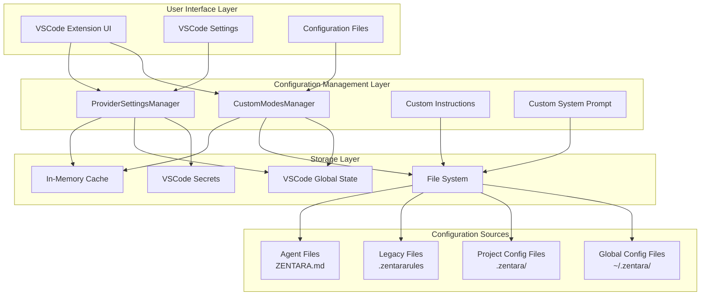
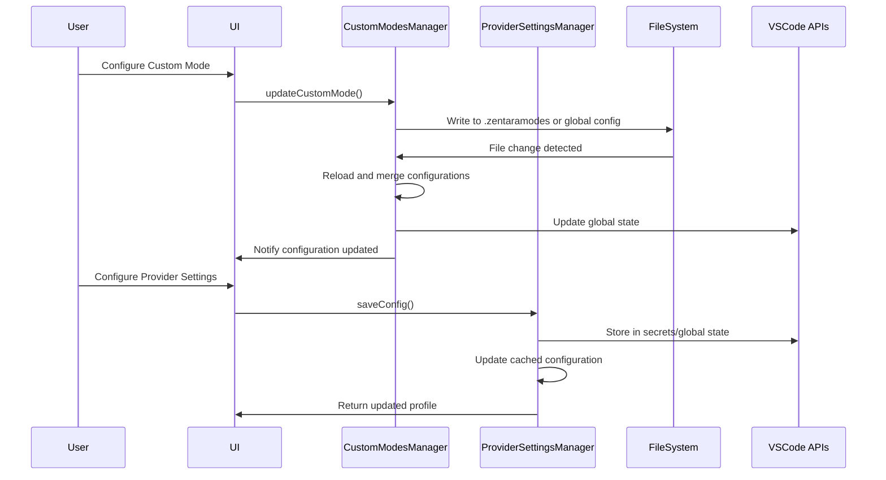
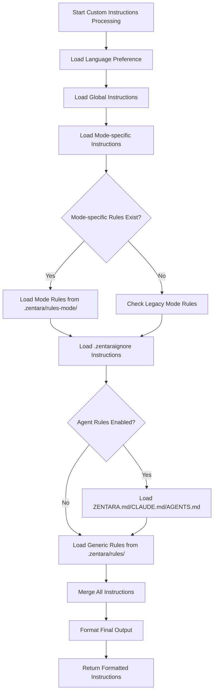
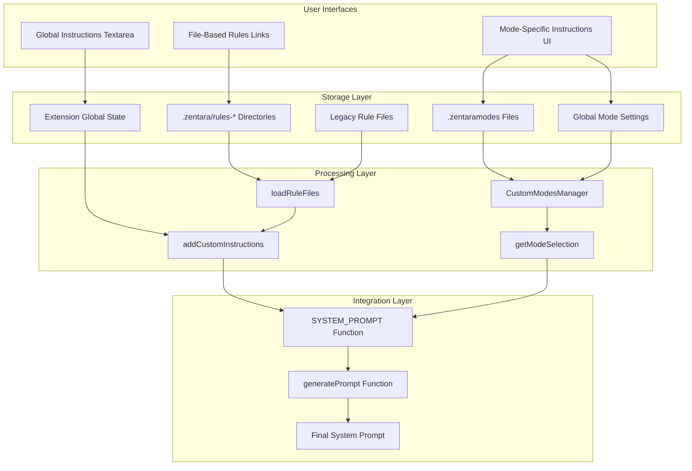
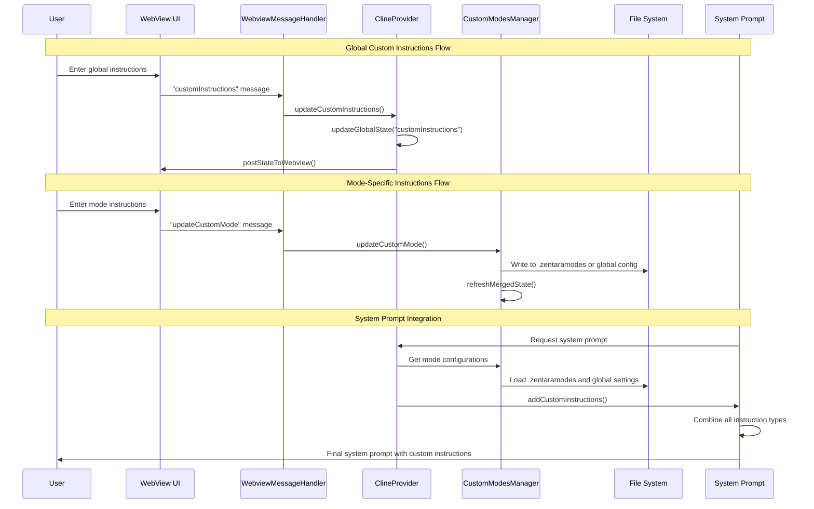
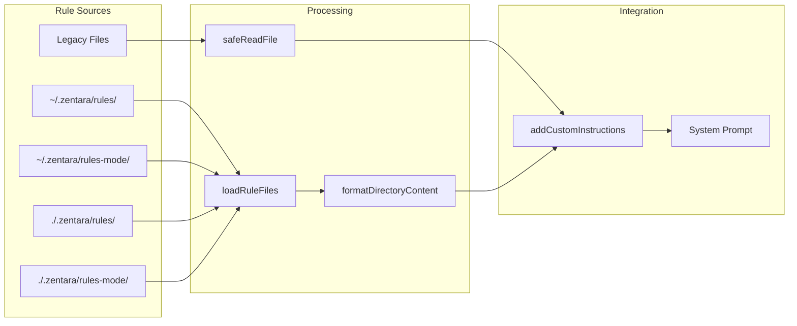
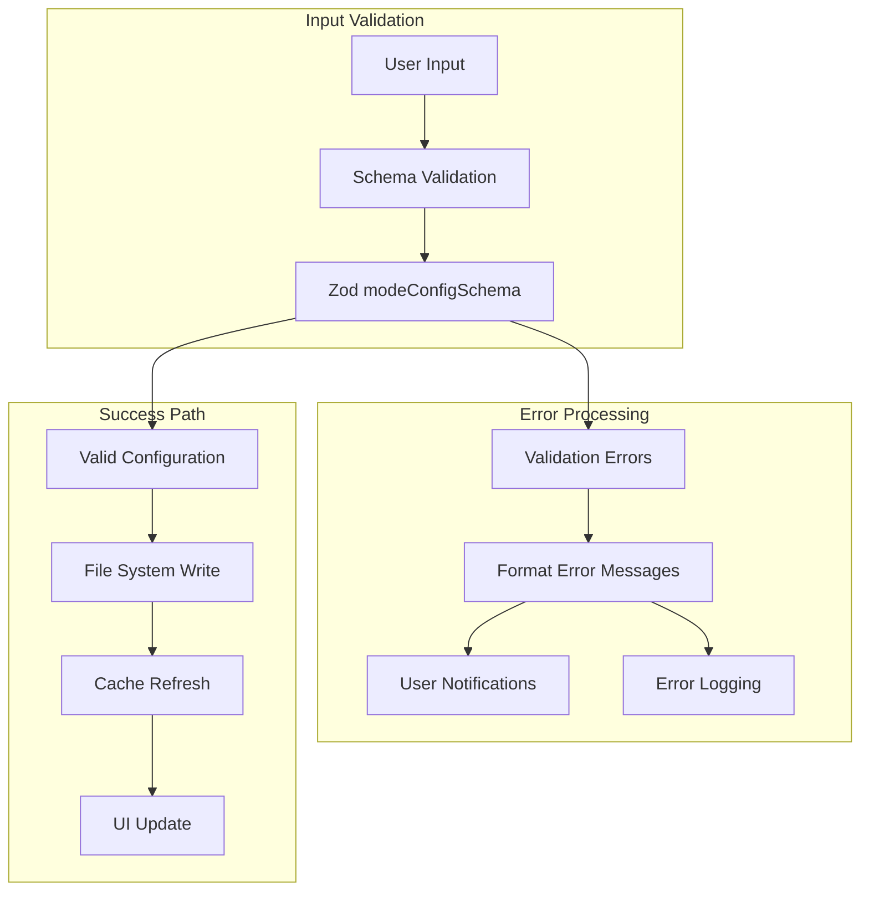

# Custom Prompt Configuration Architecture Analysis

## Executive Summary

The Zentara Code extension implements a sophisticated multi-layered custom prompt configuration system that supports global, project-local, and mode-specific customizations. The architecture provides flexible user preference management through VSCode's extension context, file-based configurations, and hierarchical rule systems.

## Configuration File Locations and Hierarchy

### Global Configuration Files
- **Location**: `~/.zentara/` (Global Zentara directory)
- **Custom Modes**: `~/.zentara/custom-modes.yaml`
- **Rules**: `~/.zentara/rules/` (directory containing multiple rule files)
- **Provider Settings**: Stored in VSCode secrets via `ProviderSettingsManager`

### Project-Local Configuration Files
- **Location**: `{workspace}/.zentara/`
- **Custom Modes**: `{workspace}/.zentaramodes` (YAML format)
- **Rules**: `{workspace}/.zentara/rules/` (directory)
- **Mode-specific Rules**: `{workspace}/.zentara/rules-{mode}/` (e.g., `rules-architect/`)
- **System Prompts**: `{workspace}/.zentara/system-prompt-{mode}` (e.g., `system-prompt-code`)
- **Legacy Rules**: `{workspace}/.zentararules`, `{workspace}/.clinerules`
- **Agent Rules**: `{workspace}/ZENTARA.md`, `{workspace}/CLAUDE.md`, `{workspace}/AGENTS.md`, `{workspace}/AGENT.md`

### Configuration Priority (Highest to Lowest)
1. Project-local `.zentaramodes` file
2. Global `~/.zentara/custom-modes.yaml`
3. Mode-specific rules in `.zentara/rules-{mode}/`
4. Generic rules in `.zentara/rules/`
5. Legacy rule files (`.zentararules`, `.clinerules`)

## VSCode Settings Integration Patterns

### Extension Context Storage
```typescript
// Global State (non-sensitive data)
context.globalState.update(key, value)
context.globalState.get(key)

// Secret State (API keys, sensitive data)
context.secrets.store(key, value)
context.secrets.get(key)
```

### Settings Schema Integration
- **Global Settings**: Defined in `packages/types/src/global-settings.ts`
- **Provider Settings**: Defined in `packages/types/src/provider-settings.ts`
- **Custom Mode Settings**: Integrated via `customModesSettingsSchema`

### File System Watchers
- Automatic detection of configuration file changes
- Real-time updates without extension restart
- Handles both creation and deletion of config files

## User Preference Storage Mechanisms

### 1. Provider Settings Manager
**File**: `src/core/config/ProviderSettingsManager.ts`

**Storage Strategy**:
- Uses VSCode secrets for sensitive data (API keys)
- Uses global state for non-sensitive configuration
- Implements profile-based configuration with per-mode API configs

**Key Features**:
- Profile import/export functionality
- Migration system for backward compatibility
- Concurrent access protection via locking mechanism

### 2. Custom Modes Manager
**File**: `src/core/config/CustomModesManager.ts`

**Storage Strategy**:
- YAML-based configuration files
- Hierarchical merging (project overrides global)
- File system watching for real-time updates

**Key Features**:
- Mode export/import with rules files
- Automatic cache invalidation
- YAML parsing with error recovery

### 3. Global Settings Schema
**File**: `packages/types/src/global-settings.ts`

**Supported Settings**:
- Custom instructions (`customInstructions`)
- Language preferences (`language`)
- Mode configurations (`customModes`, `modeApiConfigs`)
- Custom prompts (`customModePrompts`, `customSupportPrompts`)
- Behavioral settings (auto-approval, timeouts, etc.)

## Custom Instructions System

### Architecture
**File**: `src/core/prompts/sections/custom-instructions.ts`

### Instruction Types and Priority
1. **Language Preference**: User's preferred language for communication
2. **Global Instructions**: Apply to all modes and sessions
3. **Mode-specific Instructions**: Override global for specific modes
4. **Rules**: File-based rules with hierarchical loading

### Rule File Processing
```typescript
// Rule loading hierarchy
const zentaraDirectories = getZentaraDirectoriesForCwd(cwd)
for (const zentaraDir of zentaraDirectories) {
    const rulesDir = path.join(zentaraDir, "rules")
    // Process rules in alphabetical order
}
```

### Features
- **Symlink Support**: Resolves symbolic links recursively
- **File Filtering**: Excludes cache and system files
- **Content Interpolation**: Supports variable substitution
- **Agent Rules Integration**: Supports ZENTARA.md, CLAUDE.md, AGENTS.md, AGENT.md

## Custom System Prompt Functionality

### Architecture
**File**: `src/core/prompts/sections/custom-system-prompt.ts`

### System Prompt Files
- **Location**: `.zentara/system-prompt-{mode}`
- **Format**: Plain text with variable interpolation
- **Variables**: `{{workspace}}`, `{{mode}}`, `{{language}}`, `{{shell}}`, `{{operatingSystem}}`

### Variable Interpolation
```typescript
function interpolatePromptContent(content: string, variables: PromptVariables): string {
    let interpolatedContent = content
    for (const key in variables) {
        const placeholder = new RegExp(`\\{\\{${key}\\}\\}`, "g")
        interpolatedContent = interpolatedContent.replace(placeholder, variables[key])
    }
    return interpolatedContent
}
```

## Mode-Specific Configuration

### Custom Modes Architecture
- **Schema**: Defined in `@zentara-code/types` package
- **Storage**: YAML files with validation
- **Features**: Name, slug, description, system prompt, file restrictions

### Mode Configuration Structure
```yaml
customModes:
  - name: "Custom Architect"
    slug: "custom-architect"
    description: "Enhanced architect mode"
    systemPrompt: "You are a specialized architect..."
    fileRestrictions: ["*.md", "*.txt"]
    source: "project" # or "global"
```

### Mode-Specific Rules
- **Location**: `.zentara/rules-{mode}/`
- **Fallback**: `.zentararules-{mode}`, `.clinerules-{mode}`
- **Processing**: Loaded before generic rules

## Provider Settings Management

### Multi-Profile System
- **Default Profile**: Always exists with generated ID
- **Named Profiles**: User-created configurations
- **Per-Mode Configs**: Different providers per mode

### Settings Structure
```typescript
interface ProviderProfiles {
    currentApiConfigName: string
    apiConfigs: Record<string, ProviderSettingsWithId>
    modeApiConfigs?: Record<string, string>
    cloudProfileIds?: string[]
    migrations?: MigrationFlags
}
```

### Migration System
- **Rate Limit Migration**: Migrates global rate limits to per-profile
- **Diff Settings Migration**: Migrates diff-related settings
- **OpenAI Headers Migration**: Converts legacy header format
- **Consecutive Mistake Limit**: Adds mistake tracking
- **Todo List Enabled**: Enables todo list functionality

## Architectural Overview



## Configuration Flow Diagram



## Custom Instructions Processing Flow



## Recommendations for Custom Prompt Enhancements

### 1. Configuration Management Improvements

#### A. Centralized Configuration API
```typescript
interface ConfigurationAPI {
    // Unified access to all configuration types
    getGlobalConfig<T>(key: string): Promise<T>
    setGlobalConfig<T>(key: string, value: T): Promise<void>
    getModeConfig<T>(mode: string, key: string): Promise<T>
    setModeConfig<T>(mode: string, key: string, value: T): Promise<void>
    
    // Configuration validation
    validateConfig(config: any, schema: ZodSchema): ValidationResult
    
    // Configuration templates
    getConfigTemplate(type: ConfigType): ConfigTemplate
    applyConfigTemplate(template: ConfigTemplate): Promise<void>
}
```

#### B. Enhanced Configuration UI
- **Visual Configuration Editor**: GUI for complex configurations
- **Configuration Validation**: Real-time validation with helpful error messages
- **Configuration Templates**: Pre-built templates for common use cases
- **Import/Export Wizard**: Simplified sharing of configurations

### 2. Custom Prompt System Enhancements

#### A. Advanced Prompt Templating
```typescript
interface PromptTemplate {
    id: string
    name: string
    description: string
    variables: PromptVariable[]
    template: string
    conditions?: PromptCondition[]
}

interface PromptVariable {
    name: string
    type: 'string' | 'number' | 'boolean' | 'select'
    required: boolean
    default?: any
    options?: string[] // for select type
    validation?: RegExp
}
```

#### B. Dynamic Prompt Composition
- **Conditional Sections**: Include/exclude prompt sections based on context
- **Variable Scoping**: Support for nested variable contexts
- **Prompt Inheritance**: Allow prompts to extend base templates
- **Real-time Preview**: Show how prompts will look with current variables

### 3. Rule System Improvements

#### A. Rule Engine Enhancement
```typescript
interface RuleEngine {
    // Rule evaluation
    evaluateRules(context: RuleContext): Promise<RuleResult[]>
    
    // Rule composition
    composeRules(rules: Rule[]): ComposedRule
    
    // Rule validation
    validateRule(rule: Rule): ValidationResult
    
    // Rule debugging
    debugRule(rule: Rule, context: RuleContext): DebugResult
}

interface Rule {
    id: string
    name: string
    description: string
    conditions: RuleCondition[]
    actions: RuleAction[]
    priority: number
    enabled: boolean
}
```

#### B. Advanced Rule Features
- **Rule Dependencies**: Define rule execution order
- **Rule Debugging**: Visual debugging of rule evaluation
- **Rule Testing**: Unit testing framework for rules
- **Rule Performance Monitoring**: Track rule execution performance

### 4. Integration Enhancements

#### A. External Configuration Sources
```typescript
interface ConfigurationSource {
    type: 'file' | 'url' | 'git' | 'database'
    location: string
    authentication?: AuthConfig
    syncInterval?: number
    
    load(): Promise<Configuration>
    watch(callback: (config: Configuration) => void): void
}
```

#### B. Configuration Synchronization
- **Cloud Sync**: Synchronize configurations across devices
- **Team Sharing**: Share configurations within teams
- **Version Control**: Track configuration changes over time
- **Conflict Resolution**: Handle configuration conflicts gracefully

### 5. Performance Optimizations

#### A. Caching Strategy
```typescript
interface ConfigurationCache {
    // Multi-level caching
    get<T>(key: string, level: CacheLevel): Promise<T | null>
    set<T>(key: string, value: T, level: CacheLevel, ttl?: number): Promise<void>
    
    // Cache invalidation
    invalidate(pattern: string): Promise<void>
    invalidateAll(): Promise<void>
    
    // Cache statistics
    getStats(): CacheStats
}

enum CacheLevel {
    Memory = 'memory',
    Disk = 'disk',
    Network = 'network'
}
```

#### B. Lazy Loading
- **On-demand Configuration Loading**: Load configurations only when needed
- **Progressive Enhancement**: Start with basic config, enhance as needed
- **Background Preloading**: Preload likely-needed configurations

### 6. Developer Experience Improvements

#### A. Configuration Schema Documentation
- **Auto-generated Documentation**: Generate docs from TypeScript schemas
- **Interactive Examples**: Provide working examples for each configuration option
- **Migration Guides**: Step-by-step guides for configuration updates

#### B. Development Tools
```typescript
interface ConfigurationDevTools {
    // Configuration validation
    validateConfiguration(config: any): ValidationReport
    
    // Configuration diffing
    diffConfigurations(config1: any, config2: any): ConfigurationDiff
    
    // Configuration migration
    migrateConfiguration(config: any, fromVersion: string, toVersion: string): any
    
    // Configuration testing
    testConfiguration(config: any, testCases: TestCase[]): TestResult[]
}
```

### 7. Security Enhancements

#### A. Secure Configuration Storage
- **Encryption at Rest**: Encrypt sensitive configuration data
- **Access Control**: Role-based access to configuration sections
- **Audit Logging**: Track all configuration changes
- **Secure Defaults**: Ensure secure default configurations

#### B. Configuration Validation
- **Input Sanitization**: Sanitize all configuration inputs
- **Schema Validation**: Strict schema validation for all configurations
- **Security Scanning**: Scan configurations for security issues

## Implementation Priority

### Phase 1: Foundation (High Priority)
1. Centralized Configuration API
2. Enhanced validation and error handling
3. Performance optimizations (caching)
4. Configuration UI improvements

### Phase 2: Advanced Features (Medium Priority)
1. Advanced prompt templating
2. Rule engine enhancements
3. External configuration sources
4. Development tools

### Phase 3: Enterprise Features (Lower Priority)
1. Cloud synchronization
2. Team collaboration features
3. Advanced security features
4. Enterprise management tools

## Conclusion

The current custom prompt configuration system in Zentara Code is well-architected with a solid foundation for extensibility. The multi-layered approach provides flexibility while maintaining simplicity for basic use cases. The recommended enhancements would significantly improve the developer experience, performance, and enterprise readiness of the configuration system.

The hierarchical configuration system, combined with the robust file watching and caching mechanisms, provides a strong foundation for building more advanced features. The separation of concerns between different configuration types (modes, providers, instructions, system prompts) allows for targeted improvements without affecting the entire system.
## 7. Storage and Persistence Mechanisms

### Global Custom Instructions Storage
- **Storage Method**: VSCode Extension Global State via `context.globalState.update()`
- **Key**: `"customInstructions"`
- **Data Type**: `string | undefined`
- **Persistence**: Survives VSCode restarts and workspace changes
- **Access Method**: `updateGlobalState("customInstructions", value)` in ClineProvider.ts (line 2268)

### Mode-Specific Custom Instructions Storage
Mode-specific instructions are stored in two different locations depending on scope:

#### Project-Level Storage
- **File**: `.zentaramodes` (YAML format)
- **Location**: Workspace root directory
- **Constant**: `ROOMODES_FILENAME = ".zentaramodes"`
- **Schema Field**: `customInstructions: z.string().optional()`
- **Precedence**: Takes priority over global modes with same slug

#### Global-Level Storage
- **Storage Method**: VSCode Extension Global Settings
- **Path**: Determined by `getCustomModesFilePath()` method
- **Format**: YAML with mode configurations
- **Schema**: Validated against `modeConfigSchema`

### File-Based Rules Storage
Rules are stored in a hierarchical directory structure:

#### Directory Structure
```
Global Rules:
~/.zentara/rules/                    # Generic global rules
~/.zentara/rules-${mode}/           # Mode-specific global rules

Project Rules:
{workspace}/.zentara/rules/         # Generic project rules  
{workspace}/.zentara/rules-${mode}/ # Mode-specific project rules
```

#### Legacy File Support
- `.zentararules-${mode}` files (project root)
- `.clinerules-${mode}` files (project root)

#### File Processing
- **File Types**: All text files in rules directories
- **Processing Order**: Global directories first, then project-local directories
- **Content Formatting**: Files are combined with directory path headers

### Storage Validation and Error Handling
All storage operations include comprehensive validation:

#### Mode Configuration Validation
- **Schema**: `modeConfigSchema` using Zod validation
- **Required Fields**: `slug`, `name`, `roleDefinition`
- **Slug Format**: Must match `/^[a-zA-Z0-9-]+$/`
- **Error Handling**: User-friendly error messages via `vscode.window.showErrorMessage()`

#### File System Error Handling
- **Write Queue**: `queueWrite()` method prevents concurrent file modifications
- **Atomic Operations**: File updates use temporary files and atomic moves
- **Error Recovery**: Failed operations show user notifications and log detailed errors
- **File Watching**: Automatic refresh when configuration files change

#### Validation Error Messages
```typescript
// Example validation error processing (lines 408-414)
const errorMessages = validationResult.error.errors
    .map((err) => `${err.path.join(".")}: ${err.message}`)
    .join(", ")
const errorMessage = `Invalid mode configuration: ${errorMessages}`
```

### File System Watchers
The system includes comprehensive file watching for automatic updates:

- **Global Settings**: VSCode settings change events
- **Project Files**: `.zentaramodes` file watcher with create/change/delete events
- **Rules Directories**: Automatic detection of new rule files
- **Cache Management**: Automatic cache clearing on file changes

## 8. Validation and Error Handling

### Schema Validation
The system uses Zod schemas for comprehensive validation:

#### Mode Configuration Schema
```typescript
// From packages/types/src/mode.ts (lines 63-72)
export const modeConfigSchema = z.object({
    slug: z.string().regex(/^[a-zA-Z0-9-]+$/, "Slug must contain only letters numbers and dashes"),
    name: z.string().min(1, "Name is required"),
    roleDefinition: z.string().min(1, "Role definition is required"),
    whenToUse: z.string().optional(),
    description: z.string().optional(),
    customInstructions: z.string().optional(),  // Custom instructions field
    groups: groupEntryArraySchema,
    source: z.enum(["global", "project"]).optional(),
})
```

#### Validation Process
1. **Pre-Save Validation**: All mode configurations validated before storage
2. **Error Collection**: Multiple validation errors collected and formatted
3. **User Feedback**: Detailed error messages shown via VSCode notifications
4. **Logging**: Comprehensive error logging for debugging

### Error Handling Patterns

#### File System Operations
- **Try-Catch Blocks**: All file operations wrapped in error handling
- **User Notifications**: `vscode.window.showErrorMessage()` for user-facing errors
- **Detailed Logging**: `logger.error()` with context for debugging
- **Graceful Degradation**: System continues functioning with partial failures

#### YAML Parsing Errors
- **Primary Parser**: YAML parsing with fallback to JSON for `.zentaramodes` files
- **Error Recovery**: Detailed parse error messages for user correction
- **File Format Detection**: Automatic detection of YAML vs JSON format

#### Validation Error Examples
```typescript
// Mode validation failure (lines 407-415)
if (!validationResult.success) {
    const errorMessages = validationResult.error.errors
        .map((err) => `${err.path.join(".")}: ${err.message}`)
        .join(", ")
    const errorMessage = `Invalid mode configuration: ${errorMessages}`
    logger.error("Mode validation failed", { slug, errors: validationResult.error.errors })
    vscode.window.showErrorMessage(t("common:customModes.errors.updateFailed", { error: errorMessage }))
    return
}
```

### Error Recovery Mechanisms
- **Cache Clearing**: Automatic cache invalidation on errors
- **State Refresh**: Automatic state refresh after error recovery
- **Partial Success**: System handles partial configuration loading
- **User Guidance**: Clear error messages guide users to fix configuration issues

### Internationalization Support
Error messages support multiple languages through the i18n system:
- **Translation Keys**: `t("common:customModes.errors.updateFailed", { error })`
- **Localized Messages**: Error messages available in multiple languages
- **Context Preservation**: Error context maintained across translations

## 9. Architectural Data Flow Diagrams

### Overall System Architecture



### Custom Instructions Processing Flow



### File-Based Rules Processing



### Validation and Error Handling Flow



## 10. User Entry Points for Custom Instructions

### Primary User Interfaces

#### 1. Global Custom Instructions
- **Location**: Modes tab in webview UI
- **Component**: `ModesView.tsx` lines 1333-1349
- **UI Element**: `VSCodeTextArea` with placeholder "Enter global custom instructions..."
- **Storage**: Extension global state
- **Persistence**: Survives workspace changes and VSCode restarts

#### 2. Mode-Specific Custom Instructions
- **Location**: Individual mode configuration in Modes tab
- **Component**: `ModesView.tsx` lines 1108-1143
- **UI Elements**: 
  - Custom mode creation dialog (lines 1545-1561)
  - Mode editing interface with custom instructions textarea
- **Storage**: `.zentaramodes` files (project) or global settings
- **Validation**: Real-time validation with error feedback

#### 3. File-Based Rules System
Multiple file-based entry points for advanced users:

##### Generic Rules
- **Global**: `~/.zentara/rules/` directory
- **Project**: `{workspace}/.zentara/rules/` directory
- **UI Access**: Clickable links in ModesView to create rule files
- **File Types**: Any text files (`.md`, `.txt`, etc.)

##### Mode-Specific Rules
- **Global**: `~/.zentara/rules-{mode}/` directories
- **Project**: `{workspace}/.zentara/rules-{mode}/` directories
- **Auto-Creation**: UI provides links to create mode-specific rule directories

##### Legacy Files (Backward Compatibility)
- `.zentararules-{mode}` files in project root
- `.clinerules-{mode}` files in project root

### Configuration File Entry Points

#### 1. Project-Level Mode Configuration
- **File**: `.zentaramodes` (YAML format)
- **Location**: Workspace root directory
- **Schema**: Includes `customInstructions` field
- **Example**:
```yaml
- slug: "my-custom-mode"
  name: "My Custom Mode"
  roleDefinition: "You are a specialized assistant..."
  customInstructions: "Always follow these specific guidelines..."
  groups: ["core"]
```

#### 2. Global Mode Configuration
- **Storage**: VSCode global settings
- **Access**: Through CustomModesManager
- **Format**: YAML configuration with validation
- **Scope**: Available across all workspaces

### Advanced Entry Points

#### 1. File-Based System Prompt Override
- **Purpose**: Complete system prompt replacement
- **Implementation**: `loadSystemPromptFile()` function
- **Custom Instructions**: Still processed and appended
- **Use Case**: Advanced users requiring full prompt control

#### 2. AGENTS.md Integration
- **File**: `AGENTS.md` in workspace root
- **Processing**: Automatic inclusion in rules section
- **Control**: Can be disabled via `useAgentRules: false` setting
- **Purpose**: Agent-specific instructions and configurations

#### 3. ZentaraIgnore Instructions
- **Source**: `.zentaraignore` file processing
- **Integration**: Automatic inclusion in custom instructions
- **Purpose**: File exclusion rules and instructions

### Developer Entry Points

#### 1. Extension API
- **Method**: `updateCustomInstructions(instructions?: string)`
- **Location**: ClineProvider.ts line 2266
- **Usage**: Programmatic updates to global custom instructions

#### 2. WebView Message API
- **Message Types**:
  - `"customInstructions"`: Update global instructions
  - `"updateCustomMode"`: Update mode-specific instructions
- **Handler**: `webviewMessageHandler.ts`

#### 3. CustomModesManager API
- **Methods**:
  - `updateCustomMode(slug, config)`: Update mode configuration
  - `deleteCustomMode(slug)`: Remove custom mode
  - `exportCustomModes()`: Export mode configurations
  - `importCustomModes()`: Import mode configurations

### User Workflow Patterns

#### 1. Quick Global Instructions
1. Open Modes tab in webview
2. Scroll to "Global Custom Instructions" section
3. Enter instructions in textarea
4. Instructions automatically saved and applied

#### 2. Mode-Specific Customization
1. Navigate to specific mode in Modes tab
2. Click "Edit" or create new custom mode
3. Fill in custom instructions field
4. Save configuration (validates against schema)

#### 3. File-Based Advanced Configuration
1. Click "Create rules file" links in UI
2. Edit created files with custom rules
3. Files automatically watched and reloaded
4. Rules processed in hierarchical order

#### 4. Project-Specific Setup
1. Create `.zentaramodes` file in project root
2. Define project-specific modes with custom instructions
3. Create `.zentara/rules-{mode}/` directories for detailed rules
4. Instructions automatically loaded for project context

### Integration Points Summary

The custom instruction system provides multiple entry points catering to different user expertise levels:

- **Beginners**: Simple textarea interfaces in the UI
- **Intermediate**: Mode-specific configurations and file creation links
- **Advanced**: Direct file editing and directory-based rule systems
- **Developers**: Programmatic APIs and message-based updates

All entry points converge through the `addCustomInstructions()` function, ensuring consistent processing and integration with the main system prompt.
