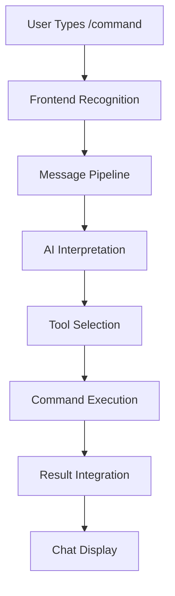

# Zentara Code Slash Commands: Comprehensive Documentation

## Table of Contents
1. [Overview](#overview)
2. [Architecture](#architecture)
3. [How Slash Commands Work](#how-slash-commands-work)
4. [Creating Custom Commands](#creating-custom-commands)
5. [Built-in Commands](#built-in-commands)
6. [Configuration System](#configuration-system)
7. [Advanced Features](#advanced-features)
8. [Technical Implementation](#technical-implementation)
9. [Troubleshooting](#troubleshooting)
10. [Best Practices](#best-practices)

## Overview

Zentara Code features a sophisticated slash command system that allows users to create and execute custom commands within the chat interface. Unlike traditional command systems, Zentara uses an AI-driven architecture where slash commands are processed as natural language input and interpreted by the AI model.

### Key Features
- **Custom Commands**: Create project-specific and global commands
- **AI-Driven Execution**: Commands are interpreted by AI and executed using appropriate tools
- **Hierarchical Configuration**: Project commands override global commands
- **Rich Metadata**: Support for descriptions, argument hints, and custom metadata
- **Autocomplete**: Intelligent command suggestions with fuzzy matching
- **Internationalization**: Full i18n support across 12+ languages

## Architecture

### System Overview



### Core Components

1. **Frontend Layer** (`webview-ui/`)
   - Command recognition and autocomplete
   - UI components for command interaction
   - Real-time validation and suggestions

2. **Backend Processing** (`src/`)
   - Command loading and validation
   - Mention parsing and processing
   - AI-driven command interpretation

3. **Configuration System** (`.zentara/`)
   - Hierarchical command storage
   - YAML frontmatter parsing
   - Priority-based command resolution

## How Slash Commands Work

### Command Detection
Commands are detected using the regex pattern:
```regex
/(?:^|\s)\/([a-zA-Z0-9_\.-]+)(?=\s|$)/g
```

Valid command formats:
- `/command-name`
- `/my_command`
- `/command.name`
- `/command123`

### Processing Flow

1. **User Input**: User types `/command` in chat
2. **Frontend Recognition**: ChatTextArea detects slash command pattern
3. **Autocomplete**: System shows available commands with descriptions
4. **Selection**: User selects or completes command
5. **Backend Processing**: Command is processed through mention parsing system
6. **AI Interpretation**: AI model receives command content and selects appropriate tools
7. **Execution**: Selected tools execute the command logic
8. **Result Integration**: Results are integrated back into chat interface

### Command Priority System

Commands are loaded with the following priority (highest to lowest):

1. **Project Commands** (`.zentara/commands/` in project root)
2. **Global Commands** (`~/.zentara/commands/` in user home)
3. **Built-in Commands** (hardcoded system commands)

Higher priority commands completely override lower priority commands with the same name.

## Creating Custom Commands

### Basic Command Structure

Create a `.md` file in `.zentara/commands/` directory:

```markdown
# My Custom Command

This is a simple command that does something useful.

1. First step
2. Second step
3. Final step
```

### Advanced Command with Metadata

Use YAML frontmatter for rich metadata:

```markdown
---
description: "Deploy application to specified environment"
argument-hint: staging | production | development
author: DevOps Team
version: 1.0
tags: [deployment, automation]
---

# Deployment Command

Deploy the application to the specified environment.

## Prerequisites
- Ensure all tests pass
- Verify environment availability

## Steps
1. Check environment status
2. Build application
3. Deploy to target environment
4. Run post-deployment verification
5. Send notification to team
```

### Command File Naming

- File name becomes command name: `deploy.md` → `/deploy`
- Use hyphens for multi-word commands: `create-release.md` → `/create-release`
- Avoid spaces and special characters

### Supported Frontmatter Fields

| Field | Type | Description | Example |
|-------|------|-------------|---------|
| `description` | string | Brief command description | "Deploy to environment" |
| `argument-hint` | string | Usage hint for arguments | "staging \| production" |
| `author` | string | Command author | "DevOps Team" |
| `version` | string | Command version | "1.0.0" |
| `tags` | array | Command categories | ["deployment", "automation"] |

## Built-in Commands

### `/init` Command

The primary built-in command that analyzes codebases and creates documentation:

```markdown
/init
```

**Purpose**: 
- Analyzes project structure and dependencies
- Creates comprehensive AGENTS.md documentation
- Provides codebase overview and insights

**Features**:
- Multi-phase analysis workflow
- Intelligent file discovery
- Automated documentation generation
- Integration with project tools and frameworks

## Configuration System

### Directory Structure

```
.zentara/
├── commands/           # Custom slash commands
│   ├── deploy.md      # Example: /deploy command
│   ├── release.md     # Example: /release command
│   └── setup.md       # Example: /setup command
├── agents/            # Custom subagents
├── rules/             # Custom rules
└── zentaramotes.yml   # Main configuration
```

### Global vs Project Commands

**Global Commands** (`~/.zentara/commands/`):
- Available across all projects
- Good for general-purpose commands
- Lower priority than project commands

**Project Commands** (`.zentara/commands/`):
- Project-specific commands
- Highest priority
- Can override global and built-in commands

### Command Interface

Each command has the following structure:

```typescript
interface Command {
    name: string           // Command name (from filename)
    content: string        // Markdown content
    source: "global" | "project" | "built-in"
    filePath: string       // Absolute path to command file
    description?: string   // From YAML frontmatter
    argumentHint?: string  // From YAML frontmatter
}
```

## Advanced Features

### Command Validation and Caching

The system includes sophisticated validation:

1. **Existence Checking**: Commands are validated before processing
2. **Parallel Validation**: Multiple commands validated simultaneously
3. **Caching**: Valid commands cached for performance
4. **Error Handling**: Invalid commands silently ignored

### Autocomplete System

**Frontend Autocomplete** (`webview-ui/src/utils/context-mentions.ts`):
- Fuzzy matching using Fzf library
- Real-time command filtering
- Description and argument hint display
- Keyboard navigation support

**Trigger Conditions**:
- Text starts with `/`
- No spaces in current word
- Cursor at end of command

### Internationalization

Full i18n support with translations for:
- Command tooltips and descriptions
- UI elements and labels
- Error messages and hints

Supported languages: English, Chinese, Japanese, French, German, Spanish, Italian, Portuguese, Russian, Korean, Dutch, Polish, Turkish, Vietnamese, Hindi, Indonesian.

### Integration with Mention System

Commands integrate seamlessly with the mention parsing system:

1. **Command Detection**: Regex-based command recognition
2. **Content Injection**: Command content wrapped in XML tags
3. **Context Integration**: Commands processed alongside file mentions and other context

Example output format:
```xml
<command name="deploy">
Description: Deploy application to specified environment

Deploy the application to the specified environment.
...
</command>
```

## Technical Implementation

### Key Files and Components

**Backend Core**:
- `src/services/command/commands.ts` - Command loading and management
- `src/services/command/built-in-commands.ts` - Built-in command definitions
- `src/core/mentions/index.ts` - Mention parsing and processing
- `src/services/zentara-config/index.ts` - Configuration management

**Frontend UI**:
- `webview-ui/src/components/chat/ChatTextArea.tsx` - Command input handling
- `webview-ui/src/components/chat/SlashCommandsPopover.tsx` - Command selection UI
- `webview-ui/src/utils/context-mentions.ts` - Autocomplete logic

**Testing**:
- `src/__tests__/command-mentions.spec.ts` - Command mention parsing tests
- `src/__tests__/commands.spec.ts` - Command utility tests
- `webview-ui/src/__tests__/command-autocomplete.spec.ts` - Autocomplete tests

### Command Loading Algorithm

```typescript
// Simplified command loading logic
async function getCommand(cwd: string, name: string): Promise<Command | null> {
    // 1. Check project directory first (highest priority)
    const projectCommand = await tryLoadCommand(
        path.join(cwd, '.zentara', 'commands'), 
        name, 
        'project'
    );
    if (projectCommand) return projectCommand;
    
    // 2. Check global directory (medium priority)
    const globalCommand = await tryLoadCommand(
        path.join(os.homedir(), '.zentara', 'commands'), 
        name, 
        'global'
    );
    if (globalCommand) return globalCommand;
    
    // 3. Check built-in commands (lowest priority)
    const builtInCommand = BUILT_IN_COMMANDS[name];
    if (builtInCommand) return builtInCommand;
    
    return null;
}
```

### AI-Driven Execution Model

Unlike traditional command systems, Zentara uses an AI interpretation model:

1. **Natural Language Processing**: Commands processed as regular text
2. **Tool Selection**: AI selects appropriate tools from 80+ available tools
3. **Context Awareness**: AI considers full conversation context
4. **Flexible Execution**: Same command can execute differently based on context

### Available Tool Categories

The AI has access to 80+ tools across categories:
- **File Operations**: read_file, write_to_file, apply_diff, etc.
- **Terminal Commands**: execute_command with full shell access
- **LSP Operations**: 25+ language server protocol tools
- **Web Interaction**: browser_action for web automation
- **Debugging**: debug_launch, debug_set_breakpoint, etc.
- **Search Operations**: glob, search_files, lsp_search_symbols
- **Git Operations**: Git command integration
- **Project Management**: Task creation and management

## Troubleshooting

### Common Issues

**Command Not Found**:
- Verify file exists in `.zentara/commands/`
- Check file naming (no spaces, use hyphens)
- Ensure `.md` extension

**Command Not Executing**:
- Check YAML frontmatter syntax
- Verify command content is valid markdown
- Review AI interpretation in chat

**Autocomplete Not Working**:
- Ensure command starts with `/`
- Check for typos in command name
- Verify no spaces before command completion

**Priority Issues**:
- Project commands override global commands
- Check which directory contains the command
- Use unique names to avoid conflicts

### Debug Information

Enable debug logging to troubleshoot issues:
1. Check VSCode Developer Console
2. Review extension logs
3. Verify command file parsing

### Performance Considerations

- Commands are cached after first load
- Large command files may impact performance
- Consider breaking complex commands into smaller ones

## Best Practices

### Command Design

1. **Clear Naming**: Use descriptive, hyphenated names
2. **Comprehensive Descriptions**: Include helpful descriptions and argument hints
3. **Step-by-Step Instructions**: Break complex tasks into clear steps
4. **Error Handling**: Include error scenarios and recovery steps

### Content Organization

1. **Logical Structure**: Organize commands by functionality
2. **Consistent Format**: Use consistent markdown formatting
3. **Metadata Usage**: Leverage frontmatter for rich metadata
4. **Documentation**: Include usage examples and prerequisites

### Project Management

1. **Version Control**: Include `.zentara/commands/` in version control
2. **Team Sharing**: Share useful commands with team members
3. **Regular Review**: Periodically review and update commands
4. **Testing**: Test commands in different scenarios

### Security Considerations

1. **Sensitive Data**: Avoid hardcoding secrets or credentials
2. **Command Validation**: Be cautious with commands that modify system state
3. **Access Control**: Consider who has access to command directories
4. **Review Process**: Implement review process for shared commands

### Performance Optimization

1. **Command Size**: Keep commands focused and concise
2. **Caching**: Leverage built-in caching mechanisms
3. **Parallel Processing**: Design commands for parallel execution when possible
4. **Resource Usage**: Consider resource impact of command execution

## Examples

### Simple Task Command

```markdown
---
description: "Set up development environment"
argument-hint: frontend | backend | full
---

# Development Setup

Set up the development environment for the project.

## Steps

1. Install dependencies: `npm install`
2. Copy environment file: `cp .env.example .env`
3. Start development server: `npm run dev`
4. Open browser to http://localhost:3000
```

### Complex Workflow Command

```markdown
---
description: "Create and publish a new release"
argument-hint: patch | minor | major
author: Release Team
version: 2.0
tags: [release, automation, git]
---

# Release Creation Workflow

Create a new release of the application with proper versioning and deployment.

## Prerequisites

- All tests must pass
- No pending pull requests
- Clean working directory
- Valid semantic version argument

## Release Steps

### 1. Version Bump
- Update version in package.json
- Update CHANGELOG.md with new version
- Commit version changes

### 2. Build and Test
- Run full test suite
- Build production artifacts
- Verify build integrity

### 3. Git Operations
- Create release branch
- Tag release with version
- Push to remote repository

### 4. Deployment
- Deploy to staging environment
- Run smoke tests
- Deploy to production

### 5. Post-Release
- Create GitHub release
- Update documentation
- Notify team members
- Monitor deployment metrics

## Rollback Procedure

If issues are detected:
1. Immediately rollback deployment
2. Investigate root cause
3. Fix issues in hotfix branch
4. Re-run release process
```

### Integration Command

```markdown
---
description: "Run comprehensive integration tests"
argument-hint: api | ui | e2e | all
author: QA Team
tags: [testing, integration, quality]
---

# Integration Test Suite

Execute comprehensive integration tests across different system components.

## Test Categories

### API Tests
- Authentication endpoints
- CRUD operations
- Error handling
- Rate limiting

### UI Tests
- Component rendering
- User interactions
- Form validation
- Navigation flows

### End-to-End Tests
- Complete user workflows
- Cross-browser compatibility
- Performance benchmarks
- Accessibility compliance

## Execution Steps

1. **Environment Setup**
   - Start test database
   - Initialize test data
   - Configure test environment

2. **Test Execution**
   - Run selected test suite
   - Generate test reports
   - Capture screenshots/videos

3. **Result Analysis**
   - Review test results
   - Identify failures
   - Generate summary report

4. **Cleanup**
   - Stop test services
   - Clean test data
   - Archive test artifacts
```

---

This comprehensive documentation provides everything needed to understand, use, and customize the Zentara Code slash command system. The AI-driven architecture provides unprecedented flexibility while maintaining the power and precision of traditional command-line interfaces.