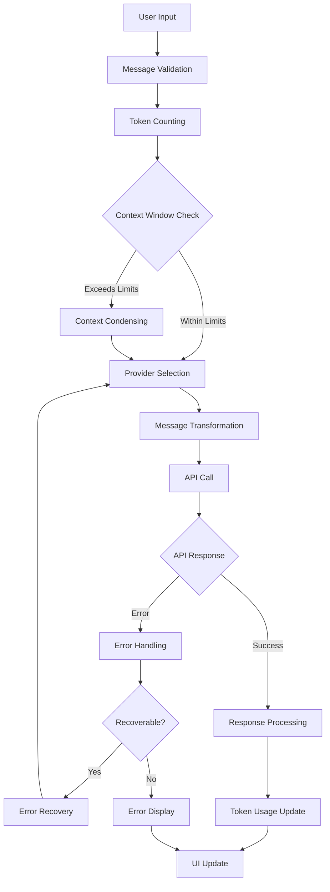
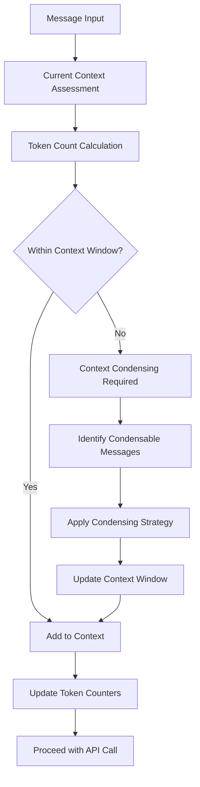

# AI API Integration and Context Management Analysis

## Executive Summary

This document provides a comprehensive technical analysis of how the Zentara Code system integrates with AI APIs for context management. The analysis covers API integration architecture, context management workflows, token counting and budget systems, message processing patterns, and error handling mechanisms.

## 1. API Integration Architecture

### 1.1 Multi-Provider Support

The system supports extensive AI provider integration through a unified architecture:

**Core Providers:**
- **Anthropic** (`src/api/providers/anthropic.ts`) - Primary Claude integration
- **OpenAI** (`src/api/providers/openai.ts`, `openai-native.ts`) - GPT models
- **Gemini** (`src/api/providers/gemini.ts`) - Google AI integration
- **Bedrock** (`src/api/providers/bedrock.ts`) - AWS Bedrock services
- **Mistral** (`src/api/providers/mistral.ts`) - Mistral AI models
- **Claude-Max** (`src/api/providers/claude-max.ts`) - Enhanced Claude integration
- **G-CLI** (`src/api/providers/g-cli.ts`) - Google CLI integration
- **Cerebras** (`src/api/providers/cerebras.ts`) - Cerebras inference
- **VSCode LM** (`src/api/providers/vscode-lm.ts`) - VSCode language models

**Specialized Providers:**
- **LM Studio** (`src/api/providers/lm-studio.ts`) - Local model hosting
- **Ollama** (`src/api/providers/ollama.ts`, `native-ollama.ts`) - Local inference
- **OpenRouter** (`src/api/providers/openrouter.ts`) - Model routing service
- **Hugging Face** (`src/api/providers/huggingface.ts`) - HF model access
- **LiteLLM** (`src/api/providers/lite-llm.ts`) - Multi-provider proxy

### 1.2 Provider Configuration Management

**ProviderSettingsManager** (`src/core/webview/ClineProvider.ts:apiConfiguration`)
- Centralized API configuration management
- Dynamic provider switching capabilities
- Configuration validation and error handling
- Settings persistence and retrieval

### 1.3 Unified Message Interface

All providers implement consistent message handling through:
- `createMessage()` functions for API calls
- Standardized message transformation pipelines
- Unified error handling patterns
- Consistent token counting mechanisms

## 2. Context Management Workflows

### 2.1 Context Window Management

**Core Context Components:**
- **Context Window Tracking** (`src/core/task/Task.ts:contextWindow`)
- **Current Token Counting** (`src/core/task/Task.ts:currentTokens`)
- **Context Token Management** (`src/core/task/Task.ts:contextTokens`)
- **Background Token Tracking** (`bgInputTokens`, `bgOutputTokens`)

**Context Processing Pipeline:**
```
Message Input → Token Counting → Context Window Check → Context Condensing (if needed) → API Call
```

### 2.2 Sliding Window Implementation

**Sliding Window Manager** (`src/core/sliding-window/index.ts`)
- **TOKEN_BUFFER_PERCENTAGE**: Configurable buffer for context management
- **allowedTokens**: Dynamic token allocation based on model limits
- **lastMessageTokens**: Recent message prioritization
- Automatic context truncation when limits exceeded

### 2.3 Context Condensing System

**Auto-Condense Context** (`src/core/webview/ClineProvider.ts:autoCondenseContext`)
- Automatic context compression when approaching limits
- Intelligent message prioritization and summarization
- Context preservation for critical information
- **CondenseContextErrorRow** UI component for error display

### 2.4 Context Error Handling

**Context Error Patterns** (`src/core/context/context-management/context-error-handling.ts`)
- **CONTEXT_ERROR_PATTERNS**: Regex patterns for context-related errors
- **KNOWN_CONTEXT_ERROR_SUBSTRINGS**: Common error message detection
- Automatic context window exceeded error handling
- Context error recovery mechanisms

## 3. Token Counting and Budget Management

### 3.1 Token Counting Infrastructure

**Provider-Specific Token Counting:**
- **Anthropic**: `countTokens()` with Claude-specific tokenization
- **OpenAI**: `addMaxTokensIfNeeded()` with GPT tokenization
- **Gemini**: `countTokens()` with Gemini tokenization
- **Bedrock**: Cache token handling for AWS services
- **Universal**: Fallback token estimation for unsupported providers

### 3.2 Token Budget Management

**Token Usage Tracking** (`src/core/task/Task.ts`)
- **Input Tokens**: `bgInputTokens`, context input tracking
- **Output Tokens**: `bgOutputTokens`, response token counting
- **Cache Tokens**: `cacheReadTokens`, `cacheWriteTokens` for caching systems
- **Token Usage Reporting**: `getTokenUsage()`, `tokenUsage` aggregation

### 3.3 Model-Specific Token Limits

**Token Limit Configuration** (`src/shared/api.ts`)
- **DEFAULT_HYBRID_REASONING_MODEL_MAX_TOKENS**: Default limits
- **getModelMaxOutputTokens()**: Dynamic limit retrieval
- **Provider Max Tokens**: Individual provider token limits
  - `ANTHROPIC_DEFAULT_MAX_TOKENS`
  - `OPENAI_DEFAULT_MAX_TOKENS`
  - Model-specific configurations

### 3.4 Cost Management

**API Metrics and Cost Tracking** (`src/shared/getApiMetrics.ts`)
- Token usage cost calculation
- API call frequency monitoring
- Budget threshold management
- Cost reporting and analytics

## 4. Message Processing Patterns

### 4.1 Message Creation Pipeline

**Universal Message Creation Flow:**
```
User Input → Message Validation → Provider Transformation → Token Counting → API Call → Response Processing
```

**Provider-Specific Message Handling:**
- **Anthropic**: `createMessage()` with Claude message format
- **OpenAI**: `createMessage()` with ChatML format
- **Gemini**: `createMessage()` with Gemini-specific formatting
- **Bedrock**: `convertToBedrockConverseMessages()` for AWS format

### 4.2 Message Validation and Schema

**Message Schema Validation** (`packages/types/src/message.ts`)
- **clineMessageSchema**: Core message structure validation
- Type safety enforcement across all providers
- Message format consistency checks
- Error handling for invalid messages

### 4.3 Message Enhancement and Transformation

**Message Processing Functions** (`src/core/task/Task.ts`)
- **addToClineMessages()**: Message queue management
- **combineMessages()**: Message aggregation and optimization
- Message deduplication and compression
- Context-aware message prioritization

### 4.4 UI Message Display System

**Chat Interface Components** (`webview-ui/src/components/chat/`)
- **ChatView.tsx**: Main chat interface with message handling
- **ChatRow.tsx**: Individual message rendering
- **QueuedMessages.tsx**: Message queue management
- **MessageModificationConfirmationDialog.tsx**: Message editing capabilities

## 5. Error Handling Mechanisms

### 5.1 API Error Classification

**Error Categories Identified:**
- **Context Window Errors**: Token limit exceeded, context too large
- **API Authentication Errors**: Invalid keys, expired tokens
- **Rate Limiting Errors**: API quota exceeded, throttling
- **Model Availability Errors**: Model unavailable, service down
- **Network Errors**: Connection failures, timeouts
- **Format Errors**: Invalid message format, unsupported content

### 5.2 Provider-Specific Error Handling

**Error Handling Patterns Across Providers:**
- **Anthropic**: Context window error detection and recovery
- **OpenAI**: Rate limiting and quota management
- **Gemini**: Safety filter and content policy errors
- **Bedrock**: AWS service-specific error handling
- **Local Providers**: Connection and model loading errors

### 5.3 Error Recovery Mechanisms

**Automatic Error Recovery:**
- Context condensing on window exceeded errors
- Provider fallback on service unavailability
- Retry logic with exponential backoff
- Graceful degradation for non-critical failures

### 5.4 Error Display and User Feedback

**UI Error Components:**
- **ApiErrorMessage.tsx**: API-specific error display
- **CommandExecutionError.tsx**: Command execution failures
- **CondenseContextErrorRow.tsx**: Context management errors
- **McpErrorRow.tsx**: MCP integration errors

## 6. Integration Workflows

### 6.1 Complete API Call Workflow



### 6.2 Context Management Lifecycle



## 7. Key Technical Insights

### 7.1 Architecture Strengths

1. **Unified Provider Interface**: Consistent API across all providers
2. **Intelligent Context Management**: Automatic context window optimization
3. **Comprehensive Error Handling**: Robust error recovery mechanisms
4. **Token Budget Management**: Precise cost tracking and control
5. **Scalable Design**: Easy addition of new providers

### 7.2 Context Management Sophistication

1. **Sliding Window Implementation**: Efficient context preservation
2. **Automatic Condensing**: Intelligent context compression
3. **Token-Aware Processing**: Precise token counting and management
4. **Error Recovery**: Graceful handling of context-related failures

### 7.3 Integration Completeness

The system provides comprehensive API integration covering:
- 15+ AI service providers
- Universal message handling
- Sophisticated context management
- Comprehensive error handling
- Real-time token tracking
- Cost management and budgeting

## 8. Conclusion

The Zentara Code system implements a sophisticated and comprehensive AI API integration architecture with advanced context management capabilities. The system successfully abstracts the complexity of multiple AI providers while providing intelligent context window management, precise token counting, and robust error handling mechanisms.

The architecture demonstrates enterprise-level sophistication in handling the challenges of AI API integration, particularly in managing context windows, token budgets, and provider-specific requirements while maintaining a consistent user experience.