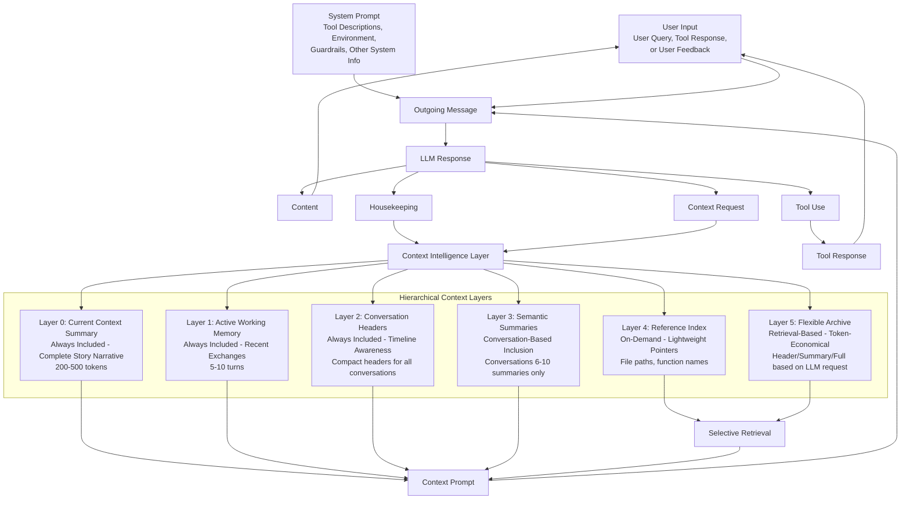

# Smart Context Management for AI Code Assistants
## Problem Analysis and Architectural Vision

### Executive Summary

The current VSCode extension faces a critical **exponential context window growth problem** that fundamentally limits scalability and user experience. This document analyzes the root causes and proposes a revolutionary **hierarchical context management architecture** inspired by human cognitive patterns - using summaries, selective memory, and intelligent reference systems to maintain small, focused prompts while preserving access to historical context.

---

## 🔍 Problem Statement

### Current Context Window Crisis

The existing system suffers from **unsustainable memory growth** that creates cascading problems:

1. **Exponential Token Consumption**: Each conversation turn accumulates more context, leading to exponential growth patterns
2. **Performance Degradation**: Larger contexts mean slower API calls, higher costs, and increased latency
3. **Context Window Limits**: Frequent hitting of model limits (200K+ tokens) requiring emergency truncation
4. **Information Loss**: Current mitigation strategies (75% truncation) cause abrupt context loss
5. **Tool Result Bloat**: File contents, LSP responses, and command outputs create massive context overhead

### Current Architecture Limitations

Based on analysis of the codebase, the current system has several architectural weaknesses:

```typescript
// Current problematic pattern
class Task {
  apiConversationHistory: ApiMessage[]     // Grows indefinitely
  clineMessages: ClineMessage[]            // Rich metadata accumulation
  
  // Reactive approach - only acts when limits hit
  async handleContextOverflow() {
    if (contextPercent >= 75) {
      // Emergency truncation - loses 75% of history
      this.truncateConversation()
    }
  }
}
```

**Key Issues:**
- **Binary Context Management**: Either keep everything or lose everything
- **Reactive Strategy**: Only responds to crises, doesn't prevent them
- **Tool Result Accumulation**: No compression of large outputs
- **Metadata Overhead**: Rich UI state stored in conversation history
- **No Semantic Understanding**: Truncation ignores content importance

---

## 🧠 Human-Inspired Context Management Vision

### The Human Cognitive Model

Humans efficiently manage limited working memory through:

1. **Hierarchical Summarization**: Key points bubble up, details fade
2. **Selective Attention**: Focus on relevant information, background awareness of context
3. **Reference-Based Memory**: Remember where information is, not all details
4. **Context Switching**: Maintain thread awareness while diving deep into specifics
5. **Progressive Detail**: Start broad, drill down as needed

### Proposed Architecture: Layered Context Intelligence



---

## 🏗️ Revolutionary Context Management Architecture

### 1. Multi-Layered Context Hierarchy

#### Layer 0: Current Context Summary (Always Included - CRITICAL)
- **Size**: 200-500 tokens
- **Content**: Cohesive narrative of the entire conversation journey
- **Purpose**: Provides LLM with complete story awareness and continuity thread

#### Layer 1: Active Working Memory (Always Included)
- **Size**: 5-10 most recent exchanges
- **Content**: Full conversation context for immediate continuity
- **Purpose**: Maintains conversation flow and immediate context

#### Layer 2: Conversation Headers (Always Included)
- **Size**: Compact headers for all conversations
- **Content**: Timestamp, topic, key entities, outcome
- **Purpose**: Provides timeline awareness and conversation mapping

```typescript
interface CurrentContextSummary {
  overallNarrative: string        // The complete story so far
  currentObjective: string        // What we're working on now
  keyAchievements: string[]       // Major milestones reached
  activeEntities: {               // Currently relevant items
    files: string[]
    functions: string[]
    concepts: string[]
  }
  contextualState: string         // Where we are in the journey
  nextSteps: string[]            // Anticipated directions
  lastUpdated: number
}

interface ConversationHeader {
  id: string
  timestamp: number
  topic: string                    // Auto-extracted main topic
  keyEntities: string[]           // Files, functions, concepts mentioned
  outcome: 'completed' | 'ongoing' | 'error'
  tokenCount: number
  summary: string                 // One-line summary
}
```

#### Layer 3: Semantic Summaries (Conversation-Based Inclusion)
- **Size**: Summaries of conversations 6-10 only
- **Content**: Summary format for conversations 6-10 (Layer 1 contains 1-5 full, Layer 2 contains headers)
- **Purpose**: Maintains awareness of recent major developments beyond immediate working memory

#### Layer 4: Reference Index (On-Demand)
- **Size**: Lightweight pointers to detailed information
- **Content**: File paths, function names, error patterns
- **Purpose**: Enables precise retrieval when needed

#### Layer 5: Flexible Archive (Retrieval-Based)
- **Size**: Complete conversation history with flexible retrieval options
- **Content**: Full text, summaries, or headers for any conversation based on LLM request
- **Purpose**: Token-economical retrieval - LLM can request specific format (header/summary/full) for optimal context

### 2. Conversation Storage Architecture

#### Trio Format for Each Conversation

Each conversation in the system is stored in three formats to enable flexible, token-economical retrieval:

1. **Header**: Compact metadata (≤12 tokens) - timestamp, topic, key entities, outcome
2. **Summary**: Condensed key information (≤120 tokens) - decisions, code changes, resolutions  
3. **Full Text**: Complete conversation content - entire context when needed

This trio approach allows the LLM to request the most appropriate format based on context needs:
- **Headers** for timeline awareness and conversation mapping
- **Summaries** for understanding key developments without full detail
- **Full Text** for deep context when specifically required

```typescript
interface ConversationTrio {
  conversation_id: string
  header: ConversationHeader      // Always available in Layer 2
  summary: ConversationSummary    // Available in Layer 3 (for 6-10) or Layer 5 (on-demand)
  fullText: FullConversation      // Available in Layer 1 (for 1-5) or Layer 5 (on-demand)
}

interface FlexibleRetrievalRequest {
  conversation_ids: string[]
  format: 'header' | 'summary' | 'full' | 'mixed'  // Token-economical choice
  priority: 'recent' | 'relevant' | 'specific'
}
```

### 3. Intelligent Context Orchestration

#### Three-Branch Message Architecture

The architecture implements a three-branch message composition system where each branch serves a distinct purpose:

1. **Context Prompt Branch**: The hierarchical context layers (0-5) are assembled into a cohesive context prompt providing historical awareness
2. **System Prompt Branch**: Tool descriptions, environment details, guardrails, and other system information maintained separately for consistency
3. **User Input Branch**: Consolidated input containing user queries, tool responses, or user feedback that directly triggers the conversation turn
4. **Message Composition**: All three branches combine to form the complete outgoing message to the LLM
5. **Response Processing**: LLM responses are structured into four distinct outputs that feed back into the system

```typescript
interface ContextAssembly {
  // CRITICAL: Always included first - the complete story
  currentContext: CurrentContextSummary
  
  // Always included (small, essential)
  activeMemory: ConversationTurn[]
  headers: ConversationHeader[]
  
  // Conversation-based summaries
  conversationSummaries: ConversationSummary[]
  requestedConversations: string[]  // LLM-requested full context
  
  // Metadata
  contextBudget: TokenBudget
  retrievalCapacity: number
}

interface ThreeBranchMessageComposition {
  // Branch 1: Historical context and awareness
  contextPrompt: ContextAssembly
  
  // Branch 2: System configuration and capabilities
  systemPrompt: SystemConfiguration
  
  // Branch 3: Consolidated user input (queries, tool responses, feedback)
  userInput: ConsolidatedUserInput
  
  // Final composition
  outgoingMessage: CombinedPrompt   // All three branches merged
}

interface SystemConfiguration {
  toolDescriptions: ToolDefinition[]
  environmentDetails: EnvironmentInfo
  guardrails: SafetyRule[]
  otherSystemInfo: SystemMetadata
}

interface ConsolidatedUserInput {
  type: 'user_query' | 'tool_response' | 'user_feedback'
  content: string
  metadata: InputMetadata
  timestamp: number
}
```

#### Dynamic Context Budget Management
```typescript
interface TokenBudget {
  total: number           // Model's context window
  reserved: number        // System prompt, tools, environment
  available: number       // For conversation context
  
  allocation: {
    currentContext: number  // 15% - complete story narrative
    activeMemory: number    // 25% - immediate context
    headers: number         // 10% - conversation awareness
    summaries: number       // 35% - semantic understanding
    retrieved: number       // 15% - on-demand details
  }
}
```

### 3. Proactive Context Intelligence

#### Predictive Context Management
- **Token Monitoring**: Track context growth in real-time
- **Semantic Clustering**: Group related conversations for efficient summarization
- **Relevance Scoring**: Prioritize context based on current task
- **Preemptive Summarization**: Summarize before hitting limits

#### Smart Summarization Strategies
```typescript
interface ConversationSummary {
  conversation_id: string
  position: number                    // Position in conversation sequence (6-10 range)
  content: string                     // Summary content only (Layer 3 contains summaries only)
  key_decisions: string[]
  code_changes: CodeChange[]
  open_questions: string[]
  retrievable: boolean                // Can LLM request full content if needed
}

interface SummarizationStrategy {
  // Preserve critical information
  codeChanges: CodeChange[]
  decisions: Decision[]
  errorResolutions: ErrorResolution[]
  
  // Compress verbose content
  toolResults: CompressedToolResult[]
  conversationSummaries: ConversationSummary[]  // Updated to use conversation-based approach
  debuggingSessions: ProblemSolution[]
}
```

---

## 🔄 Proposed Response Format Revolution

### Three-Branch Message Flow Architecture

The architecture implements a three-branch message composition system with structured feedback loops:

#### Message Composition Flow
1. **Context Prompt Assembly**: Hierarchical layers (0-5) assembled into cohesive historical context
2. **System Prompt Preparation**: Tools, environment, guardrails maintained separately for consistency
3. **User Input Processing**: Consolidated user input (queries, tool responses, or feedback) that triggered this conversation turn
4. **Three-Branch Combination**: Context + System + User Input → Outgoing Message → LLM
5. **Structured Response**: Four distinct outputs with complete feedback cycles

#### Assistant → Extension (each turn)
- **Content**: Normal response content → Consolidated User Input
- **Tool Use**: Tool calls → Tool Responses → Consolidated User Input
- **Housekeeping**: Context management metadata → Context Intelligence Layer
- **Context Requests**: Explicit retrieval needs → Context Intelligence Layer

#### Extension → Assistant (next turn)
- **Branch 1 - Context Prompt**: Assembled from hierarchical layers (historical awareness)
- **Branch 2 - System Prompt**: Tools, environment, guardrails (system capabilities)
- **Branch 3 - User Input**: Consolidated user queries, tool responses, or feedback (immediate trigger)
- **Combined Message**: All three branches merged for comprehensive LLM processing

#### Three-Branch Schema Architecture
```typescript
// Three-branch outbound message structure
interface ThreeBranchOutgoingMessage {
  // Branch 1: Historical context and awareness
  contextPrompt: ContextAssembly
  
  // Branch 2: System capabilities and configuration
  systemPrompt: SystemConfiguration
  
  // Branch 3: Consolidated user input (flows directly to outgoing message)
  userInput: ConsolidatedUserInput
  
  // Final merged message
  combinedMessage: string  // All three branches integrated
}

// Response structure with feedback loops
interface StructuredResponse {
  content: string           // → User Input (consolidated)
  toolUse: ToolUse[]       // → User Input (consolidated)
  housekeeping: Metadata   // → Direct to Context Intelligence Layer
  contextRequest: Request  // → Direct to Context Intelligence Layer
}

// Consolidated user input types (flows directly to outgoing message)
interface ConsolidatedUserInput {
  type: 'user_query' | 'tool_response' | 'user_feedback'
  content: string
  metadata?: {
    toolId?: string
    attachments?: Attachment[]
    errors?: string[]
  }
  timestamp: number
}
```

### Enhanced LLM Response Structure and Feedback Cycle

The LLM response is structured into four distinct outputs that create complete feedback loops back to the Context Intelligence Layer:

```typescript
interface SmartAssistantResponse {
  // 1. Content Output - Goes to user, generates user feedback
  content: string
  
  // 2. Tool Use Output - Triggers tool execution, generates tool responses
  toolUses?: ToolUse[]
  
  // 3. Housekeeping Output - Updates context management directly
  housekeeping: {
    // LLM's self-awareness
    llm: {
      responseHeader: ResponseHeader
      contextSummary: string
      keyDecisions: string[]
      codeChanges: CodeChange[]
    }
    
    // Understanding of user context
    user: {
      queryHeader: QueryHeader
      understoodIntent: string
      contextUsed: string[]
    }
  }
  
  // 4. Context Request Output - Requests specific context for next turn
  contextRequests: {
    retrieveConversations: FlexibleRetrievalRequest[]  // Specific conversations with format choice
    summarizeTopics: string[]                          // Topics needing summarization
    archiveConversations: string[]                     // Conversations ready for archiving
  }
}

// Feedback cycle interfaces
interface ToolResponse {
  toolId: string
  result: any
  summary: string
  errors?: string[]
  metadata: ToolMetadata
}

interface UserFeedback {
  response: string
  satisfaction: 'positive' | 'negative' | 'neutral'
  corrections?: string[]
  additionalContext?: string
}

// All feedback flows back to Context Intelligence Layer
interface FeedbackIntegration {
  toolResponses: ToolResponse[]      // From tool executions
  userFeedback: UserFeedback[]       // From user interactions
  housekeeping: HousekeepingData     // From LLM self-awareness
  contextRequests: ContextRequest[]  // From LLM context needs
}
```

### Three-Branch Message Assembly and Processing Flow

The complete message flow demonstrates the three-branch architecture with feedback integration:

```typescript
interface ThreeBranchMessageAssemblyFlow {
  // Input processing - consolidated user input handling
  inputType: 'user_query' | 'tool_response' | 'user_feedback'
  contextIntelligenceLayer: ContextLayer
  
  // Branch 1: Context Prompt Assembly (Historical Awareness)
  contextPrompt: {
    // CRITICAL: Complete story awareness (always included first)
    currentContext: CurrentContextSummary
    
    // Lightweight awareness (always included)
    conversationHeaders: ConversationHeader[]
    
    // Recent context (always included)
    recentConversations: ConversationTurn[]  // Last 5 turns
    
    // Conversation-based summaries (conversations 6-10 only)
    conversationSummaries: ConversationSummary[]  // Conversations 6-10 as summaries
    
    // Specific context (LLM-requested with flexible format)
    retrievedConversations: ConversationTrio[]  // Headers, summaries, or full text based on request
  }
  
  // Branch 2: System Prompt (Capabilities and Configuration)
  systemPrompt: {
    toolDescriptions: ToolDefinition[]
    environmentDetails: EnvironmentInfo
    guardrails: SafetyRule[]
    otherSystemInfo: SystemMetadata
  }
  
  // Branch 3: Consolidated User Input (flows directly to Outgoing Message)
  userInput: {
    type: 'user_query' | 'tool_response' | 'user_feedback'
    content: string
    metadata?: {
      toolId?: string
      attachments?: Attachment[]
      errors?: string[]
    }
    timestamp: number
  }
  
  // Three-branch message composition
  outgoingMessage: ThreeBranchCombinedPrompt
  
  // Response processing with feedback loops
  llmResponse: {
    content: string        // → Consolidated User Input
    toolUse: ToolUse[]    // → Consolidated User Input
    housekeeping: Metadata // → Direct to Context Intelligence Layer
    contextRequest: Request // → Direct to Context Intelligence Layer
  }
}

// Enhanced feedback integration matching the corrected scheme
interface ThreeBranchFeedbackCycle {
  // All user-facing outputs flow to consolidated User Input
  userFacingOutputs: {
    content: string[]        // Content responses → User Input
    toolResponses: ToolResponse[]  // Tool execution results → User Input
  }
  
  // Context management outputs flow to Context Intelligence Layer
  contextManagementOutputs: {
    housekeepingUpdates: Metadata    // Updates Context Intelligence Layer
    contextRequests: ContextRequest  // Updates Context Intelligence Layer
  }
  
  // Next cycle preparation
  nextCycleInput: ConsolidatedUserInput
  updatedContextLayer: ContextLayer
}
```

---

## 🧵 The Critical Role of Current Context Summary

### Why Current Context Summary is Essential

The **Current Context Summary** (Layer 0) is the most critical innovation in this architecture. It solves the fundamental problem of **narrative discontinuity** that occurs when LLMs lose track of the overarching story across long conversations.

#### The Narrative Thread Problem

Without a current context summary, LLMs experience:
- **Story Fragmentation**: Understanding individual conversations but losing the bigger picture
- **Objective Drift**: Forgetting the original goals and how current work relates to them
- **Context Switching Confusion**: Inability to understand how different conversation topics connect
- **Progress Blindness**: Not knowing what has been accomplished and what remains

#### Current Context Summary as the Solution

```typescript
// Example of a well-crafted Current Context Summary
const currentContext: CurrentContextSummary = {
  overallNarrative: "User is building a VSCode extension for AI code assistance. Started with basic chat functionality, then added tool integration, now optimizing context management to handle growing conversation history without hitting token limits.",
  
  currentObjective: "Implementing smart context management architecture to replace current reactive truncation system with proactive, layered context intelligence.",
  
  keyAchievements: [
    "Analyzed current context management revealing exponential growth problem",
    "Designed 6-layer hierarchical context architecture",
    "Identified tool result bloat as primary growth vector",
    "Created comprehensive architectural vision document"
  ],
  
  activeEntities: {
    files: ["src/core/task/Task.ts", "src/core/condense/index.ts", "smart-context-management-analysis.md"],
    functions: ["truncateConversation", "summarizeConversation", "handleContextOverflow"],
    concepts: ["context window management", "semantic summarization", "token budget allocation"]
  },
  
  contextualState: "Architecture design phase - moving from problem analysis to implementation planning",
  
  nextSteps: [
    "Design specific implementation strategies for each context layer",
    "Create proof-of-concept for semantic summarization",
    "Build context intelligence orchestration system"
  ],
  
  lastUpdated: Date.now()
}
```

#### Benefits of Current Context Summary

1. **Narrative Continuity**: LLM always understands the complete story
2. **Goal Alignment**: Maintains awareness of objectives throughout long conversations
3. **Progress Tracking**: Clear understanding of what's been accomplished
4. **Context Bridging**: Connects seemingly unrelated conversation segments
5. **Efficient Onboarding**: New conversation turns immediately understand the full context

#### Dynamic Context Evolution

The Current Context Summary evolves with each conversation turn:
- **Narrative Updates**: Story progression and new developments
- **Achievement Tracking**: Completed milestones and progress markers
- **Entity Evolution**: Files, functions, and concepts entering/leaving focus
- **Objective Refinement**: Goals clarification and priority shifts
- **State Transitions**: Movement through different phases of work

---

## 🚀 Advanced Context Intelligence Features

### 1. Semantic Context Clustering

Group conversations by semantic similarity:
- **Code Feature Development**: All conversations about a specific feature
- **Bug Investigation**: Related debugging sessions
- **Refactoring Projects**: Architectural changes and their discussions
- **Learning Sessions**: Explanatory conversations about concepts

### 2. Intelligent Context Compression

#### Tool Result Compression
```typescript
interface CompressedToolResult {
  tool: string
  summary: string              // Key findings
  keyFiles: string[]          // Important files discovered
  errorPatterns: string[]     // Issues encountered
  fullResultId: string        // Reference to full result
}
```

#### Code Change Tracking
```typescript
interface CodeChange {
  files: string[]
  changeType: 'create' | 'modify' | 'delete' | 'refactor'
  summary: string
  impact: 'low' | 'medium' | 'high'
  relatedConversations: string[]
}
```

### 3. Context Relevance Scoring

Score context relevance based on:
- **Temporal Proximity**: Recent conversations more relevant
- **Semantic Similarity**: Related topics and entities
- **Dependency Relationships**: Code files and functions mentioned
- **Error Correlation**: Related problems and solutions
- **User Patterns**: Frequently referenced conversations

### 4. Adaptive Context Strategies

#### Context Profiles
```typescript
interface ContextProfile {
  name: string
  strategy: {
    activeMemorySize: number      // How much recent context to keep
    summaryDepth: number          // How detailed summaries should be
    retrievalThreshold: number    // When to request full conversations
    compressionLevel: number      // How aggressively to compress
  }
  
  triggers: {
    codeIntensive: ContextStrategy    // Heavy coding sessions
    debugging: ContextStrategy        // Problem-solving mode
    exploration: ContextStrategy      // Learning/discovery mode
    maintenance: ContextStrategy      // Routine tasks
  }
}
```

---

## 📐 Design Principles, Schemas, and Budgets

### Design Principles
- Guaranteed inclusions: current_context and headers always present; never dropped
- Retrieval-by-id: LLM explicitly requests deeper threads by conversation_id
- Deterministic assembly: stable, seeded packer; reproducible under same inputs
- Small-first: prefer headers/summaries; fulls only when requested or essential
- Explicit budgets: fixed allocations with preflight sizing and graceful degradation
- Privacy-first: PII scrubbing, redaction, allowlists, auditable decisions

### Schemas and Token Caps
- ConversationHeader: id, timestamp, topic, keyEntities[], outcome, tokenCount, summary (cap: ≤12 tokens)
- ConversationSummary: conversation_id, position(6-10), content(summary only), key_decisions[], code_changes[], open_questions[], retrievable (cap: ≤120 tokens)
- CurrentContextSummary: overallNarrative, currentObjective, keyAchievements[], activeEntities{files[],functions[],concepts[]}, contextualState, nextSteps[] (cap: ≤300 tokens)
- CompressedToolResult: blob_ref(sha256,size,mime), summary (≤60 tokens), entities[], pointers[]

Caps are enforced pre-send; overflow triggers trimming by sentences, then by key points.

### Token Budget Allocator (Deterministic)
```ts
function assemblePack(input, budget, seed) {
  const alloc = {
    currentContext: Math.floor(budget * 0.15),
    activeMemory:   Math.floor(budget * 0.25),
    headers:        Math.floor(budget * 0.10),
    summaries:      Math.floor(budget * 0.35),
    retrieved:      budget - (/*sum above*/)
  }
  const rng = seeded(seed);
  const pick = deterministicOrder(input, rng);

  include(current_context, alloc.currentContext);         // must include
  include(all_headers, alloc.headers);                     // must include
  include(recent_turns, alloc.activeMemory);
  include(conversation_summaries, alloc.summaries);
  include(requested_fulls, alloc.retrieved);

  // Drop-order when oversize
  for (const tier of ['nonRequestedFulls','summaries','headers']) {
    while (overBudget()) dropLeastRelevant(tier, rng);
    if (!overBudget()) break;
  }
  assert(!overBudget()); return packWithChecksum();
}
```

### Default Policy and Knobs
- Layer 1: Conversations 1-5 (full content), Layer 2: All conversation headers, Layer 3: Conversations 6-10 (summaries only), Layer 5: Flexible retrieval (header/summary/full) for any conversation based on LLM token-economical requests
- Max headers: 200; header summary ≤12 tokens; current_context ≤300 tokens
- Per-turn retrieval quota: ≤3 full threads; LRU cache for hot fulls
- Strict dedup: blobs/content addressed by sha256; no raw logs in summaries
- Backpressure: if budget tight, defer low-priority retrievals; queue with TTL

### Governance and Privacy
- PII/secret scrubber on summaries and current_context
- File path/domain allowlist for what can appear in summaries
- Audit log: pack composition, drops, and reasons; pack checksum recorded

## ⚠️ Risks, Failure Modes, Mitigations

- Summary drift: summaries may introduce or omit facts
  - Mitigations: schema caps, factuality checks against canonical logs, diff-aware summarization, confidence scores, rollback to previous summary versions
- ID granularity/versioning: ambiguity about what a conversation/turn means over edits
  - Mitigations: stable conversation_id with monotonic turn_id; versioned snapshots; deprecate superseded IDs via alias map
- Latency spikes from on-demand retrieval
  - Mitigations: cache requested fulls; prefetch likely follow-ups; limit per-turn retrieval quota; background summarization
- Tool-output bloat leaking into summaries
  - Mitigations: normalize/strip logs; content-addressed blobs with references; top-k findings only; deduplicate by hash
- Nondeterminism across retries (different packs → different outcomes)
  - Mitigations: deterministic selection policy with seeded ordering; explicit drop-order; pack checksum validation
- Budget starvation when prompts grow (env/tools)
  - Mitigations: budget allocator with guaranteed inclusions (current_context, headers); adaptive caps; early preflight sizing and graceful degradation
- Privacy/security leakage into summaries
  - Mitigations: PII scrubber, file path allowlist, redaction rules, audit trail and opt-out flags

## 🔒 Deterministic Packaging and Token Budgeting

```typescript
interface ContextPack {
  seed: string                    // derived from taskId + turn
  selectionPolicy: 'deterministic-v1'
  guaranteed: { currentContext: true; headers: true }
  quotas: { summaries: number; fulls: number }
  dropOrder: ('nonRequestedFulls'|'summaries'|'headers')[]
  included: {
    currentContext: CurrentContextSummary
    headers: ConversationHeader[]
    summaries: SemanticSummary[]
    fulls: FullConversationRef[]  // requested + policy-based
  }
  checksum: string                // sha256 over canonicalized pack
}
```

- Preflight sizing computes token costs, then fills allocations in fixed order.
- Given same inputs and budget, the pack is reproducible bit-for-bit.
- On retry, the same seed yields identical assembly unless inputs changed.

## 🗂️ Reference Index, Compression, Deduplication

```typescript
interface BlobRef { sha256: string; size: number; mime: string; store: 'local'|'remote' }
interface CompressedToolResult {
  blob: BlobRef                 // raw payload stored out-of-band
  summary: string               // distilled findings
  entities: string[]            // files/functions
  pointers: string[]            // clickable refs to code/errors
}
```

- Store large tool outputs as blobs; pass only summaries + blob refs.
- Deduplicate by sha256; reuse across turns; LRU cache for hot blobs.

## 📏 Quality Metrics and Guardrails

- Token efficiency: avg tokens/turn, reduction vs baseline
- Latency: p50/p95 end-to-end and retrieval overhead
- Retrieval efficacy: hit-rate of requested fulls, precision/recall of relevance
- Summary fidelity: factual consistency vs canonical logs (spot checks)
- Drift detection: delta in current_context vs last turn; alert on large swings
- Re-ask rate: frequency the LLM requests already provided context
- Budget adherence: violations/turn; count of forced drops

Operational policies:
- Hard caps per field (headers/summary/current_context) with validation
- Quotas per turn for requested fulls; backpressure and deferral queue
- Audit logs for pack composition and reasons for drops

## 🚦 Phased Adoption Plan (with Rollback)

1) Minimal Turn Protocol + current_context
- Ship guaranteed inclusions; deterministic packer; strict caps
- Exit: ≥60% token reduction, no coherence loss in evals

2) Headers + last-N summaries (capped)
- Add relevance scoring; drift checks; blob dedup
- Exit: maintain latency within +10% p95; summary fidelity ≥95%

3) Retrieval-by-id
- Enable conversation_ids; caching; quotas; prefetch heuristics
- Exit: retrieval precision ≥0.8, recall ≥0.8 on eval suites

4) Adaptive strategies + metrics
- Context profiles; adaptive budgets; continuous quality dashboards
- Exit: stable KPIs over 2 weeks; zero critical regressions

Rollback criteria: latency regression >20% p95, fidelity <90%, budget violations spike.

## 🎯 Implementation Benefits

### Immediate Advantages

1. **Dramatic Token Reduction**: 70-90% reduction in context size
2. **Consistent Performance**: No more context window limit hits
3. **Preserved Intelligence**: Maintains awareness without bloat
4. **Cost Efficiency**: Significantly reduced API costs
5. **Faster Responses**: Smaller contexts mean faster processing

### Long-term Strategic Benefits

1. **Unlimited Conversation Length**: No practical limit on conversation history
2. **Intelligent Context Evolution**: Context gets smarter over time
3. **Personalized Context Management**: Adapts to user patterns
4. **Cross-Session Continuity**: Maintains context across extension restarts
5. **Scalable Architecture**: Handles enterprise-scale usage

### User Experience Improvements

1. **Seamless Continuity**: No jarring context loss
2. **Intelligent Assistance**: LLM has better situational awareness
3. **Faster Interactions**: Reduced latency from smaller contexts
4. **Reliable Memory**: Important information never lost
5. **Progressive Detail**: Can dive deep when needed

---

## 🔮 Future Vision: Cognitive Context Management

### Advanced Intelligence Features

#### Conversation Memory Graphs
- **Entity Relationships**: Track how files, functions, and concepts relate
- **Temporal Patterns**: Understand user work patterns and preferences
- **Problem-Solution Mapping**: Build knowledge base of common issues
- **Context Prediction**: Anticipate what context will be needed

#### Collaborative Context Intelligence
- **Team Context Sharing**: Share relevant context across team members
- **Project Context Inheritance**: New conversations inherit project context
- **Cross-Repository Awareness**: Maintain context across related projects
- **Organizational Memory**: Build institutional knowledge

#### Self-Improving Context Management
- **Usage Pattern Learning**: Optimize context strategies based on effectiveness
- **Relevance Feedback**: Learn from user interactions what context matters
- **Automatic Strategy Tuning**: Adjust parameters based on conversation outcomes
- **Context Quality Metrics**: Measure and improve context usefulness

---

## 🎪 Conclusion: The Context Revolution

This smart context management architecture represents a fundamental shift from **reactive context crisis management** to **proactive context intelligence**. By mimicking human cognitive patterns of summarization, selective attention, and reference-based memory, we can create an AI assistant that maintains perfect situational awareness while operating within strict token budgets.

The key insight is that **context intelligence is more valuable than context volume**. A well-structured, semantically-aware context of 10K tokens can be more effective than a bloated, unstructured context of 100K tokens.

This architecture doesn't just solve the context window problem - it creates a foundation for truly intelligent, long-term AI assistance that gets smarter and more helpful over time while remaining fast, cost-effective, and reliable.

### Next Steps

1. **Prototype the layered context architecture**
2. **Implement semantic summarization algorithms**
3. **Build the context intelligence orchestration layer**
4. **Create adaptive context management strategies**
5. **Develop context quality metrics and feedback loops**

The future of AI assistance lies not in bigger context windows, but in smarter context management. This architecture provides the blueprint for that future.