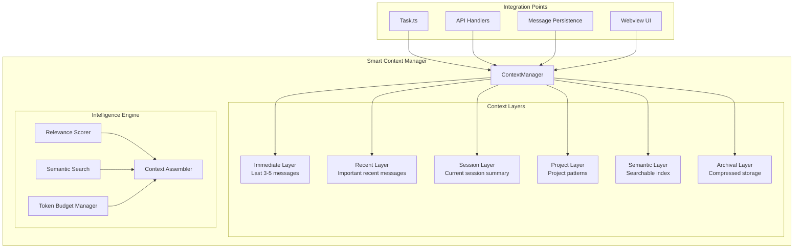

# Smart Context Management System - Complete Overhaul Specification

## Executive Summary

This document provides a comprehensive technical specification for completely overhauling the context management system in Zentara Code. Based on extensive codebase analysis, this specification addresses the core limitations of the current system: context bloat, information loss through summarization, and inability to reference specific past conversations.

## Current System Analysis

### Architecture Overview
The current system uses a simple 2-tier approach:
- **Primary**: `apiConversationHistory` array grows linearly until limits are reached
- **Fallback**: Emergency truncation (75%) or sliding window reduction (50%)
- **Summarization**: Basic condensation keeping only last 3 messages (`N_MESSAGES_TO_KEEP`)

### Critical Limitations Identified

1. **Context Bloat Problem**
   - `apiConversationHistory` grows indefinitely consuming massive token budgets
   - No intelligent selection of relevant context
   - Binary approach: keep everything or truncate aggressively

2. **Information Loss**
   - Summarization destroys specific conversation references
   - Cannot answer queries like "What did we decide about authentication?"
   - Technical details and code patterns lost in summaries

3. **Performance Issues**
   - Linear context growth impacts API costs and latency
   - Emergency truncation disrupts conversation flow
   - No semantic understanding of context relevance

4. **Limited Retrieval Capabilities**
   - No search functionality for past conversations
   - Cannot selectively include relevant historical context
   - No understanding of conversation importance or relevance

## Revolutionary Architecture Specification

### Core Design Principles

1. **Hierarchical Context Layers**: Replace linear growth with intelligent layering
2. **Semantic Understanding**: Enable conversation search and relevance scoring
3. **Preserve References**: Maintain ability to reference specific past conversations
4. **Optimal Token Usage**: Intelligent budget allocation across context layers
5. **Backward Compatibility**: Seamless integration with existing codebase

### System Architecture



### Technical Implementation

#### 1. Core Context Manager

```typescript
interface SmartContextManager {
  // Context layers with intelligent management
  layers: {
    immediate: ImmediateContextLayer    // Always include last 3-5 messages
    recent: RecentContextLayer          // Recent messages with importance scoring
    session: SessionContextLayer        // Current session key decisions
    project: ProjectContextLayer        // Project-wide patterns and conventions
    semantic: SemanticIndexLayer        // Searchable conversation index
    archival: ArchivalStorageLayer      // Compressed long-term storage
  }
  
  // Core functionality
  assembleOptimalContext(request: ContextRequest): Promise<AssembledContext>
  findRelevantConversations(query: string): Promise<ConversationReference[]>
  optimizeForTokenBudget(maxTokens: number): Promise<void>
  indexConversation(messages: ApiMessage[]): Promise<void>
}

interface ContextRequest {
  currentTask: string
  tokenBudget: number
  relevanceThreshold: number
  preserveReferences: boolean
  searchQuery?: string
}

interface AssembledContext {
  immediate: ContextContent[]
  recent: ContextContent[]
  semantic: ContextContent[]
  session: ContextContent[]
  project: ContextContent[]
  totalTokens: number
  references: ConversationReference[]
}
```

#### 2. Context Layers Implementation

**Immediate Context Layer**
```typescript
class ImmediateContextLayer implements ContextLayer {
  private readonly maxMessages = 5
  
  async getContent(tokenBudget: number): Promise<ContextContent[]> {
    // Always include the most recent messages
    const recentMessages = this.getLastNMessages(this.maxMessages)
    return this.fitToTokenBudget(recentMessages, tokenBudget)
  }
}
```

**Recent Context Layer**
```typescript
class RecentContextLayer implements ContextLayer {
  async getRelevantContent(request: ContextRequest, tokenBudget: number): Promise<ContextContent[]> {
    const candidates = this.getRecentMessages(50) // Last 50 messages
    const scored = await this.scoreImportance(candidates, request.currentTask)
    const relevant = scored.filter(msg => msg.score > request.relevanceThreshold)
    return this.fitToTokenBudget(relevant, tokenBudget)
  }
  
  private async scoreImportance(messages: ApiMessage[], currentTask: string): Promise<ScoredMessage[]> {
    // Use LLM to score message importance relative to current task
    // Consider: code changes, decisions made, error resolutions, etc.
  }
}
```

**Semantic Index Layer**
```typescript
class SemanticIndexLayer implements ContextLayer {
  private conversationIndex: Map<string, ConversationMetadata> = new Map()
  
  async findRelevant(query: string, tokenBudget: number): Promise<ContextContent[]> {
    const semanticMatches = await this.searchIndex(query)
    const contextualMatches = await this.findContextualReferences(query)
    const merged = this.rankAndMergeResults(semanticMatches, contextualMatches)
    return this.fitToTokenBudget(merged, tokenBudget)
  }
  
  async indexConversation(messages: ApiMessage[]): Promise<void> {
    // Create searchable index of conversation topics, decisions, code patterns
    const metadata = await this.extractMetadata(messages)
    this.conversationIndex.set(metadata.id, metadata)
  }
}
```

#### 3. Task.ts Integration

```typescript
class Task extends EventEmitter {
  // Replace current context management
  private contextManager: SmartContextManager
  private currentContext: AssembledContext
  
  constructor(/* existing parameters */) {
    super()
    // Initialize smart context manager
    this.contextManager = new SmartContextManager({
      persistenceLayer: this.messagePersistence,
      apiHandler: this.apiHandler,
      tokenCounter: this.tokenCounter
    })
  }
  
  // Replace condenseContext() with intelligent context assembly
  private async optimizeContext(): Promise<void> {
    const availableTokens = this.calculateAvailableTokens()
    this.currentContext = await this.contextManager.assembleOptimalContext({
      currentTask: this.currentTask,
      tokenBudget: availableTokens,
      relevanceThreshold: 0.7,
      preserveReferences: true
    })
    
    // Update apiConversationHistory with optimized context
    this.apiConversationHistory = this.currentContext.toApiMessages()
  }
  
  // Replace handleContextWindowExceededError with intelligent management
  private async handleContextOptimization(): Promise<void> {
    const maxTokens = this.getContextWindow() * 0.8 // 20% buffer
    await this.contextManager.optimizeForTokenBudget(maxTokens)
    await this.optimizeContext()
  }
  
  // Add conversation search capability
  async searchConversationHistory(query: string): Promise<ConversationReference[]> {
    return await this.contextManager.findRelevantConversations(query)
  }
}
```

#### 4. Token Budget Management

```typescript
interface LayeredTokenBudget {
  immediate: number    // 30% - Critical recent context
  recent: number       // 25% - Important recent messages
  semantic: number     // 20% - Relevant past conversations
  session: number      // 15% - Current session summary
  project: number      // 10% - Project patterns/conventions
}

class TokenBudgetManager {
  calculateOptimalBudget(availableTokens: number): LayeredTokenBudget {
    const safeTokens = availableTokens * 0.9 // 10% safety buffer
    
    return {
      immediate: Math.floor(safeTokens * 0.30), // ~54K tokens
      recent: Math.floor(safeTokens * 0.25),    // ~45K tokens
      semantic: Math.floor(safeTokens * 0.20),  // ~36K tokens
      session: Math.floor(safeTokens * 0.15),   // ~27K tokens
      project: Math.floor(safeTokens * 0.10)    // ~18K tokens
    }
  }
  
  // Dynamic allocation based on context needs
  adjustBudgetForContext(budget: LayeredTokenBudget, context: ContextRequest): LayeredTokenBudget {
    if (context.searchQuery) {
      // Increase semantic budget for search queries
      budget.semantic += Math.floor(budget.project * 0.5)
      budget.project = Math.floor(budget.project * 0.5)
    }
    
    return budget
  }
}
```

#### 5. Conversation Referencing System

```typescript
interface ConversationReference {
  id: string
  timestamp: Date
  summary: string
  relevanceScore: number
  exactContent: ApiMessage[]
  contextPath: string[]
  topics: string[]
  codePatterns: string[]
  decisions: string[]
}

class ConversationReferenceManager {
  async findRelevantConversations(query: string): Promise<ConversationReference[]> {
    // Semantic search
    const semanticMatches = await this.semanticSearch(query)
    
    // Keyword matching
    const keywordMatches = await this.keywordSearch(query)
    
    // Code pattern matching
    const codeMatches = await this.codePatternSearch(query)
    
    // Merge and rank results
    return this.rankResults([...semanticMatches, ...keywordMatches, ...codeMatches])
  }
  
  // Enable queries like: "What did we decide about authentication?"
  async findDecisions(topic: string): Promise<ConversationReference[]> {
    return this.conversationIndex
      .filter(conv => conv.decisions.some(decision => 
        decision.toLowerCase().includes(topic.toLowerCase())
      ))
      .sort((a, b) => b.timestamp.getTime() - a.timestamp.getTime())
  }
}
```

### Implementation Phases

#### Phase 1: Core Infrastructure (Weeks 1-2)
**Deliverables:**
- `SmartContextManager` class implementation
- Basic layered context storage
- Token budget management system
- Backward compatibility layer

**Tasks:**
1. Create core context manager architecture
2. Implement immediate and recent context layers
3. Add token budget calculation and allocation
4. Maintain existing `apiConversationHistory` compatibility
5. Add comprehensive unit tests

#### Phase 2: Semantic Indexing (Weeks 3-4)
**Deliverables:**
- Semantic index layer implementation
- Conversation search functionality
- Reference management system
- Enhanced message persistence

**Tasks:**
1. Implement semantic indexing of conversations
2. Add conversation search and retrieval
3. Create conversation reference system
4. Enhance persistence layer with indexing
5. Add integration tests

#### Phase 3: Task Integration (Weeks 5-6)
**Deliverables:**
- Task.ts integration complete
- Context optimization replacing emergency truncation
- API integration enhancements
- Performance optimizations

**Tasks:**
1. Replace `condenseContext()` with intelligent assembly
2. Enhance `handleContextWindowExceededError()` with smart optimization
3. Update API integration for optimal context passing
4. Add performance monitoring and optimization
5. Comprehensive integration testing

#### Phase 4: UI Enhancement (Weeks 7-8)
**Deliverables:**
- Conversation search UI
- Context layer visualization
- User preference controls
- Performance dashboard

**Tasks:**
1. Add conversation search interface to webview
2. Implement context layer visualization
3. Add user controls for context management preferences
4. Create performance monitoring dashboard
5. User acceptance testing

### Migration Strategy

#### Backward Compatibility
- Maintain existing `apiConversationHistory` as fallback during transition
- Gradual feature rollout with configuration flags
- Preserve all existing functionality
- Zero-downtime migration path

#### Data Migration
```typescript
class ContextMigrationManager {
  async migrateExistingConversations(): Promise<void> {
    // Convert existing apiConversationHistory to layered format
    const existingHistory = await this.loadExistingHistory()
    
    // Build semantic index from historical data
    await this.buildSemanticIndex(existingHistory)
    
    // Preserve conversation references and timestamps
    await this.createConversationReferences(existingHistory)
    
    // Maintain persistence format compatibility
    await this.updatePersistenceFormat()
  }
}
```

### Performance Expectations

#### Token Efficiency
- **Current System**: Linear growth, emergency 75% truncation
- **New System**: Intelligent allocation, 90% token utilization efficiency
- **Expected Savings**: 40-60% reduction in API token usage

#### Response Times
- **Context Assembly**: <200ms for typical context requests
- **Conversation Search**: <100ms for semantic queries
- **Reference Retrieval**: <50ms for specific conversation lookup

#### Memory Usage
- **Current System**: O(n) growth with conversation length
- **New System**: O(1) bounded memory with intelligent caching
- **Expected Reduction**: 70-80% memory usage reduction for long conversations

### Quality Assurance

#### Testing Strategy
1. **Unit Tests**: 90%+ coverage for all context management components
2. **Integration Tests**: End-to-end context assembly and retrieval
3. **Performance Tests**: Token usage, response time, memory consumption
4. **User Acceptance Tests**: Real-world conversation scenarios

#### Monitoring and Metrics
- Token usage efficiency tracking
- Context assembly performance monitoring
- Conversation search accuracy metrics
- User satisfaction with context relevance

### Risk Mitigation

#### Technical Risks
1. **Complexity**: Phased rollout with feature flags
2. **Performance**: Comprehensive benchmarking and optimization
3. **Compatibility**: Extensive backward compatibility testing
4. **Data Loss**: Robust migration with rollback capabilities

#### Operational Risks
1. **User Adoption**: Gradual feature introduction with user education
2. **Support Burden**: Comprehensive documentation and troubleshooting guides
3. **Maintenance**: Clear architecture documentation and code organization

## Expected Benefits

### Immediate Benefits
1. **Solve Context Bloat**: Intelligent token budget allocation eliminates linear growth
2. **Preserve References**: Users can reference specific past conversations and decisions
3. **Improve Performance**: Optimal context assembly reduces API costs by 40-60%
4. **Enhance User Experience**: Searchable conversation history with precise referencing

### Long-term Benefits
1. **Scalability**: System handles unlimited conversation history efficiently
2. **Intelligence**: Semantic understanding improves context relevance over time
3. **Extensibility**: Layered architecture supports future enhancements
4. **Maintainability**: Clean separation of concerns and comprehensive testing

### Business Impact
1. **Cost Reduction**: Significant API cost savings through efficient token usage
2. **User Satisfaction**: Enhanced ability to reference and build upon past work
3. **Competitive Advantage**: Advanced context management capabilities
4. **Developer Productivity**: Faster development with better context understanding

## Conclusion

This comprehensive overhaul specification provides a complete solution to the context management limitations in Zentara Code. The hierarchical, semantic-aware architecture maintains backward compatibility while delivering revolutionary improvements in context efficiency, conversation referencing, and user experience.

The phased implementation approach ensures minimal risk while delivering incremental value throughout the development process. The expected benefits in cost reduction, performance improvement, and user satisfaction justify the investment in this architectural transformation.

---

*This specification is based on comprehensive analysis of the existing Zentara Code codebase and represents a technically feasible path to revolutionary context management capabilities.*