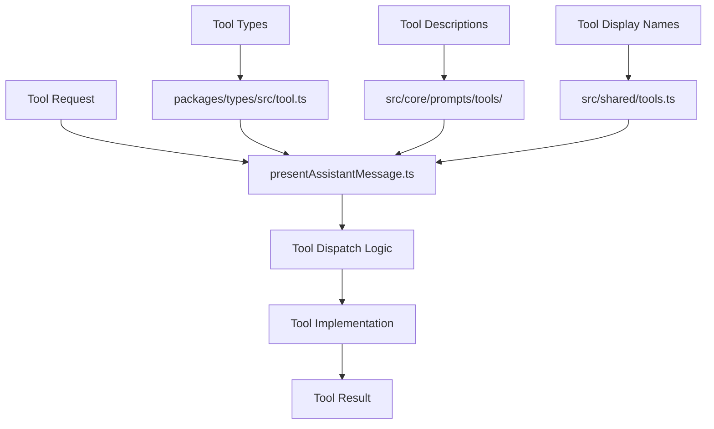

# Tool Integration Guide for Zentara Code

This guide provides a comprehensive walkthrough for integrating new tools into Zentara Code, from simple standalone tools to complex tool groups with multiple operations. The system uses a robust, type-safe architecture with JSON-based parameters.

## Table of Contents

1. [Architecture Overview](#architecture-overview)
2. [Simple Tool Integration](#simple-tool-integration)
3. [Tool Group Integration](#tool-group-integration)
4. [Registration Requirements](#registration-requirements)
5. [Testing and Validation](#testing-and-validation)
6. [Troubleshooting](#troubleshooting)

## Architecture Overview

Zentara Code's tool system is built on a modular, type-safe architecture with clear separation of concerns:

### Core Components



### Directory Structure

- **`src/core/tools/`** - Tool implementation functions
- **`src/core/prompts/tools/`** - Tool descriptions for AI prompts
- **`packages/types/src/tool.ts`** - Type definitions and tool registry
- **`src/shared/tools.ts`** - Display names and UI configuration

### Tool Categories

The system organizes 67+ tools into 8 functional groups:

1. **Read Tools**: `read_file`, `list_files`, `glob`, `search_files`
2. **Edit Tools**: `write_to_file`, `apply_diff`, `search_and_replace`
3. **Browser Tools**: `browser_action`
4. **Command Tools**: `execute_command`
5. **MCP Tools**: Various MCP server integrations
6. **Mode Tools**: `switch_mode`, `new_task`
7. **Debug Tools**: 35+ debugging operations
8. **LSP Tools**: 25+ Language Server Protocol operations

## Simple Tool Integration

For standalone tools that perform a single operation (like `glob` or `read_file`).

### Step 1: Implement Core Logic

Create the tool implementation in `src/core/tools/`:

```typescript
// src/core/tools/myNewTool.ts
import { Task } from "../task/Task"
import { ToolUse } from "../../shared/ExtensionMessage"
import { AskApproval, HandleError, PushToolResult } from "./types"
import { z } from "zod"

// Define parameter schema
const MyNewToolParamsSchema = z.object({
    requiredParam: z.string(),
    optionalParam: z.number().optional(),
})

type MyNewToolParams = z.infer<typeof MyNewToolParamsSchema>

export async function myNewTool(
    cline: Task,
    block: ToolUse,
    askApproval: AskApproval,
    handleError: HandleError,
    pushToolResult: PushToolResult
): Promise<void> {
    try {
        // Parse and validate parameters
        const params = JSON.parse(block.params?.text || "{}")
        const validatedParams = MyNewToolParamsSchema.parse(params)
        
        // Request approval if needed
        const didApprove = await askApproval("tool", JSON.stringify({
            tool: "my_new_tool",
            ...validatedParams
        }))
        
        if (!didApprove) return
        
        // Implement your tool logic here
        const result = await performMyToolOperation(validatedParams)
        
        // Return result
        pushToolResult({
            success: true,
            data: result
        })
        
    } catch (error) {
        await handleError("executing my_new_tool", error)
        pushToolResult({
            success: false,
            error: (error as Error).message
        })
    }
}

async function performMyToolOperation(params: MyNewToolParams) {
    // Your tool implementation logic
    return { message: `Processed ${params.requiredParam}` }
}
```

### Step 2: Create Tool Description

Create the AI prompt description in `src/core/prompts/tools/`:

```typescript
// src/core/prompts/tools/my-new-tool.ts
import type { ToolArgs } from "./types"

export function getMyNewToolDescription(args: ToolArgs): string {
    return `## my_new_tool – Brief description of what this tool does

Description:
Detailed explanation of the tool's purpose, when to use it, and its benefits.

────────────────────────  QUICK-START  ────────────────────────
✅ **Usage**
1️⃣ Use the <my_new_tool> tag.
2️⃣ Provide all parameters as a single, well-formed JSON object string.

⚠️ **Common Breakers**
• Malformed JSON string (missing quotes, trailing commas)
• Missing required parameters
• Invalid parameter types

────────────  COPY-READY TEMPLATE  ────────────
<my_new_tool>{"requiredParam": "value", "optionalParam": 123}</my_new_tool>
───────────────────────────────────────────────

### Parameters:
All parameters are provided as key-value pairs within a single JSON object.

**Required Parameters:**
- "requiredParam" (string, REQUIRED): Description of this parameter.

**Optional Parameters:**
- "optionalParam" (number, optional): Description of this parameter.

### Examples:

1. **Basic Usage:**
   \`\`\`xml
   <my_new_tool>{"requiredParam": "example_value"}</my_new_tool>
   \`\`\`

2. **With Optional Parameters:**
   \`\`\`xml
   <my_new_tool>{"requiredParam": "example", "optionalParam": 42}</my_new_tool>
   \`\`\`

### Notes:
- Additional usage notes and best practices
- Performance considerations
- Common use cases
────────────────────────────────────────────────────────────────────────────
`
}
```

### Step 3: Register the Tool

Update the registration files:

#### 3a. Add to Type Definitions

```typescript
// packages/types/src/tool.ts
export const toolNames = [
    // ... existing tools ...
    "my_new_tool",
] as const
```

#### 3b. Add Display Name

```typescript
// src/shared/tools.ts
export const TOOL_DISPLAY_NAMES: Record<ToolName, string> = {
    // ... existing tools ...
    my_new_tool: "My New Tool",
} as const

// Add to appropriate group
export const TOOL_GROUPS: Record<ToolGroupName, ToolName[]> = {
    // ... existing groups ...
    edit: [
        // ... existing tools ...
        "my_new_tool",
    ],
}
```

#### 3c. Map Tool Description

```typescript
// src/core/prompts/tools/index.ts
import { getMyNewToolDescription } from "./my-new-tool"

const toolDescriptionMap: Record<string, (args: ToolArgs) => string | undefined> = {
    // ... existing mappings ...
    my_new_tool: (args) => getMyNewToolDescription(args),
}
```

#### 3d. Add Tool Dispatch

```typescript
// src/core/assistant-message/presentAssistantMessage.ts
import { myNewTool } from "../tools/myNewTool"

// In the main switch statement (around line 521):
case "my_new_tool": {
    await myNewTool(cline, block, askApproval, handleError, pushToolResult)
    break
}
```

## Tool Group Integration

For complex tools with multiple related operations (like `debug` or `lsp` tools).

### Step 1: Design the Tool Group

Plan your tool group structure:

```typescript
// src/my_tool_group/src/IMyGroupController.ts
export interface MyGroupController {
    operation1(params: Operation1Params): Promise<Operation1Result>
    operation2(params: Operation2Params): Promise<Operation2Result>
    // ... more operations
}

export interface Operation1Params {
    param1: string
    param2?: number
}

export interface Operation1Result {
    success: boolean
    data?: any
    error?: string
}
```

### Step 2: Implement the Controller

```typescript
// src/my_tool_group/src/MyGroupController.ts
export class MyGroupController implements IMyGroupController {
    async operation1(params: Operation1Params): Promise<Operation1Result> {
        try {
            // Implementation logic
            return { success: true, data: "result" }
        } catch (error) {
            return { success: false, error: (error as Error).message }
        }
    }
    
    async operation2(params: Operation2Params): Promise<Operation2Result> {
        // Implementation logic
    }
}

export const myGroupController = new MyGroupController()
```

### Step 3: Create Meta-Tool Handler

```typescript
// src/core/tools/myGroupTool.ts
import { myGroupController } from "../../my_tool_group/src/MyGroupController"
import type { IMyGroupController } from "../../my_tool_group/src/IMyGroupController"

// Create operation mapping
function createOperationMap(controller: IMyGroupController): Record<string, (args?: any) => Promise<any>> {
    return {
        operation1: controller.operation1.bind(controller),
        operation2: controller.operation2.bind(controller),
        // Map all operations
    }
}

const moduleOperationMap = createOperationMap(myGroupController)

export async function myGroupTool(
    cline: Task,
    block: ToolUse,
    askApproval: AskApproval,
    handleError: HandleError,
    pushToolResult: PushToolResult
): Promise<void> {
    try {
        // Extract operation and parameters
        const { my_group_operation, _text } = block.params || {}
        
        if (!my_group_operation) {
            pushToolResult({ success: false, error: "Operation not specified" })
            return
        }
        
        // Request approval
        const didApprove = await askApproval("tool", JSON.stringify({
            tool: "my_group",
            operation: my_group_operation,
            content: _text
        }))
        
        if (!didApprove) return
        
        // Find and execute operation
        const targetMethod = moduleOperationMap[my_group_operation]
        if (!targetMethod) {
            pushToolResult({ success: false, error: `Unknown operation: ${my_group_operation}` })
            return
        }
        
        // Parse parameters and execute
        const params = JSON.parse(_text || "{}")
        const result = await targetMethod(params)
        
        pushToolResult(result)
        
    } catch (error) {
        await handleError(`executing my_group operation`, error)
        pushToolResult({ success: false, error: (error as Error).message })
    }
}
```

### Step 4: Register Tool Group

#### 4a. Add to Type Definitions

```typescript
// packages/types/src/tool.ts
export const toolGroups = [
    // ... existing groups ...
    "my_group",
] as const

export const toolNames = [
    // ... existing tools ...
    "my_group_operation1",
    "my_group_operation2",
] as const
```

#### 4b. Create Operation Descriptions

Create individual description files for each operation:

```typescript
// src/core/prompts/tools/my_group_operations/operation1.ts
export function getMyGroupOperation1Description(args: ToolArgs): string {
    return `## my_group_operation1 – Description of operation 1
    
    // ... detailed description following the same pattern as simple tools
    `
}
```

#### 4c. Register All Operations

```typescript
// src/core/prompts/tools/index.ts
import { getMyGroupOperation1Description } from "./my_group_operations/operation1"
import { getMyGroupOperation2Description } from "./my_group_operations/operation2"

const toolDescriptionMap: Record<string, (args: ToolArgs) => string | undefined> = {
    // ... existing mappings ...
    my_group_operation1: (args) => getMyGroupOperation1Description(args),
    my_group_operation2: (args) => getMyGroupOperation2Description(args),
}
```

#### 4d. Add Group Dispatch

```typescript
// src/core/assistant-message/presentAssistantMessage.ts
import { myGroupTool } from "../tools/myGroupTool"

// Add to the tool group handling section:
if (toolName.startsWith("my_group_")) {
    await myGroupTool(cline, block, askApproval, handleError, pushToolResult)
    break
}
```

## Registration Requirements

### Complete Checklist

For **ALL** new tools:

- [ ] **Implementation**: Create tool function in `src/core/tools/`
- [ ] **Description**: Create prompt file in `src/core/prompts/tools/`
- [ ] **Types**: Add to `toolNames` in `packages/types/src/tool.ts`
- [ ] **Display**: Add to `TOOL_DISPLAY_NAMES` in `src/shared/tools.ts`
- [ ] **Grouping**: Add to appropriate group in `TOOL_GROUPS`
- [ ] **Mapping**: Add to `toolDescriptionMap` in `src/core/prompts/tools/index.ts`
- [ ] **Dispatch**: Add case in `presentAssistantMessage.ts`
- [ ] **Tests**: Create unit and integration tests

For **Tool Groups** additionally:

- [ ] **Controller**: Create interface and implementation
- [ ] **Operations**: Add all operation names to `toolNames`
- [ ] **Group Name**: Add to `toolGroups` in type definitions
- [ ] **Operation Descriptions**: Create individual prompt files
- [ ] **Meta-Tool**: Create group handler with operation mapping
- [ ] **Mode Integration**: Add to relevant modes if needed

### File Locations Reference

| Component | Location | Purpose |
|-----------|----------|---------|
| Tool Implementation | `src/core/tools/{toolName}Tool.ts` | Core logic |
| Tool Description | `src/core/prompts/tools/{tool-name}.ts` | AI prompts |
| Type Definitions | `packages/types/src/tool.ts` | TypeScript types |
| Display Names | `src/shared/tools.ts` | UI configuration |
| Description Mapping | `src/core/prompts/tools/index.ts` | Prompt routing |
| Tool Dispatch | `src/core/assistant-message/presentAssistantMessage.ts` | Request routing |
| Controller Interface | `src/{tool_group}/src/I{Group}Controller.ts` | Group contracts |
| Controller Implementation | `src/{tool_group}/src/{Group}Controller.ts` | Group logic |

## Testing and Validation

### Unit Tests

Create tests for your tool logic:

```typescript
// src/core/tools/__tests__/myNewTool.test.ts
import { describe, it, expect, vi } from 'vitest'
import { myNewTool } from '../myNewTool'

describe('myNewTool', () => {
    it('should process valid parameters', async () => {
        const mockCline = {} as any
        const mockBlock = {
            params: { text: '{"requiredParam": "test"}' }
        } as any
        const mockAskApproval = vi.fn().mockResolvedValue(true)
        const mockHandleError = vi.fn()
        const mockPushToolResult = vi.fn()
        
        await myNewTool(mockCline, mockBlock, mockAskApproval, mockHandleError, mockPushToolResult)
        
        expect(mockPushToolResult).toHaveBeenCalledWith({
            success: true,
            data: expect.any(Object)
        })
    })
})
```

### Integration Tests

Test the full tool flow including registration and dispatch.

### Validation Steps

1. **Type Safety**: Ensure TypeScript compilation passes
2. **Tool Registration**: Verify tool appears in available tools list
3. **Description Generation**: Test prompt generation works
4. **Parameter Validation**: Test with valid and invalid parameters
5. **Error Handling**: Test error scenarios and edge cases
6. **UI Integration**: Verify tool appears correctly in UI

## Troubleshooting

### Common Issues

#### Tool Not Appearing in Available Tools

**Symptoms**: Tool doesn't show up in tool lists or AI prompts
**Causes**:
- Missing from `toolNames` array
- Not added to `toolDescriptionMap`
- TypeScript compilation errors

**Solutions**:
1. Verify tool name in `packages/types/src/tool.ts`
2. Check `toolDescriptionMap` in `src/core/prompts/tools/index.ts`
3. Run TypeScript compiler to check for errors

#### Tool Execution Fails

**Symptoms**: Tool is called but fails during execution
**Causes**:
- Missing dispatch case in `presentAssistantMessage.ts`
- Parameter validation errors
- Implementation bugs

**Solutions**:
1. Add proper dispatch case with correct tool name
2. Validate parameter schemas match expected format
3. Add comprehensive error handling and logging

#### TypeScript Compilation Errors

**Symptoms**: Build fails with type errors
**Causes**:
- Missing display name in `TOOL_DISPLAY_NAMES`
- Incorrect type definitions
- Missing imports

**Solutions**:
1. Ensure all required fields are added to configuration objects
2. Check type definitions match implementation
3. Verify all imports are correct

#### Tool Group Operations Not Working

**Symptoms**: Individual operations in tool group fail
**Causes**:
- Missing operation mapping in controller
- Incorrect operation name registration
- Missing operation descriptions

**Solutions**:
1. Verify operation mapping in `createOperationMap()`
2. Check all operation names in `toolNames` array
3. Ensure each operation has description file

### Debugging Tips

1. **Enable Logging**: Add console.log statements to trace execution
2. **Check Network Tab**: Monitor tool requests in browser dev tools
3. **Validate JSON**: Ensure parameter JSON is well-formed
4. **Test Incrementally**: Add one component at a time
5. **Use TypeScript**: Let the compiler catch type errors early

### Getting Help

- Check existing tool implementations for patterns
- Review test files for usage examples
- Consult the codebase for similar functionality
- Use TypeScript compiler for type validation

## Best Practices

### Code Organization

- Keep tool logic focused and single-purpose
- Use TypeScript for type safety
- Follow existing naming conventions
- Separate concerns between implementation and description

### Error Handling

- Always validate input parameters
- Provide meaningful error messages
- Handle edge cases gracefully
- Log errors for debugging

### Documentation

- Write clear, comprehensive tool descriptions
- Include usage examples
- Document parameter requirements
- Explain when to use the tool

### Testing

- Write unit tests for core logic
- Test error scenarios
- Validate parameter handling
- Test integration with the broader system

This guide provides the foundation for integrating new tools into Zentara Code. Follow the patterns established by existing tools and refer to their implementations for additional guidance.