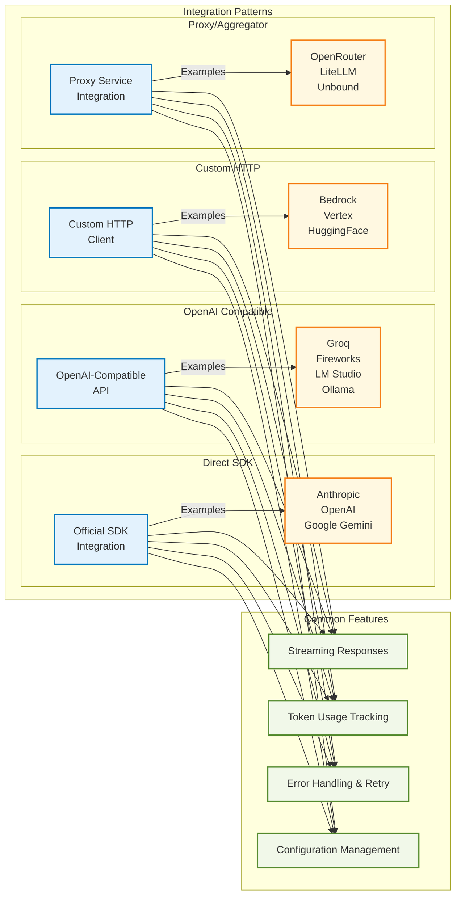
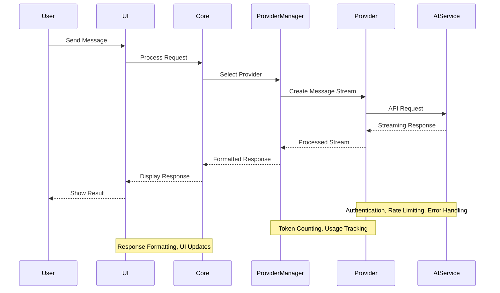
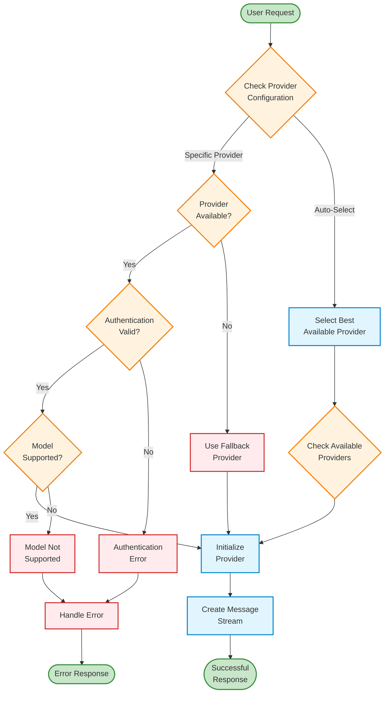

# AI Provider Architecture Diagram

## System Architecture Overview

```mermaid
graph TB
    subgraph "Roo Code Extension"
        UI[User Interface]
        Core[Core System]
        ProviderManager[Provider Manager]
    end

    subgraph "Base Provider Classes"
        BaseProvider[BaseProvider<br/>Abstract Base Class]
        BaseOpenAI[BaseOpenAiCompatibleProvider<br/>OpenAI-Compatible Base]
    end

    subgraph "Major AI Services"
        subgraph "Anthropic Family"
            Anthropic[AnthropicHandler]
            AnthropicVertex[AnthropicVertexHandler]
            ClaudeCode[ClaudeCodeHandler]
            ClaudeMax[ClaudeMaxHandler]
        end

        subgraph "OpenAI Family"
            OpenAI[OpenAiHandler]
            OpenAINative[OpenAiNativeHandler]
        end

        subgraph "Google Family"
            Gemini[GeminiHandler]
            Vertex[VertexHandler]
        end

        subgraph "AWS"
            Bedrock[AwsBedrockHandler]
        end
    end

    subgraph "Third-Party Platforms"
        subgraph "API Aggregators"
            OpenRouter[OpenRouterHandler]
            LiteLLM[LiteLLMHandler]
            Unbound[UnboundHandler]
        end

        subgraph "Specialized Platforms"
            HuggingFace[HuggingFaceHandler]
            Groq[GroqHandler]
            Mistral[MistralHandler]
            Fireworks[FireworksHandler]
            Cerebras[CerebrasHandler]
        end
    end

    subgraph "Local Solutions"
        Ollama[OllamaHandler]
        NativeOllama[NativeOllamaHandler]
        LMStudio[LmStudioHandler]
    end

    subgraph "Regional Services"
        subgraph "Chinese AI"
            DeepSeek[DeepSeekHandler]
            Doubao[DoubaoHandler]
            Moonshot[MoonshotHandler]
            ZAI[ZAiHandler]
        end

        subgraph "Other Regional"
            Glama[GlamaHandler]
            SambaNova[SambaNovaHandler]
            XAI[XAIHandler]
            Featherless[FeatherlessHandler]
        end
    end

    subgraph "Platform Integrations"
        VSCodeLM[VsCodeLmHandler]
        GCli[GCliHandler]
        Roo[RooHandler]
    end

    subgraph "Development Tools"
        FakeAI[FakeAIHandler]
        HumanRelay[HumanRelayHandler]
    end

    subgraph "Utility Components"
        Fetchers[Model Fetchers<br/>- HuggingFace<br/>- OpenRouter<br/>- LiteLLM<br/>- Ollama]
        Utils[Utilities<br/>- Timeout Config<br/>- Auth Management<br/>- Caching]
        Constants[Constants<br/>- Default Headers<br/>- Configuration]
    end

    %% Connections
    UI --> Core
    Core --> ProviderManager
    ProviderManager --> BaseProvider
    ProviderManager --> BaseOpenAI

    %% Base class inheritance
    BaseProvider --> Anthropic
    BaseProvider --> AnthropicVertex
    BaseProvider --> ClaudeCode
    BaseProvider --> ClaudeMax
    BaseProvider --> OpenAI
    BaseProvider --> OpenAINative
    BaseProvider --> Gemini
    BaseProvider --> Vertex
    BaseProvider --> Bedrock
    BaseProvider --> VSCodeLM
    BaseProvider --> GCli
    BaseProvider --> Roo
    BaseProvider --> FakeAI
    BaseProvider --> HumanRelay

    BaseOpenAI --> OpenRouter
    BaseOpenAI --> LiteLLM
    BaseOpenAI --> Unbound
    BaseOpenAI --> HuggingFace
    BaseOpenAI --> Groq
    BaseOpenAI --> Mistral
    BaseOpenAI --> Fireworks
    BaseOpenAI --> Cerebras
    BaseOpenAI --> Ollama
    BaseOpenAI --> NativeOllama
    BaseOpenAI --> LMStudio
    BaseOpenAI --> DeepSeek
    BaseOpenAI --> Doubao
    BaseOpenAI --> Moonshot
    BaseOpenAI --> ZAI
    BaseOpenAI --> Glama
    BaseOpenAI --> SambaNova
    BaseOpenAI --> XAI
    BaseOpenAI --> Featherless

    %% Utility connections
    ProviderManager --> Fetchers
    ProviderManager --> Utils
    ProviderManager --> Constants

    %% Styling
    classDef baseClass fill:#e1f5fe,stroke:#01579b,stroke-width:2px
    classDef majorService fill:#f3e5f5,stroke:#4a148c,stroke-width:2px
    classDef thirdParty fill:#e8f5e8,stroke:#1b5e20,stroke-width:2px
    classDef local fill:#fff3e0,stroke:#e65100,stroke-width:2px
    classDef regional fill:#fce4ec,stroke:#880e4f,stroke-width:2px
    classDef platform fill:#f1f8e9,stroke:#33691e,stroke-width:2px
    classDef dev fill:#f5f5f5,stroke:#424242,stroke-width:2px
    classDef utility fill:#e0f2f1,stroke:#00695c,stroke-width:2px

    class BaseProvider,BaseOpenAI baseClass
    class Anthropic,AnthropicVertex,ClaudeCode,ClaudeMax,OpenAI,OpenAINative,Gemini,Vertex,Bedrock majorService
    class OpenRouter,LiteLLM,Unbound,HuggingFace,Groq,Mistral,Fireworks,Cerebras thirdParty
    class Ollama,NativeOllama,LMStudio local
    class DeepSeek,Doubao,Moonshot,ZAI,Glama,SambaNova,XAI,Featherless regional
    class VSCodeLM,GCli,Roo platform
    class FakeAI,HumanRelay dev
    class Fetchers,Utils,Constants utility
```

## Provider Integration Patterns

## Data Flow Architecture

## Provider Selection Logic

This architectural overview demonstrates the comprehensive and well-structured design of the AI provider system in Roo Code, showing how 35+ different AI services are integrated through a consistent and extensible architecture.