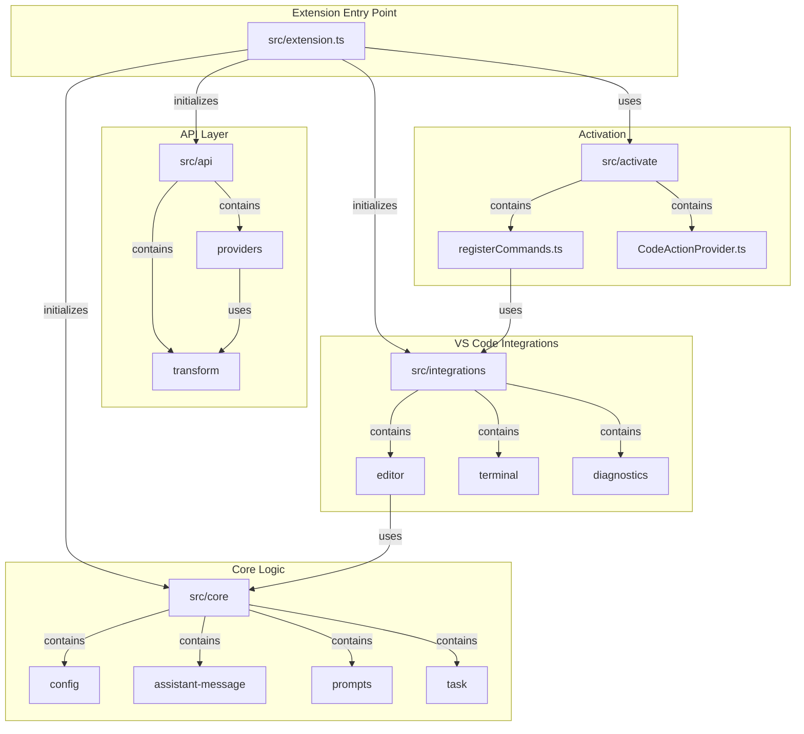

# Roo Code Extension Architecture

Here is a Mermaid diagram visualizing the architecture of the Roo Code extension based on the analysis of the `src` directory.

## Summary

*   **`src/extension.ts`**: The main entry point of the extension.
*   **`src/core`**: Contains the core business logic of the extension.
*   **`src/api`**: Manages communication with external AI providers.
*   **`src/integrations`**: Integrates the extension with the VS Code UI and environment.
*   **`src/activate`**: Handles the activation of the extension and registration of its components.