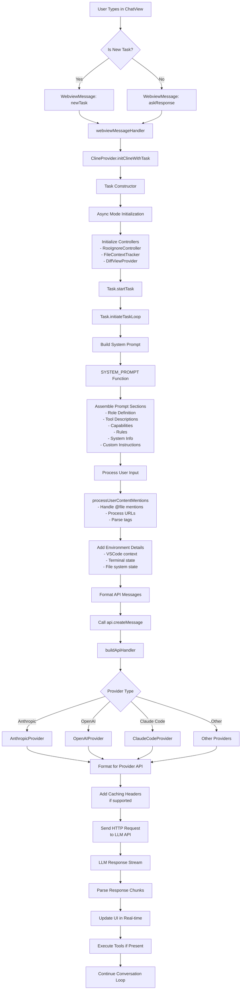

# Data Flow Analysis: New Task Initiation to LLM

Based on comprehensive analysis of the Roo Code extension codebase, this document maps the complete data flow from when a user initiates a new task to when that data reaches the LLM.

## Executive Summary

The data flow follows a sophisticated multi-layer architecture that transforms user input through several processing stages before reaching the LLM:

```
User Input → Webview → Extension Core → Task Engine → Prompt Builder → Provider Layer → LLM
```

**Critical Distinction**: User messages are **NOT** included in the system prompt. They are sent separately as conversation history.

Each layer adds context, validation, and transformation to ensure the LLM receives comprehensive, well-formatted information.

## Complete Data Flow Diagram



## Detailed Component Analysis

### 1. User Interface Layer

**Component**: `ChatView.tsx`
- **Role**: Primary user interaction point
- **Key Logic**: Determines if input creates new task or responds to existing
- **Data Flow**: User text/images → WebviewMessage object

```typescript
// New task detection
if (messagesRef.current.length === 0) {
    vscode.postMessage({ type: "newTask", text, images })
} else {
    vscode.postMessage({ type: "askResponse", taskId, text, images })
}
```

### 2. Message Routing Layer

**Component**: `webviewMessageHandler.ts`
- **Role**: Routes messages from UI to appropriate handlers
- **Key Logic**: Switches on message type to delegate processing
- **Data Flow**: WebviewMessage → Provider method calls

### 3. Task Orchestration Layer

**Component**: `ClineProvider.ts`
- **Role**: Main orchestrator for task lifecycle
- **Key Logic**: Manages task creation, parallel/sequential execution
- **Data Flow**: Provider methods → Task instances

**Task Creation Process**:
```typescript
const cline = await this.initClineWithTask(text, images, historyItem)
if (!is_parallel) {
    await this.addClineToStack(cline)  // Sequential
} else {
    await this.addClineToSet(cline)    // Parallel
}
```

### 4. Task Engine Layer

**Component**: `Task.ts` 
- **Role**: Core execution engine with comprehensive state management
- **Key Components**:
  - **Async Mode Initialization**: Fetches mode configuration
  - **Controller Setup**: Initializes file access, diff, context tracking
  - **Execution Loop**: `recursivelyMakeClineRequests()` with streaming

**Critical Initialization Flow**:
```typescript
// Mode initialization (async)
this.mode = await this.initializeMode()

// Controller setup
this.rooIgnoreController = new RooIgnoreController(...)
this.fileContextTracker = new FileContextTracker(...)
this.diffViewProvider = new DiffViewProvider(...)

// Start execution
await this.startTask()
```

### 5. Prompt Construction Layer

**Component**: `system.ts` + prompt sections
- **Role**: Assembles comprehensive system prompt
- **Key Components**:
  - **Modular Sections**: Role, tools, capabilities, rules, system-info
  - **Mode-Aware Filtering**: Tools and capabilities filtered by current mode
  - **Dynamic Content**: MCP servers, environment details, custom instructions

**Prompt Assembly Process**:
```typescript
const systemPrompt = `
${roleDefinition}
${markdownFormattingSection()}
${getToolDescriptionsForMode(mode, tools)}
${getCapabilitiesSection(context)}
${getRulesSection(customRules)}
${getSystemInfoSection(cwd)}
${await addCustomInstructions(userInstructions)}
`
```

### 6. Input Processing Layer

**Component**: `processUserContentMentions.ts` + environment details
- **Role**: Enriches user input with context and resolves references
- **Processing Steps**:
  - **Mention Resolution**: @file mentions → file content inclusion
  - **URL Processing**: Fetch external content
  - **Tag Processing**: Handle `<task>`, `<feedback>` tags
  - **Environment Injection**: Add VSCode state, terminal output, file context

### 7. Provider Abstraction Layer

**Component**: `buildApiHandler()` + provider implementations
- **Role**: Unified interface to multiple LLM providers
- **Key Features**:
  - **Format Translation**: Converts between provider message formats
  - **Caching Integration**: Anthropic prompt caching, OpenAI caching
  - **Streaming Support**: Unified streaming interface across providers
  - **Error Handling**: Provider-specific error translation

**Provider Selection Logic**:
```typescript
switch (apiProvider) {
    case "anthropic": return new AnthropicProvider(...)
    case "openai": return new OpenAIProvider(...)
    case "claude-code": return new ClaudeCodeProvider(...)
    // ... 20+ providers supported
}
```

## Key Data Transformations

### 1. User Input → Structured Message
- Raw text/images → WebviewMessage with type/metadata
- Task ID assignment for routing
- Validation and sanitization

### 2. Message → Task Context
- WebviewMessage → Task initialization parameters
- Mode detection and configuration loading
- Controller and resource initialization

### 3. Context → System Prompt
- Task context → Multi-section system prompt
- Tool filtering based on mode permissions
- Dynamic content injection (environment, rules, capabilities)

### 4. User Content → Processed Input
- Mention resolution (@file → file content)
- Environment detail injection
- Tag processing and formatting

### 5. Processed Data → Provider Format
- Universal message format → Provider-specific format
- Caching header injection
- Tool description translation

### 6. Provider Response → UI Updates
- Streaming response chunks → Real-time UI updates
- Tool execution integration
- Conversation history maintenance

## Critical Clarification: System Prompt vs User Messages

**IMPORTANT**: User messages are **NOT** included in the [`SYSTEM_PROMPT()`](src/core/prompts/system.ts:134) function.

### Two Separate Components Sent to LLM:

**1. System Prompt** (from `SYSTEM_PROMPT()` function):
- Contains role definition, tools, capabilities, rules, system information
- Built once per task initialization
- **Does NOT contain any user messages**

**2. Conversation History** (user messages + AI responses):
- Contains the actual user input and previous conversation
- Stored in `this.apiConversationHistory` in Task.ts
- Processed and sent separately to the LLM

### LLM API Call Structure:
```typescript
// From Task.ts line 2367
this.api.createMessage(
  systemPrompt,           // System instructions ONLY
  cleanConversationHistory, // User messages + AI responses (separate)
  metadata               // Task metadata
)
```

## Critical Performance Optimizations

### 1. Caching Strategies
- **Anthropic**: System prompt cached as `ephemeral`, conversation context cached
- **Provider-Specific**: Each provider implements optimal caching strategy
- **Context Preservation**: Sliding window management for long conversations

### 2. Streaming Architecture
- **Real-time Updates**: Progressive UI updates during response generation
- **Tool Integration**: Tools executed immediately upon detection
- **Error Handling**: Graceful error propagation through stream

### 3. Resource Management
- **Controller Lifecycle**: Proper initialization and disposal
- **Memory Management**: Context window management and cleanup
- **File System**: Efficient file access with ignore patterns

## Security and Validation

### 1. Input Validation
- **Zod Schemas**: Message validation at API boundaries
- **File Access Control**: RooIgnore and RooProtect controllers
- **Tool Permissions**: Mode-based tool filtering

### 2. State Isolation
- **Task Isolation**: Each task maintains independent state
- **Provider Isolation**: Provider-specific error handling
- **UI State Management**: React context with proper updates

## Parallel Execution Support

The system supports both sequential and parallel task execution:

- **Sequential Tasks**: Managed in `clineStack` (LIFO)
- **Parallel Tasks**: Managed in `clineSet` for concurrent execution  
- **Task Registry**: O(1) lookup for efficient message routing
- **Subagent Support**: Independent parallel AI agents

## Summary

The data flow from new task initiation to LLM represents a sophisticated, multi-layered architecture that:

1. **Captures** user intent through intuitive UI
2. **Routes** messages efficiently through centralized handlers
3. **Orchestrates** task lifecycle with comprehensive state management
4. **Constructs** rich, contextual prompts with modular components
5. **Processes** user input with mention resolution and environment enrichment
6. **Abstracts** LLM providers through unified interfaces
7. **Streams** responses with real-time updates and tool integration

This architecture enables powerful AI interactions while maintaining modularity, performance, and extensibility across the entire data pipeline.