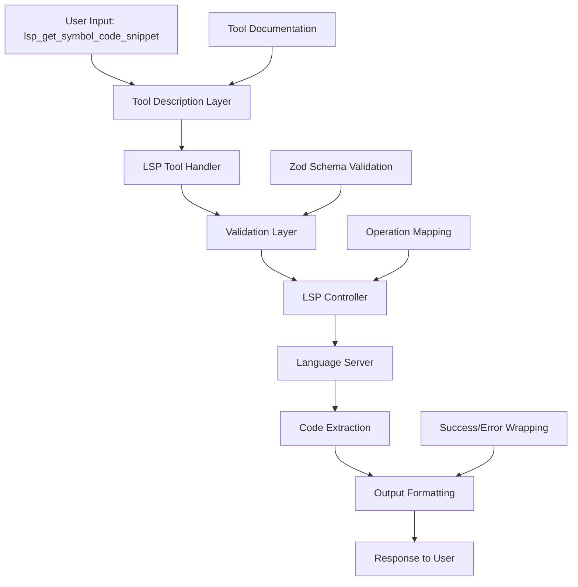

# LSP get_symbol_code_snippet Tool - Complete Implementation Architecture

## Overview

The `get_symbol_code_snippet` tool (also accessible as `lsp_get_symbol_code_snippet`) is a Language Server Protocol (LSP) operation that extracts specific blocks of code from files using URI and range coordinates. It's designed to retrieve complete implementations of symbols identified through other LSP operations.

## Architecture Diagram



## Key Components

### 1. Tool Description Layer

**File**: `src/core/prompts/tools/lsp_operations/get_symbol_code_snippet.ts`

- **Purpose**: Provides user-facing documentation and usage examples
- **Function**: `getGetSymbolCodeSnippetToolDescription()`
- **Content**:
    - Comprehensive usage guide
    - Parameter documentation
    - Examples for different programming languages
    - Common workflow patterns
    - Best practices

### 2. Tool Registration & Integration

**File**: `src/core/prompts/tools/index.ts`

- **Integration Point**: Line 164 and 83 (import)
- **Mapping**:
    ```typescript
    lsp_get_symbol_code_snippet: (args) => getGetSymbolCodeSnippetToolDescription(args)
    ```
- **Mode-based Access**: Available through tool groups configured in modes

### 3. Core LSP Tool Handler

**File**: `src/core/tools/lspTool.ts`

**Key Functions**:

- **Operation Mapping** (Lines 50-51):

    ```typescript
    get_symbol_code_snippet: controller.getSymbolCodeSnippet.bind(controller),
    lsp_get_symbol_code_snippet: controller.getSymbolCodeSnippet.bind(controller),
    ```

- **Processing Flow**:
    1. **Input Parsing**: Extracts JSON parameters from `_text` field
    2. **Validation**: Calls validation layer for parameter checking
    3. **LSP Execution**: Invokes the actual LSP operation
    4. **Output Formatting**: Wraps results in standardized format

**Output Formatting Logic** (Lines 234-270):

```typescript
if (typeof rawResult === "object" && rawResult !== null) {
    if (rawResult.success === true) {
        // Standard success case
        pushToolResult(JSON.stringify(rawResult, null, 2))
    } else if (rawResult.success === false) {
        // Standard failure case
        pushToolResult(formatResponse.toolError(...))
    } else {
        // LSP operations return data directly without success field
        const wrappedResult = {
            success: true,
            data: rawResult
        }
        pushToolResult(JSON.stringify(wrappedResult, null, 2))
    }
}
```

### 4. Validation Layer

**File**: `src/core/tools/lspToolValidation.ts`

- **Schema Mapping** (Lines 56-57):

    ```typescript
    get_symbol_code_snippet: GetSymbolCodeSnippetParamsSchema,
    lsp_get_symbol_code_snippet: GetSymbolCodeSnippetParamsSchema,
    ```

- **Validation Function**: `validateLspOperationArgs()`
- **Error Handling**: Provides detailed error messages for invalid parameters

### 5. Schema Definition

**File**: `src/zentara_lsp/src/types.ts`

**Parameter Schema** (Lines 277-281):

```typescript
export const GetSymbolCodeSnippetParamsSchema = z.object({
	location: LocationSchema,
})
```

**Location Schema** (Lines 269-275):

```typescript
export const LocationSchema = z.object({
	uri: z.string(),
	range: RangeSchema,
	preview: z.string().optional(),
})
```

**Range Schema** (Lines 250-259):

```typescript
export const RangeSchema = z.object({
	start: z.object({
		line: z.number(),
		character: z.number(),
	}),
	end: z.object({
		line: z.number(),
		character: z.number(),
	}),
})
```

**Output Schema** (Lines 383-387):

```typescript
export const CodeSnippetSchema = z.object({
	snippet: z.string(),
	uri: z.string(),
	range: RangeSchema,
})
```

## Data Flow

### Input Format

```json
{
	"location": {
		"uri": "file:///absolute/path/to/file.ts",
		"range": {
			"start": {
				"line": 10,
				"character": 0
			},
			"end": {
				"line": 25,
				"character": 1
			}
		}
	}
}
```

### Output Format

```json
{
	"success": true,
	"data": {
		"snippet": "export function complexFunction(data: any[], options: { sort?: boolean, limit?: number }): any[] {\n    let result = [...data];\n    // ... rest of function\n}",
		"uri": "file:///absolute/path/to/file.ts",
		"range": {
			"start": {
				"line": 10,
				"character": 0
			},
			"end": {
				"line": 25,
				"character": 1
			}
		}
	}
}
```

## Testing Infrastructure

### 1. Integration Tests

**File**: `src/test/lsp-integration/getSymbolCodeSnippet.test.ts`

**Test Coverage**:

- Class code snippet extraction
- Function code snippet extraction
- Method code snippet extraction
- Nested symbols handling
- Non-existent symbols handling
- Multi-language support (TypeScript, Python, JavaScript)
- CodeSnippet structure validation
- Interface symbol extraction
- Non-existent file handling

### 2. Tool-Level Tests

**File**: `src/test/lsp-integration-by-lspTool/test-get-symbol-code-snippet.ts`

**Test Focus**:

- End-to-end tool execution through lspTool handler
- Output format validation
- Error handling scenarios
- Multi-line code extraction validation
- Keyword presence verification
- Range validation

## Error Handling

### Validation Errors

- **Invalid JSON**: "Invalid JSON content provided for operation"
- **Missing Parameters**: Detailed Zod validation errors
- **Schema Violations**: Type and structure validation failures

### Runtime Errors

- **LSP Server Unavailable**: Graceful degradation with informative messages
- **File Not Found**: Returns null or throws appropriate error
- **Invalid Range**: Out-of-bounds line/character positions
- **Timeout**: 15-second timeout protection in tests

### Output Error Format

```json
{
	"success": false,
	"message": "Error description",
	"details": {
		/* additional context */
	}
}
```

## Integration Points

### 1. Mode System

- Available through LSP tool group in mode configurations
- Mode-specific restrictions handled by tool group system

### 2. Language Server Integration

- Waits for Language Server initialization before execution
- Supports multiple language servers for different file types
- Handles workspace-level and file-specific Language Server instances

### 3. Tool Ecosystem

- **Common Workflow**: Used after `lsp_get_document_symbols` or `lsp_go_to_definition`
- **Complementary Tools**: Works with `lsp_find_usages`, `lsp_find_implementations`
- **Output Consumer**: Results used for analysis, documentation, and code modification

## Performance Considerations

### Token Efficiency

- **Alternative to read_file**: Extracts only specific code blocks vs. entire files
- **Surgical Precision**: Targets exact symbol ranges from other LSP operations
- **Context Preservation**: Avoids loading large files into context

### Execution Optimization

- **Language Server Readiness**: Waits for appropriate Language Server initialization
- **Timeout Management**: 15-second timeout for test environments
- **Batch Operations**: Can be used in parallel for multiple symbols

## Best Practices for Usage

### 1. Workflow Integration

```
1. Use lsp_get_document_symbols to find symbols
2. Use lsp_get_symbol_code_snippet to extract implementation
3. Analyze or modify the retrieved code
```

### 2. Range Accuracy

- Always use ranges from other LSP operations
- Ensure absolute file URIs (file:// protocol)
- Validate line/character bounds

### 3. Multi-Language Support

- Works with TypeScript, JavaScript, Python, Java, C++
- Language-specific symbol extraction patterns
- Framework-aware extraction (React components, etc.)

## Security Considerations

### Input Validation

- Strict schema validation prevents injection
- URI format validation ensures proper file access
- Range bounds checking prevents buffer overflows

### File Access

- Respects workspace boundaries
- Uses VSCode's file system APIs
- Language Server sandboxing for file operations

## Future Enhancement Opportunities

1. **Caching**: Cache extracted snippets for repeated requests
2. **Smart Range Detection**: Auto-expand ranges for complete constructs
3. **Syntax Highlighting**: Include syntax highlighting in extracted snippets
4. **Multi-Range Support**: Extract multiple ranges in single operation
5. **Diff Integration**: Compare snippets across different versions

## Conclusion

The `get_symbol_code_snippet` tool represents a sophisticated integration of LSP capabilities with Roo's tool ecosystem. Its architecture emphasizes:

- **Type Safety**: Comprehensive Zod validation
- **Error Resilience**: Graceful handling of various failure modes
- **Performance**: Token-efficient code extraction
- **Flexibility**: Multi-language and multi-framework support
- **Integration**: Seamless workflow with other LSP tools

The implementation successfully balances user experience (comprehensive documentation), developer experience (strong typing and testing), and system reliability (robust error handling and validation).
