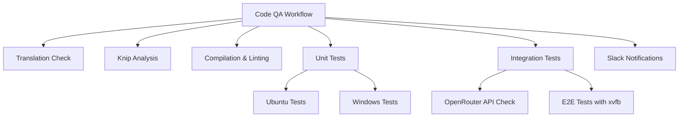
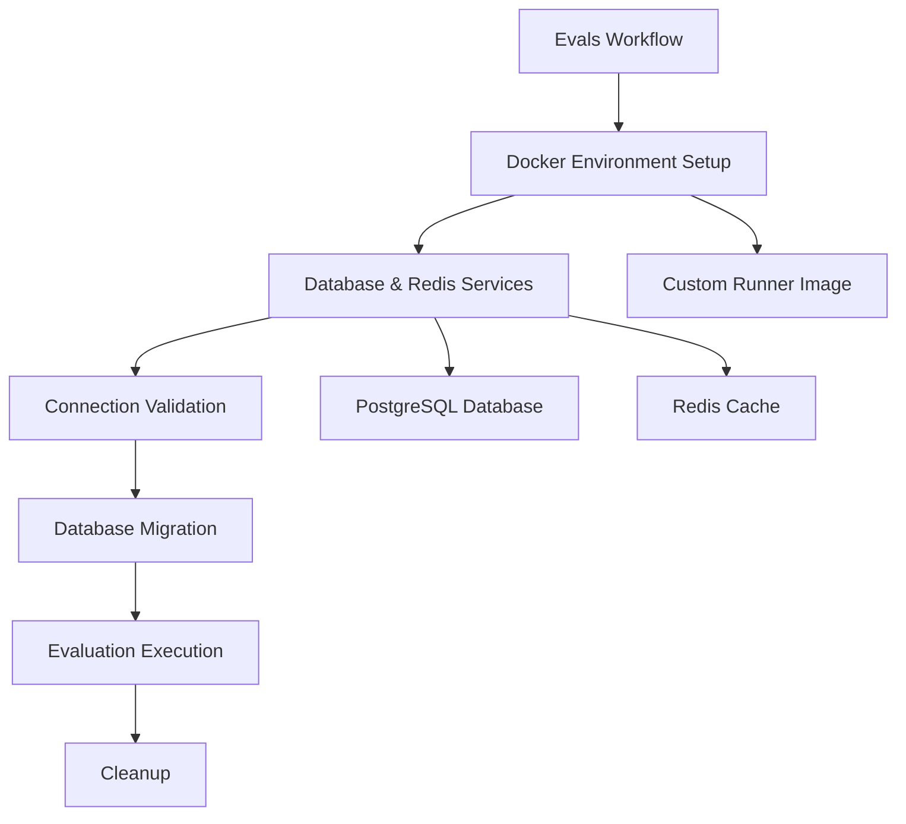
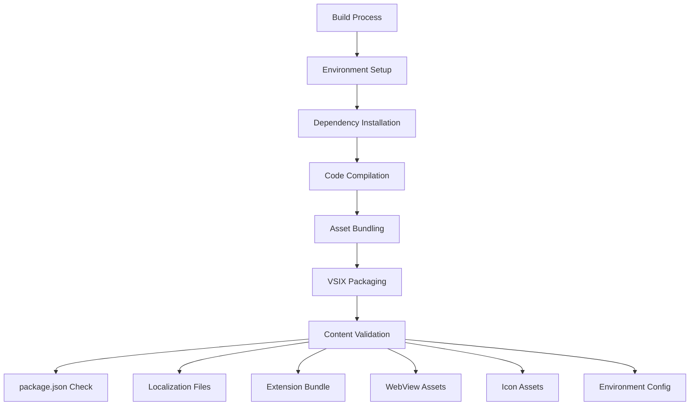
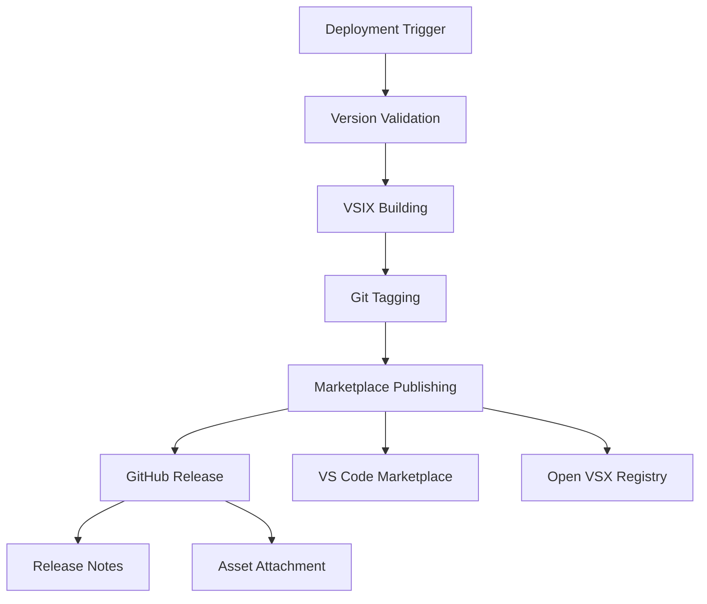
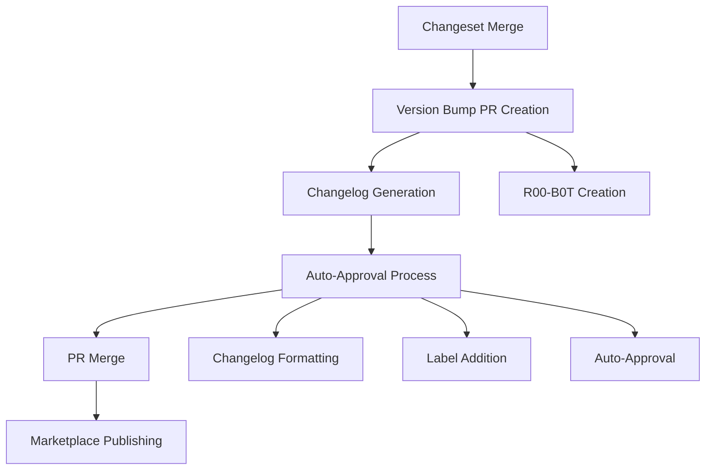

# GitHub Actions Workflows Analysis

## Overview

This document provides a comprehensive analysis of the 10 GitHub Actions workflows in the Roo Code project, focusing on automated testing, building, and deployment processes.

## Workflow Summary

| Workflow | Purpose | Triggers | Key Features |
|----------|---------|----------|--------------|
| `code-qa.yml` | Code Quality Assurance | Push to main, PRs | Multi-platform testing, linting, type checking |
| `evals.yml` | Evaluation Testing | PR labels, manual | Docker-based evaluation system |
| `codeql.yml` | Security Scanning | Push/PR to main, scheduled | Static security analysis |
| `marketplace-publish.yml` | Extension Publishing | Version bump PRs, manual | VS Code Marketplace deployment |
| `nightly-publish.yml` | Nightly Releases | Push to main, manual | Automated nightly builds |
| `changeset-release.yml` | Release Management | PR events, manual | Automated version management |
| `website-deploy.yml` | Production Website | Push to main (web changes) | Vercel production deployment |
| `website-preview.yml` | Preview Website | PRs (web changes) | Vercel preview deployments |
| `discord-pr-notify.yml` | Team Communication | PR opened | Discord notifications |
| `update-contributors.yml` | Documentation | Push to main, manual | Automated contributor updates |

## Testing Architecture

### 1. Code Quality Assurance (`code-qa.yml`)

**Multi-layered Testing Strategy:**

**Key Testing Components:**
- **Translation Verification**: Ensures all localization files are complete
- **Dead Code Detection**: Uses Knip to identify unused code
- **Cross-Platform Testing**: Runs unit tests on both Ubuntu and Windows
- **Integration Testing**: E2E tests with VSCode extension in headless environment
- **Conditional Testing**: Integration tests only run when API keys are available

### 2. Evaluation System (`evals.yml`)

**Docker-Based Evaluation Architecture:**

**Key Features:**
- **Isolated Environment**: Complete Docker-based testing environment
- **Service Dependencies**: PostgreSQL and Redis for data persistence
- **Connection Testing**: Validates all service connections before execution
- **Timeout Protection**: 45-minute timeout prevents runaway processes
- **High-Performance Runners**: Uses Blacksmith 16vCPU runners for intensive evaluation

### 3. Security Scanning (`codeql.yml`)

**Automated Security Analysis:**
- **Language Coverage**: JavaScript/TypeScript analysis
- **Scheduled Scans**: Weekly security audits (Wednesdays at 19:24 UTC)
- **PR Integration**: Security checks on all pull requests
- **GitHub Security Integration**: Results feed into GitHub Security tab

## Build Architecture

### 1. Extension Building Process

**Multi-Stage Build Pipeline:**

**Build Validation:**
- Comprehensive VSIX content verification
- Required file presence checks
- Asset integrity validation

### 2. Website Building

**Vercel-Based Build System:**
- **Environment-Specific Builds**: Separate production and preview configurations
- **Incremental Builds**: Only builds when web-related files change
- **Build Caching**: Leverages Vercel's build optimization

## Deployment Architecture

### 1. Extension Deployment Pipeline

**Deployment Features:**
- **Dual Marketplace Publishing**: VS Code Marketplace and Open VSX Registry
- **Automated Tagging**: Git tags created automatically
- **Changelog Integration**: Release notes extracted from CHANGELOG.md
- **Asset Management**: VSIX files attached to GitHub releases

### 2. Nightly Deployment System

**Automated Nightly Builds:**
- **Version Management**: Incremental version numbering (5500 + run_number)
- **Dual Publishing**: Both VS Code Marketplace and Open VSX Registry
- **Separate Package**: Uses dedicated nightly package configuration

### 3. Website Deployment

**Production Deployment:**
- **Vercel Integration**: Seamless production deployments
- **Path-Based Triggers**: Only deploys when web app files change
- **Environment Management**: Production-specific configuration

**Preview Deployment:**
- **PR Integration**: Automatic preview deployments for pull requests
- **Comment Integration**: Preview URLs posted as PR comments
- **Branch Isolation**: Non-main branches get preview deployments

## Release Management

### Changeset-Based Release System

**Release Automation Features:**
- **Changeset Integration**: Uses changesets for version management
- **Automated PR Creation**: R00-B0T creates version bump PRs
- **Changelog Management**: Automated changelog formatting and updates
- **Approval Workflow**: Automated approval for version bump PRs

## Communication & Monitoring

### 1. Team Communication
- **Discord Integration**: Automatic PR notifications to Discord channels
- **Slack Monitoring**: Failure notifications for main branch builds
- **PR Comments**: Automated preview deployment links

### 2. Failure Handling
- **Conditional Execution**: Workflows skip when required secrets are missing
- **Timeout Protection**: Prevents runaway processes
- **Cleanup Procedures**: Ensures proper resource cleanup

## Key Architectural Decisions

### 1. Multi-Platform Support
- **Cross-Platform Testing**: Ensures extension works on different operating systems
- **Environment Isolation**: Docker containers for consistent testing environments

### 2. Security-First Approach
- **Secret Management**: Conditional execution based on secret availability
- **Automated Security Scanning**: Regular CodeQL analysis
- **Secure Token Usage**: Proper token scoping and permissions

### 3. Developer Experience
- **Fast Feedback**: Quick PR checks and notifications
- **Preview Deployments**: Easy testing of web changes
- **Automated Maintenance**: Contributors list and changelog management

### 4. Scalability Considerations
- **High-Performance Runners**: Blacksmith runners for intensive tasks
- **Caching Strategies**: Docker layer caching and build optimization
- **Conditional Execution**: Workflows only run when necessary

## Recommendations

### 1. Testing Improvements
- Consider adding more comprehensive integration test coverage
- Implement automated performance testing
- Add visual regression testing for web components

### 2. Deployment Enhancements
- Implement blue-green deployment for zero-downtime releases
- Add automated rollback capabilities
- Consider implementing canary releases

### 3. Monitoring & Observability
- Add deployment success/failure metrics
- Implement automated health checks post-deployment
- Consider adding performance monitoring integration

## Conclusion

The Roo Code project demonstrates a sophisticated CI/CD architecture with:
- **Comprehensive Testing**: Multi-layered testing strategy covering unit, integration, and security
- **Automated Deployment**: Fully automated release pipeline with multiple deployment targets
- **Developer-Friendly**: Strong focus on developer experience with preview deployments and notifications
- **Security-Conscious**: Integrated security scanning and proper secret management
- **Scalable Architecture**: Designed to handle growth with high-performance runners and efficient caching

The workflow architecture effectively balances automation, security, and developer productivity while maintaining high code quality standards.