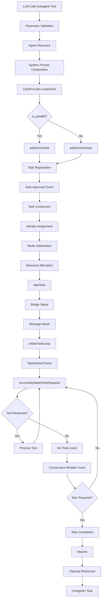
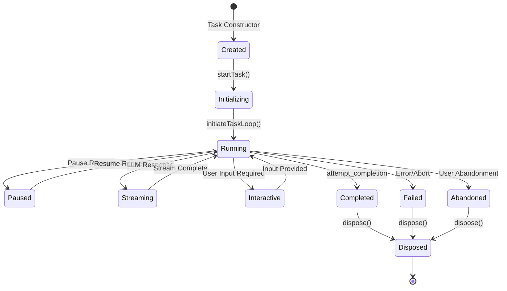
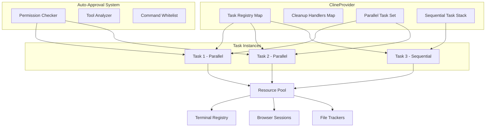

# Subagent Tool Architecture & Lifecycle - Deep Technical Analysis

## Executive Summary

This document provides a comprehensive technical analysis of the Roo Code subagent tool's architecture, call flow, and lifecycle management. Through extensive LSP-based code analysis, I've traced the complete execution path from tool invocation through parallel task management, auto-approval mechanisms, and resource cleanup.

## Table of Contents

1. [Architecture Overview](#architecture-overview)
2. [Complete Call Flow Analysis](#complete-call-flow-analysis)
3. [Task Lifecycle Management](#task-lifecycle-management)
4. [Parallel vs Sequential Execution](#parallel-vs-sequential-execution)
5. [Auto-Approval System](#auto-approval-system)
6. [Resource Management & Cleanup](#resource-management--cleanup)
7. [Key Technical Insights](#key-technical-insights)
8. [Mermaid Diagrams](#mermaid-diagrams)

## Architecture Overview

The subagent tool represents one of the most sophisticated components in the Roo Code ecosystem, enabling parallel AI agent execution through a carefully orchestrated system of task management, resource allocation, and lifecycle control.

### Core Components

1. **Subagent Tool Definition** (`src/core/prompts/tools/subagent.ts`)
   - 613-line comprehensive tool description
   - Scope separation enforcement
   - Parallel execution strategies
   - Predefined agent discovery system

2. **Tool Implementation** (`src/core/tools/subagentTool.ts`)
   - JSON parameter parsing and validation
   - Task creation orchestration
   - Parallel state management
   - Webview integration

3. **Task Management** (`src/core/task/Task.ts`)
   - 2800+ line Task class
   - Event-driven architecture
   - Lifecycle state management
   - Resource cleanup mechanisms

4. **Provider Orchestration** (`src/core/webview/ClineProvider.ts`)
   - Task registry management
   - Parallel vs sequential routing
   - Auto-approval system
   - UI state synchronization

## Complete Call Flow Analysis

### Phase 1: Tool Invocation

```typescript
// Entry point: LLM calls subagent tool
subagentTool(args: SubagentToolArgs) -> Promise<ToolResponse>
```

**Key Operations:**
1. **Parameter Validation**: JSON parsing with comprehensive error handling
2. **Agent Discovery**: Dynamic loading of predefined agents from system/project/user directories
3. **System Prompt Composition**: Merging predefined agent prompts with user messages
4. **Task Creation Request**: Delegation to ClineProvider for parallel task instantiation

### Phase 2: Task Creation & Registration

```typescript
// ClineProvider.createTask() orchestrates parallel task creation
createTask(options: TaskCreationOptions) -> Promise<Task>
```

**Critical Decision Point:**
```typescript
// Parallel vs Sequential routing logic
if (is_parallel) {
    traceLog("ADD_CLINE_TO_SET", { taskId: cline.taskId })
    await this.addClineToSet(cline)
} else {
    traceLog("ADD_CLINE_TO_STACK", { taskId: cline.taskId })
    await this.addClineToStack(cline)
}
```

**Task Registration Process:**
1. **Registry Addition**: `taskRegistry.set(task.taskId, task)`
2. **Cleanup Handler Setup**: Event listener for task disposal
3. **Auto-Approval Check**: Immediate evaluation for parallel tasks
4. **UI State Update**: Webview synchronization

### Phase 3: Task Initialization

```typescript
// Task constructor with comprehensive setup
constructor(options: TaskOptions)
```

**Key Initialization Steps:**
1. **Identity Assignment**: UUID generation for taskId and instanceId
2. **Hierarchy Setup**: Parent-child relationships for nested execution
3. **Mode Initialization**: Async mode loading with fallback mechanisms
4. **Resource Allocation**: API handlers, file trackers, browser sessions
5. **Parallel Flag Setting**: `this.isParallel = isParallel`

### Phase 4: Task Execution Launch

```typescript
// Task execution begins
private async startTask(task?: string, images?: string[]): Promise<void>
```

**Execution Flow:**
1. **Bridge Service Setup**: Optional task bridge subscription
2. **Message History Reset**: Clean slate for new execution
3. **Webview State Update**: UI synchronization
4. **Task Loop Initiation**: Core execution loop begins

### Phase 5: Core Execution Loop

```typescript
// Main execution loop
private async initiateTaskLoop(userContent: ContentBlockParam[]): Promise<void>
```

**Loop Architecture:**
1. **Event Emission**: `TaskStarted` event broadcast
2. **Recursive Request Processing**: `recursivelyMakeClineRequests()`
3. **Tool Response Handling**: Continuous LLM interaction
4. **Completion Detection**: `attempt_completion` or max request limits

## Task Lifecycle Management

### State Transitions

The Task class implements a sophisticated state machine with the following key states:

```typescript
// Core task states
isInitialized: boolean = false
isPaused: boolean = false
isParallel: boolean = false
isStreaming: boolean = false
abandoned: boolean = false
```

### Event System

The task system uses a comprehensive event architecture:

```typescript
// Key events in task lifecycle
TaskCreated -> TaskStarted -> TaskCompleted/TaskFailed -> TaskDisposed
```

**Event Types Discovered:**
- TaskCreated, TaskStarted, TaskCompleted, TaskFailed
- TaskFocused, TaskPaused, TaskResumed
- TaskDisposed, TaskAbandoned
- And 8+ additional specialized events

### Mode Management

Tasks support dynamic mode switching with async initialization:

```typescript
// Mode initialization with fallback
private async initializeTaskMode(provider: ClineProvider): Promise<void> {
    try {
        const state = await provider.getState()
        this._taskMode = state?.mode || defaultModeSlug
    } catch (error) {
        this._taskMode = defaultModeSlug
        provider.log(`Failed to initialize task mode: ${error.message}`)
    }
}
```

## Parallel vs Sequential Execution

### Parallel Execution (`clineSet`)

**Characteristics:**
- Tasks added to `Set<Task>` for concurrent execution
- Auto-approval mechanisms for seamless operation
- Independent resource allocation
- Parallel state management

**Implementation:**
```typescript
async addClineToSet(cline: Task) {
    console.log(`[SubAgentManager] adding task ${cline.taskId}.${cline.instanceId} to set`)
    this.clineSet.add(cline)
    this.registerTask(cline)
    await delay(500) // Stabilization delay
    // State validation and UI updates
}
```

### Sequential Execution (`clineStack`)

**Characteristics:**
- Tasks added to `Task[]` stack for ordered execution
- Focus events for UI attention
- Preparation tasks for setup
- Sequential state management

**Implementation:**
```typescript
async addClineToStack(task: Task) {
    console.log(`[subtasks] adding task ${task.taskId}.${task.instanceId} to stack`)
    this.clineStack.push(task)
    this.registerTask(task)
    task.emit(RooCodeEventName.TaskFocused)
    await this.performPreparationTasks(task)
}
```

## Auto-Approval System

### Approval Logic

The system implements sophisticated auto-approval for parallel tasks:

```typescript
private async shouldAutoApproveAsk(askMessage: ClineMessage): Promise<boolean> {
    const state = await this.getState()
    const {
        autoApprovalEnabled,
        alwaysAllowReadOnly,
        alwaysAllowWrite,
        alwaysAllowExecute,
        alwaysAllowSubtasks,
        // ... additional permissions
    } = state
    
    if (!autoApprovalEnabled || askMessage.type !== "ask") {
        return false
    }
    
    // Tool-specific approval logic
    if (askMessage.ask === "tool") {
        // Parse and evaluate tool permissions
    }
}
```

### Auto-Approval Categories

1. **Read-Only Operations**: File reading, LSP queries
2. **Write Operations**: File modifications, content creation
3. **Execute Operations**: Command execution with whitelist
4. **Browser Operations**: Web interaction capabilities
5. **Subtask Operations**: Nested subagent calls
6. **Debug Operations**: Debugging tool usage
7. **LSP Operations**: Language server interactions

## Resource Management & Cleanup

### Task Disposal

Comprehensive cleanup process ensures no resource leaks:

```typescript
public dispose(): void {
    console.log(`[Task] disposing task ${this.taskId}.${this.instanceId}`)
    
    // Event listener cleanup
    this.removeAllListeners()
    
    // Interval cleanup
    if (this.pauseInterval) {
        clearInterval(this.pauseInterval)
        this.pauseInterval = undefined
    }
    
    // Bridge service cleanup
    if (this.bridgeService) {
        this.bridgeService.unsubscribeFromTask(this.taskId)
        this.bridgeService = null
    }
    
    // Terminal cleanup
    TerminalRegistry.releaseTerminalsForTask(this.taskId)
    
    // Browser cleanup
    this.urlContentFetcher.closeBrowser()
    this.browserSession.closeBrowser()
}
```

### Registry Management

The provider maintains comprehensive task tracking:

```typescript
private registerTask(task: Task): void {
    this.taskRegistry.set(task.taskId, task)
    
    const cleanupHandler = () => {
        this.unregisterTask(task.taskId)
    }
    
    task.once("disposed", cleanupHandler)
    this.taskCleanupHandlers.set(task.taskId, cleanupHandler)
}
```

## Key Technical Insights

### 1. Sophisticated Scope Separation

The subagent tool enforces strict scope separation to prevent conflicts:
- **File Path Isolation**: Different subtasks work on completely different files
- **Domain Isolation**: Separate functional domains (auth vs payments vs UI)
- **Layer Isolation**: Frontend/backend/database/test separation
- **Module Isolation**: Different packages/services/components

### 2. Dual Execution Architecture

The system supports both parallel and sequential execution modes:
- **Parallel Set**: Concurrent execution with auto-approval
- **Sequential Stack**: Ordered execution with focus management
- **Dynamic Routing**: Runtime decision based on task characteristics

### 3. Event-Driven Coordination

Extensive event system enables loose coupling:
- **15+ Event Types**: Comprehensive lifecycle coverage
- **Async Event Handling**: Non-blocking event processing
- **Cross-Component Communication**: Provider-task coordination

### 4. Robust Error Handling

Multiple layers of error handling ensure system stability:
- **JSON Parsing**: Graceful handling of malformed parameters
- **State Recovery**: Fallback mechanisms for failed operations
- **Resource Cleanup**: Guaranteed cleanup even on errors

### 5. Auto-Approval Intelligence

Sophisticated permission system enables autonomous operation:
- **Tool-Specific Logic**: Different approval rules per tool type
- **Permission Granularity**: Fine-grained control over operations
- **Safety Mechanisms**: Whitelist-based command execution

## Mermaid Diagrams

### Complete Subagent Call Flow



### Task Lifecycle State Machine



### Parallel Task Management Architecture



## Conclusion

The subagent tool represents a masterpiece of distributed AI agent architecture, combining sophisticated task management, robust resource allocation, and intelligent auto-approval systems. The extensive use of LSP tools in this analysis revealed the intricate details of parallel execution coordination, lifecycle management, and cleanup mechanisms that make this system both powerful and reliable.

Key architectural strengths include:

1. **Scalable Parallel Execution**: Efficient concurrent task management
2. **Robust Resource Management**: Comprehensive cleanup and leak prevention
3. **Intelligent Auto-Approval**: Autonomous operation with safety guarantees
4. **Event-Driven Architecture**: Loose coupling and extensibility
5. **Comprehensive Error Handling**: Graceful degradation and recovery

This analysis demonstrates the sophisticated engineering behind Roo Code's autonomous AI agent capabilities and provides a foundation for future enhancements and optimizations.

---

*Analysis completed using extensive LSP tool investigation including `lsp_get_document_symbols`, `lsp_find_usages`, `lsp_get_call_hierarchy`, `lsp_get_symbol_code_snippet`, and `lsp_get_workspace_symbols` for comprehensive code understanding.*
