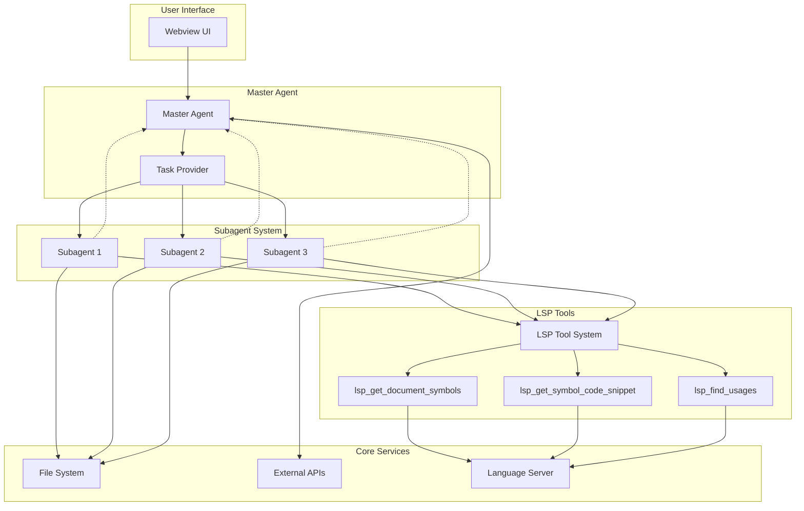
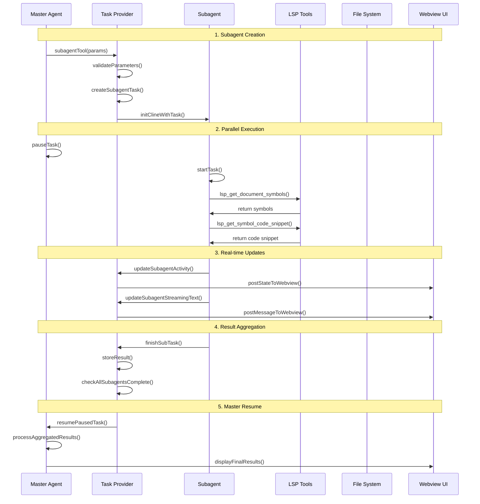
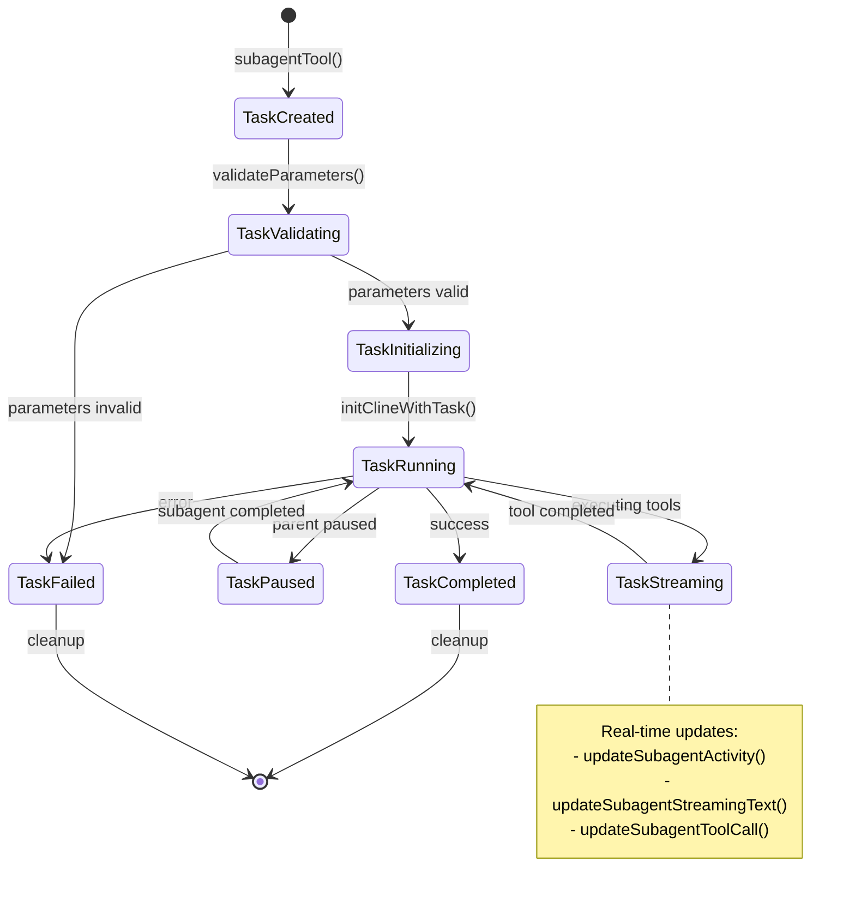
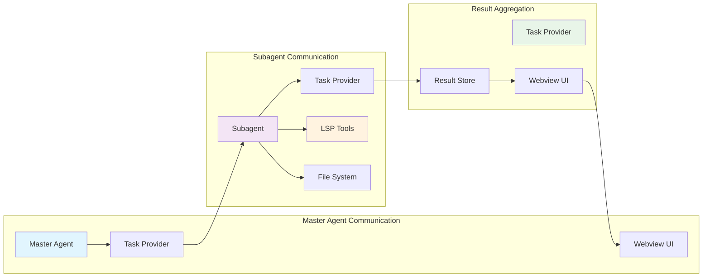
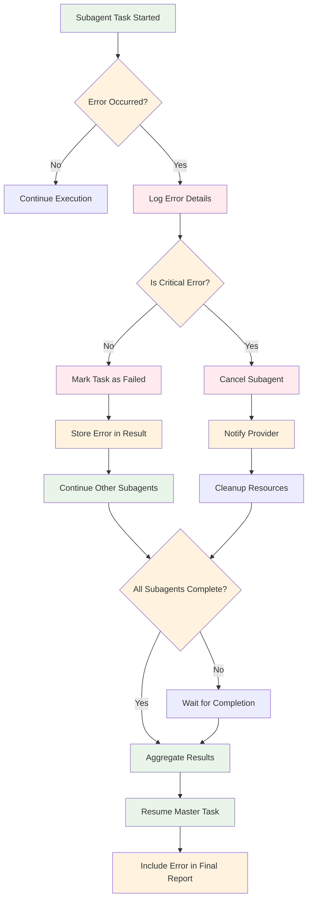
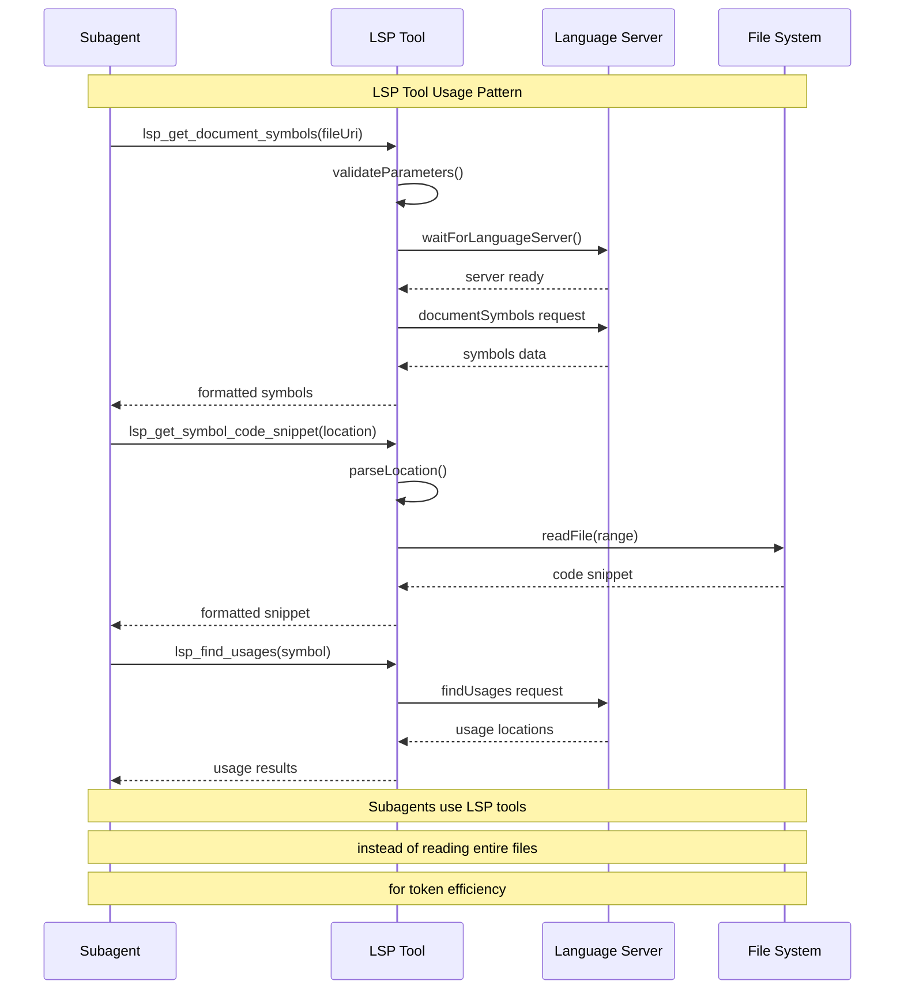
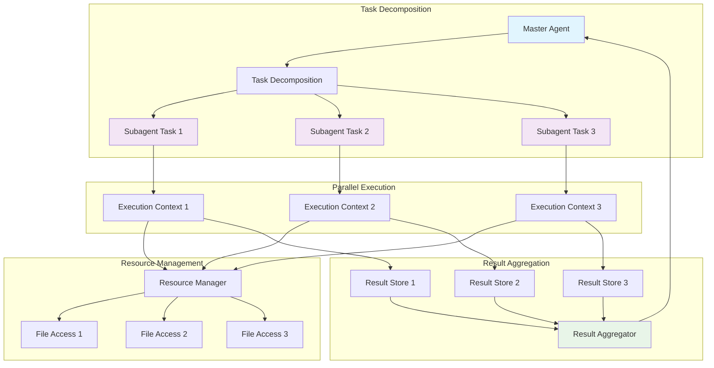
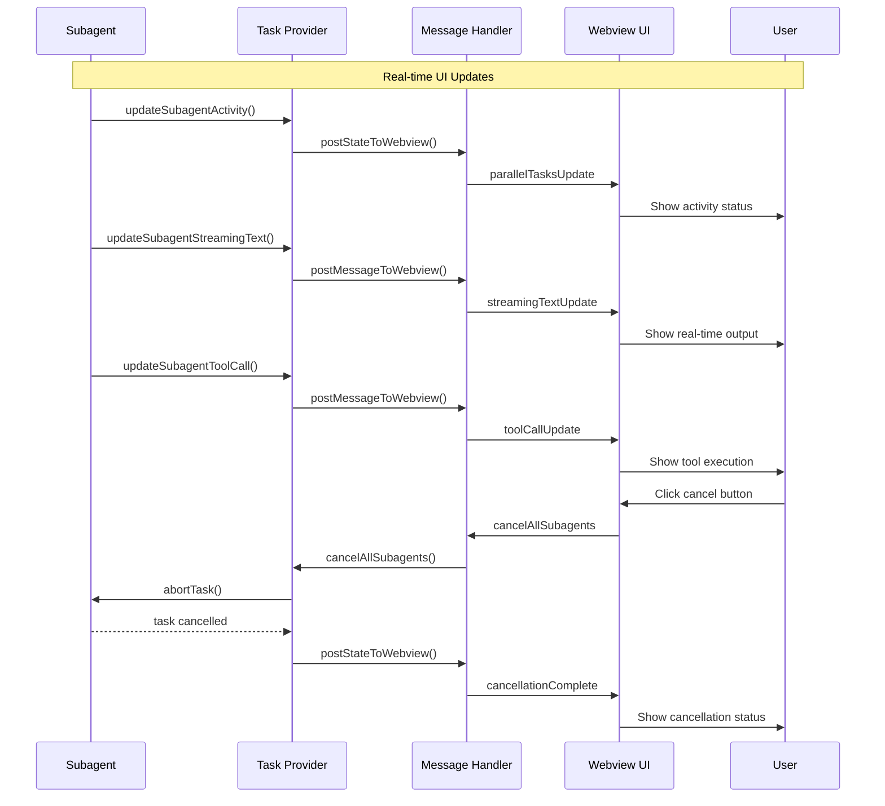

# Subagent Flow Architecture Diagrams

## 1. Overall System Architecture

## 2. Subagent Lifecycle Flow

## 3. Task State Management Flow

## 4. Communication Patterns

## 5. Error Handling and Recovery Flow

## 6. LSP Tool Integration Flow

## 7. Parallel Task Execution Flow

## 8. Webview Integration Flow

## Key Architecture Insights

### 1. **Parallel Execution Model**
- Subagents run simultaneously in isolated contexts
- Master agent pauses during subagent execution
- Results are aggregated and processed upon completion

### 2. **Token Efficiency**
- Subagents use LSP tools instead of reading entire files
- Brief tool descriptions by default, full descriptions on demand
- Minimal context preservation for master agent

### 3. **Error Resilience**
- Individual subagent failures don't stop other subagents
- Comprehensive error logging and recovery mechanisms
- Graceful degradation with partial result handling

### 4. **Real-time Communication**
- Streaming updates provide immediate feedback
- Webview integration for visual progress tracking
- Event-driven architecture for responsive UI

### 5. **Resource Management**
- Concurrent file access limits
- Timeout protection for hanging operations
- Automatic cleanup and resource release

These diagrams illustrate the sophisticated architecture that enables efficient parallel task execution while maintaining proper isolation, communication, and error handling throughout the subagent system.