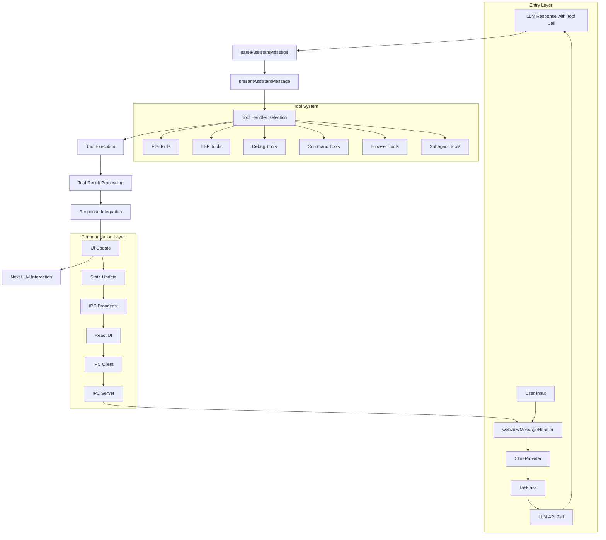

# Complete LLM Tool Call Flow in Zentara Code Extension

## Overview

This document provides a comprehensive trace of the complete call flow when an LLM calls a tool until it gets the response back in the Zentara Code VS Code extension.

## Architecture Diagram



## Detailed Flow Steps

### 1. **Initiation Phase**

#### 1.1 User Input Processing
- **Entry Point**: `webviewMessageHandler()` in `src/core/webview/webviewMessageHandler.ts`
- **Message Type**: User sends "newTask" or "askResponse" messages
- **Routing**: 2,864-line switch statement routes messages to appropriate handlers

#### 1.2 Task Creation
- **Component**: `ClineProvider` in `src/core/webview/ClineProvider.ts`
- **Method**: `initClineWithTask()` creates new Task instances
- **Architecture**: 
  - Sequential tasks: `clineStack[]` array
  - Parallel tasks: `clineSet: Set<Task>` for subagents
  - Task registry: `Map<string, Task>` for O(1) lookup

### 2. **LLM Interaction Phase**

#### 2.1 API Call Execution
- **Component**: `Task` class in `src/core/task/Task.ts` (2,586 lines)
- **Method**: `ask()` - Main method for AI interactions
- **Provider Integration**: Uses unified provider interface with tool definitions

#### 2.2 Tool Integration with LLM APIs
- **Anthropic Provider**: Native tool format, prompt caching, reasoning mode
- **OpenAI Compatible**: Format transformation via `convertToOpenAiMessages()`
- **Tool Schema**: JSON schema definitions passed to LLM providers

### 3. **Response Processing Phase**

#### 3.1 Message Parsing
- **Component**: `parseAssistantMessage()` in `src/core/assistant-message/parseAssistantMessage.ts`
- **Function**: Parses LLM responses into structured content blocks
- **Capabilities**:
  - XML-style tool tag parsing (`<tool_name>`, `<parameter>`)
  - Streaming message support
  - Tool parameter extraction

#### 3.2 Content Processing
- **Component**: `presentAssistantMessage()` in `src/core/assistant-message/presentAssistantMessage.ts`
- **Function**: Main orchestrator for executing parsed content
- **Logic**:
  - Sequential processing of content blocks
  - Differentiation between text and tool blocks
  - Tool execution coordination

### 4. **Tool Execution Phase**

#### 4.1 Tool Handler Selection
- **Specialized Handlers**:
  - `handleIndividualDebugTool()` - Debug operations
  - `handleIndividualLspTool()` - LSP operations
  - `createIndividualToolHandler()` - General tools

#### 4.2 Tool Categories & Execution

##### File Operations
- **Tools**: `readFileTool`, `writeToFileTool`, `applyDiffTool`
- **Execution**: Direct file system operations with locking
- **Results**: File content, success status, error messages

##### LSP Operations (24 tools)
- **Examples**: `lsp_get_document_symbols`, `lsp_go_to_definition`, `lsp_find_usages`
- **Integration**: VS Code Language Server Protocol
- **Results**: Semantic code information, definitions, references

##### Debug Operations (31 tools)
- **Integration**: Debug Adapter Protocol (DAP)
- **Capabilities**: Breakpoints, variable inspection, execution control
- **Results**: Debug state, variable values, stack traces

##### Command Execution
- **Tool**: `execute_command`
- **Implementation**: Terminal process spawning
- **Results**: stdout/stderr streams, exit codes

##### Browser Automation
- **Tool**: `browser_action`
- **Implementation**: Puppeteer-controlled browser
- **Results**: Screenshots, console logs, page state

##### Parallel AI Agents
- **Tool**: `subagentTool`
- **Implementation**: Autonomous AI agent coordination
- **Results**: Task completion status, aggregated results

### 5. **Response Integration Phase**

#### 5.1 Result Processing
- **Validation**: Tool results validated and formatted
- **Error Handling**: Comprehensive error capture and formatting
- **Context Integration**: Results added to conversation context

#### 5.2 State Management
- **Component**: `ContextManagerV3` maintains conversation state
- **Storage**: Tool results stored for future LLM interactions
- **Optimization**: Token-efficient context management

### 6. **Communication Phase**

#### 6.1 IPC Communication
- **Architecture**: Socket-based client-server communication
- **Message Format**:
  ```typescript
  {
    type: string,        // Message type identifier
    origin: string,      // Source of the message  
    clientId: string,    // Unique client identifier
    data: any           // Payload data
  }
  ```

#### 6.2 UI Update
- **Component**: `ExtensionStateContext` in React UI
- **Display**: `ToolDisplay` component for tool result visualization
- **Real-time**: Live updates during tool execution

### 7. **Auto-Approval System**

#### 7.1 Permission Controls
- `alwaysAllowDebug`: Debug operations
- `alwaysAllowLsp`: LSP operations  
- `alwaysAllowReadOnly/Write`: File operations
- `alwaysAllowExecute`: Command execution
- `alwaysAllowBrowser`: Browser automation
- `alwaysAllowMcp`: MCP tool interactions

#### 7.2 Security Features
- Granular permission system
- Organization-level controls
- Mode-based tool filtering

## Key Implementation Files

### Core Execution Pipeline
- `src/core/webview/webviewMessageHandler.ts` - Entry point (2,864 lines)
- `src/core/webview/ClineProvider.ts` - Task coordinator
- `src/core/task/Task.ts` - Task execution engine (2,586 lines)

### Message Processing
- `src/core/assistant-message/parseAssistantMessage.ts` - XML parsing
- `src/core/assistant-message/presentAssistantMessage.ts` - Execution orchestration

### Tool System
- `src/core/tools/` - Individual tool implementations (80+ tools)
- `src/core/prompts/tools/index.ts` - Tool registry and mode filtering

### API Integration
- `src/api/providers/` - LLM provider implementations
- `src/api/transform/openai-format.ts` - Tool format transformation

### Communication
- `src/core/webview/WebViewManager.ts` - IPC management
- `packages/ipc/` - Socket-based communication layer

## Performance Characteristics

### Tool Execution Times
- **File Operations**: ~10-50ms
- **LSP Operations**: ~100-500ms (depends on project size)
- **Debug Operations**: ~200ms-2s (depends on debug complexity)
- **Command Execution**: Variable (depends on command)
- **Subagent Tools**: 30s-5min (autonomous execution)

### Optimization Features
- **Streaming Responses**: Real-time tool call processing
- **Parallel Execution**: Subagents run concurrently
- **Caching**: Anthropic prompt caching for system prompts
- **Token Efficiency**: LSP tools prevent full file reading

## Error Handling Strategy

### Tool Execution Errors
- Comprehensive error capture and formatting
- Graceful degradation when tools unavailable
- Detailed error reporting for LLM consumption

### Recovery Mechanisms
- Automatic retry logic for transient failures
- Partial result handling for complex operations
- Context preservation across error scenarios

## Conclusion

The Zentara Code extension implements a sophisticated tool execution pipeline that enables seamless integration between LLMs and development environments. The architecture supports:

1. **80+ specialized tools** across file operations, code intelligence, debugging, and autonomous task execution
2. **Multiple LLM providers** with unified tool interface
3. **Real-time streaming** tool execution with live feedback
4. **Parallel processing** via autonomous subagent system
5. **Comprehensive error handling** and recovery mechanisms
6. **Granular security controls** with auto-approval system

This design enables powerful AI-assisted development workflows while maintaining performance, reliability, and security standards.