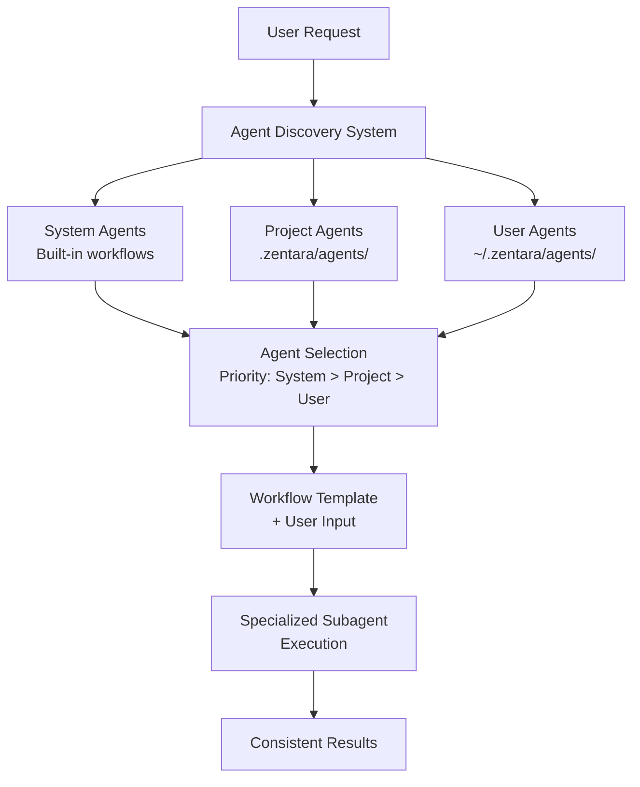

# Predefined Agents: User Guide

## Table of Contents
- [Introduction](#introduction)
- [What are Predefined Agents?](#what-are-predefined-agents)
- [How Predefined Agents Work](#how-predefined-agents-work)
- [Using Predefined Agents](#using-predefined-agents)
- [Available Predefined Agents](#available-predefined-agents)
- [Creating Custom Predefined Agents](#creating-custom-predefined-agents)
- [Agent Discovery System](#agent-discovery-system)
- [Best Practices](#best-practices)
- [Troubleshooting](#troubleshooting)

## Introduction

Predefined agents are specialized, reusable AI assistants that follow prescribed workflows for common development tasks. Unlike general subagents where you provide complete instructions, predefined agents combine your specific inputs with pre-built expert methodologies, ensuring consistent, high-quality results.

## What are Predefined Agents?

Predefined agents are **template-based subagents** that encapsulate proven workflows and best practices for recurring development tasks. They provide:

### Key Benefits

- **Consistency**: Standardized approaches across your team and projects
- **Quality**: Built-in expertise and best practices for specific domains
- **Efficiency**: No need to write complex instructions from scratch
- **Reusability**: Save and share proven workflows
- **Standardization**: Enforce consistent methodologies across projects

### Comparison: General vs Predefined Subagents

| Aspect | General Subagents | Predefined Agents |
|--------|------------------|-------------------|
| **Instructions** | You provide complete task details | You provide inputs; agent provides methodology |
| **Flexibility** | Fully customizable for any task | Specialized for specific task types |
| **Consistency** | Varies based on your instructions | Consistent, proven workflows |
| **Setup Time** | Longer (write full instructions) | Shorter (just provide inputs) |
| **Best For** | Unique, one-time tasks | Recurring, standardized tasks |

## How Predefined Agents Work

### Architecture Overview



### Discovery Priority System

When multiple agents have the same name, the system uses this priority order:

1. **System Agents** (Highest Priority)
   - Built into Zentara Code
   - Maintained by the development team
   - Cannot be overridden

2. **Project Agents** (Medium Priority)
   - Located in `.zentara/agents/`
   - Shared across the project team
   - Project-specific workflows

3. **User Agents** (Lowest Priority)
   - Located in `~/.zentara/agents/`
   - Personal, user-specific agents
   - Custom workflows for individual use

### Agent Composition Process

1. **Discovery**: System finds agent by name across all locations
2. **Selection**: Highest priority agent is chosen
3. **Composition**: Agent's system prompt + your message
4. **Execution**: Specialized subagent runs with combined instructions

## Using Predefined Agents

### Basic Syntax

```xml
<subagent>
{
  "description": "Brief task description",
  "message": "Your specific inputs and requirements",
  "subagent_type": "agent-name"
}
</subagent>
```

### Example: Code Review

**Using a General Subagent (Manual Instructions):**
```xml
<subagent>
{
  "description": "Review code changes",
  "message": "Review the UserService.ts file. Check for: 1) Security vulnerabilities, 2) Performance issues, 3) Code quality, 4) Test coverage, 5) Documentation. Use lsp_get_document_symbols for structure analysis, lsp_find_usages for dependency analysis, search_files for security patterns. Provide detailed feedback with severity levels and specific recommendations."
}
</subagent>
```

**Using a Predefined Agent (Simplified):**
```xml
<subagent>
{
  "description": "Review UserService changes",
  "message": "Please review the changes in UserService.ts focusing on the new authentication methods.",
  "subagent_type": "code-reviewer"
}
</subagent>
```

The predefined `code-reviewer` agent automatically applies comprehensive review methodology, security analysis, performance checks, and standardized reporting format.

### When to Use Predefined Agents

**✅ Use Predefined Agents For:**
- **Standardized Tasks**: Code reviews, bug investigations, security audits
- **Recurring Workflows**: Tasks you perform regularly
- **Team Consistency**: Ensuring uniform approaches across team members
- **Complex Methodologies**: Tasks requiring specific expertise or multi-step processes
- **Quality Assurance**: Tasks where consistency and thoroughness are critical

**❌ Use General Subagents For:**
- **Novel Tasks**: Unique, one-time requirements
- **Experimental Approaches**: Testing new methodologies
- **Highly Specific Context**: Tasks requiring unique, non-standard approaches
- **Simple Operations**: Basic tasks that don't need specialized workflows

## Available Predefined Agents

### System Agents (Built-in)

#### 1. `user-defined-agent-creator`
**Purpose**: Expert system for creating high-quality, reusable predefined agents

**Usage:**
```xml
<subagent>
{
  "description": "Create bug investigator agent",
  "message": "Create a predefined agent for investigating JavaScript runtime errors. Should include error analysis, stack trace interpretation, and root cause identification.",
  "subagent_type": "user-defined-agent-creator"
}
</subagent>
```

**Capabilities:**
- Agent design and architecture
- Best practices enforcement
- YAML frontmatter generation
- Workflow optimization
- Documentation generation

### Project Agents (Example)

#### 1. `code-reviewer`
**Purpose**: Comprehensive code review for VSCode extension development

**Usage:**
```xml
<subagent>
{
  "description": "Review authentication module",
  "message": "Review the authentication module changes in src/auth/. Focus on security vulnerabilities and performance implications.",
  "subagent_type": "code-reviewer"
}
</subagent>
```

**Capabilities:**
- Security analysis
- Performance review
- Architecture assessment
- Test coverage analysis
- Documentation review
- VSCode extension best practices

## Creating Custom Predefined Agents

### Agent File Structure

Predefined agents are Markdown files with YAML frontmatter:

```markdown
---
name: my-custom-agent
version: 1.0.0
description: Brief description of what this agent does
author: Your Name
created: 2025-01-01
updated: 2025-01-01
tags:
  - tag1
  - tag2
category: category-name
priority: high
scope:
  - "**/*.{ts,js}"
exclude:
  - "**/node_modules/**"
capabilities:
  - capability1
  - capability2
requirements:
  - lsp_tools
  - search_files
configuration:
  max_files: 50
  severity_levels:
    - critical
    - high
    - medium
    - low
---

# Agent System Prompt

Your detailed system prompt goes here...

## Methodology

Describe the workflow and approach...

## Tool Usage

Specify required tools and usage patterns...
```

### Creating Agents with the Agent Creator

The easiest way to create predefined agents is using the built-in `user-defined-agent-creator`:

```xml
<subagent>
{
  "description": "Create performance analyzer",
  "message": "Create a predefined agent for analyzing JavaScript performance bottlenecks. Should include: 1) Bundle analysis, 2) Memory leak detection, 3) Async pattern review, 4) Database query optimization. Target location: project-level (.zentara/agents/)",
  "subagent_type": "user-defined-agent-creator"
}
</subagent>
```

### Manual Agent Creation

1. **Choose Location:**
   - **Project-level**: `.zentara/agents/agent-name.md`
   - **User-level**: `~/.zentara/agents/agent-name.md`

2. **Create Agent File:**
   ```bash
   mkdir -p .zentara/agents
   touch .zentara/agents/performance-analyzer.md
   ```

3. **Define Agent Structure:**
   - YAML frontmatter with metadata
   - Detailed system prompt
   - Methodology and workflow
   - Tool usage guidelines

4. **Test Agent:**
   ```xml
   <subagent>
   {
     "description": "Test performance analysis",
     "message": "Analyze performance of the main application bundle.",
     "subagent_type": "performance-analyzer"
   }
   </subagent>
   ```

### Agent Metadata Fields

#### Required Fields
- `name`: Unique identifier for the agent
- `description`: Brief description of agent purpose
- `version`: Semantic version (e.g., "1.0.0")

#### Optional Fields
- `author`: Agent creator
- `created`: Creation date
- `updated`: Last update date
- `tags`: Array of descriptive tags
- `category`: Agent category
- `priority`: Priority level (high, medium, low)
- `scope`: File patterns the agent works with
- `exclude`: File patterns to exclude
- `capabilities`: List of agent capabilities
- `requirements`: Required tools
- `configuration`: Agent-specific configuration

## Agent Discovery System

### Discovery Process

1. **System Scan**: Check built-in system agents
2. **Project Scan**: Check `.zentara/agents/` directory
3. **User Scan**: Check `~/.zentara/agents/` directory
4. **Registry Creation**: Build agent registry with priority mapping
5. **Name Resolution**: Resolve agent names using priority system

### Discovery Locations

```
System Agents (Built-in)
├── user-defined-agent-creator
└── [other system agents]

Project Agents (.zentara/agents/)
├── code-reviewer.md
├── bug-investigator.md
└── performance-analyzer.md

User Agents (~/.zentara/agents/)
├── personal-workflow.md
└── custom-analyzer.md
```

### Agent Registry

The system maintains an in-memory registry:

```typescript
interface AgentRegistry {
  system: Map<string, SystemAgentDefinition>
  project: Map<string, UserAgentDefinition>
  global: Map<string, UserAgentDefinition>
}
```

### Name Resolution Example

If you have agents with the same name in multiple locations:

```
System: code-reviewer (priority 1)
Project: code-reviewer (priority 2)
User: code-reviewer (priority 3)
```

The system agent will be used due to highest priority.

## Best Practices

### 1. Agent Design Principles

**Single Responsibility**
- Each agent should focus on one specific task type
- Avoid creating overly broad, multi-purpose agents

**Clear Methodology**
- Define step-by-step workflows
- Specify tool usage patterns
- Include error handling approaches

**Consistent Output Format**
- Standardize result structure
- Use consistent severity levels
- Provide actionable recommendations

### 2. Naming Conventions

**Agent Names:**
- Use kebab-case: `code-reviewer`, `bug-investigator`
- Be descriptive but concise
- Avoid generic names like `analyzer` or `helper`

**File Names:**
- Match agent name: `code-reviewer.md`
- Use lowercase with hyphens
- Include `.md` extension

### 3. Documentation Standards

**System Prompt Quality:**
- Provide comprehensive instructions
- Include examples and patterns
- Specify tool usage requirements
- Define output format expectations

**Metadata Completeness:**
- Fill all relevant metadata fields
- Use semantic versioning
- Include descriptive tags
- Specify scope and requirements

### 4. Version Management

**Semantic Versioning:**
- `1.0.0`: Initial stable version
- `1.1.0`: New features, backward compatible
- `2.0.0`: Breaking changes

**Update Strategy:**
- Test changes thoroughly
- Document breaking changes
- Consider backward compatibility
- Update version and date fields

### 5. Team Collaboration

**Project Agents:**
- Store in version control (`.zentara/agents/`)
- Document agent purpose and usage
- Review changes through pull requests
- Maintain consistent quality standards

**Sharing Best Practices:**
- Create agent templates
- Document common patterns
- Share successful workflows
- Establish team conventions

## Troubleshooting

### Common Issues

#### 1. Agent Not Found
**Symptoms:** Error message "Agent 'agent-name' not found"

**Solutions:**
- Verify agent file exists in correct location
- Check agent name spelling in YAML frontmatter
- Ensure YAML frontmatter is valid
- Verify file has `.md` extension

#### 2. Agent Discovery Fails
**Symptoms:** No predefined agents available

**Solutions:**
- Check directory permissions
- Verify YAML frontmatter syntax
- Ensure required `name` field is present
- Check for file encoding issues

#### 3. Wrong Agent Selected
**Symptoms:** Unexpected agent behavior

**Solutions:**
- Check agent priority system
- Verify agent name uniqueness
- Review discovery locations
- Use specific agent names

#### 4. Agent Execution Errors
**Symptoms:** Agent fails during execution

**Solutions:**
- Review agent system prompt
- Check tool requirements
- Verify scope patterns
- Test with simpler inputs

### Debugging Tips

**Real-Time Monitoring:**

For the best debugging experience when working with predefined agents, monitor their execution in real-time through VS Code's Output panel:

1. **Open Output Panel**: `View` → `Output` (or `Ctrl+Shift+U` / `Cmd+Shift+U`)
2. **Select Zentara Channel**: In the dropdown, select "Zentara Code"
3. **Watch Live Logs**: See detailed agent execution logs, tool usage, and error messages as they happen

This is especially valuable for predefined agents since they follow complex workflows and you can see exactly which steps they're executing, what tools they're using, and any issues they encounter during their specialized processes.

**Check Agent Registry:**
```xml
<subagent>
{
  "description": "List available agents",
  "message": "List all available predefined agents with their sources and priorities."
}
</subagent>
```

**Validate Agent File:**
- Check YAML syntax with online validator
- Verify all required fields are present
- Test agent with minimal input
- Review system prompt clarity

**Test Agent Isolation:**
- Create test agent with simple workflow
- Verify agent discovery works
- Test with known inputs
- Compare with working agents

### Performance Considerations

**Agent Loading:**
- Agents are loaded once at startup
- Large agent files may slow discovery
- Keep system prompts focused and concise
- Use efficient file organization

**Execution Optimization:**
- Specify precise scope patterns
- Limit file processing where possible
- Use efficient tool combinations
- Avoid redundant operations

---

## Summary

Predefined agents provide a powerful way to standardize and reuse proven workflows in Zentara Code. They combine the flexibility of subagents with the consistency of expert methodologies, making them ideal for recurring development tasks.

**Key Takeaways:**
- **Two Types**: General subagents (custom) vs Predefined agents (templated)
- **Discovery System**: Automatic agent discovery with priority-based selection
- **Standardization**: Consistent, high-quality results for common tasks
- **Extensibility**: Create custom agents for team-specific workflows
- **Best Practices**: Follow naming conventions and documentation standards

Use predefined agents to accelerate your development workflow while maintaining consistent quality and methodology across your projects.