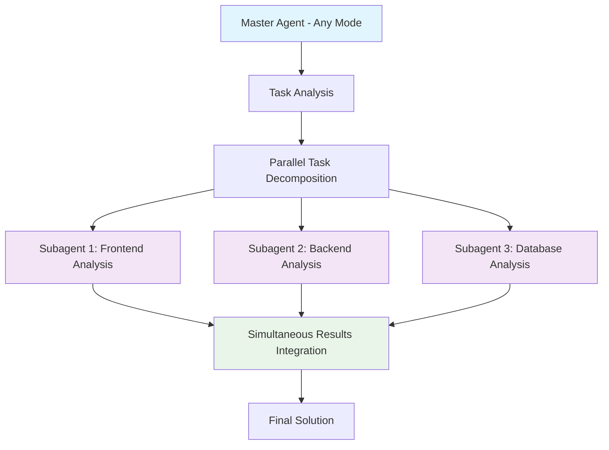

# Subagent Tool: Comprehensive Overview

## Table of Contents
- [Introduction](#introduction)
- [Core Concepts](#core-concepts)
- [When to Use Subagents](#when-to-use-subagents)
- [Architecture & Design](#architecture--design)
- [Practical Usage Guide](#practical-usage-guide)
- [Best Practices](#best-practices)
- [Advanced Patterns](#advanced-patterns)
- [Troubleshooting](#troubleshooting)
- [Performance Considerations](#performance-considerations)

## Introduction

The **subagent tool** is a powerful parallel execution mechanism in Zentara Code, designed to enable simultaneous, autonomous task execution. It allows any mode to decompose complex tasks into smaller, independent subtasks that can be executed in parallel by specialized AI agents.

### Key Distinction: Subagent Tool vs Orchestrator Mode

**Subagent Tool (Available in ALL modes):**
- **Parallel Execution**: Multiple subagents run simultaneously
- **Cross-Mode Availability**: Can be launched from any mode (Code, Debug, Architect, etc.)
- **Independent Tasks**: Subtasks execute in complete isolation
- **Immediate Results**: All results available simultaneously when complete
- **Maximum Efficiency**: Ideal for independent, self-isolated subtasks

**Orchestrator Mode (Dedicated mode):**
- **Sequential Execution**: Subtasks run one after another
- **Mode-Specific**: A dedicated mode for complex project coordination
- **Dependent Tasks**: Later tasks can build on earlier task results
- **Progressive Results**: Results available as each subtask completes
- **Complex Coordination**: Handles interdependent workflows

### When to Choose Which Approach

**Use Subagent Tool when:**
- Tasks are **independent** and can run in parallel
- You need **maximum speed** through parallel processing
- Tasks are **well-isolated** with no dependencies
- You're in any mode and need parallel assistance
- Subtasks don't need results from other subtasks

**Use Orchestrator Mode when:**
- Tasks have **sequential dependencies**
- Later tasks need results from earlier tasks
- You need **complex project coordination**
- You want **progressive feedback** as tasks complete
- Tasks must be executed in a specific order

### Key Benefits of Subagent Tool

- **Parallel Execution**: Multiple tasks run simultaneously, dramatically reducing overall completion time
- **Context Preservation**: Master agent maintains clean context by delegating detailed work to subagents
- **Specialized Processing**: Each subagent focuses on a specific, well-defined task
- **Universal Availability**: Can be used from any mode for parallel assistance
- **Scalability**: Handle complex, multi-faceted projects efficiently
- **Fault Isolation**: Issues in one subagent don't affect others

## Core Concepts

### Master Agent vs Subagents

**Master Agent (Current Mode)**:
- **Orchestrator**: Breaks down complex tasks into parallel subtasks
- **Coordinator**: Ensures no overlap or conflicts between subagent tasks
- **Integrator**: Synthesizes results from all subagents into cohesive solutions
- **Context Manager**: Preserves valuable context window for high-level coordination

**Subagents**:
- **Autonomous**: Execute tasks independently without master agent intervention
- **Isolated**: Start with clean context, no access to conversation history
- **Specialized**: Focus on single, well-defined objectives
- **Time-bounded**: Must complete within 5-minute execution limit

### Types of Subagents

Zentara Code supports two types of subagents, each designed for different use cases:

**1. General Subagents**
- **Custom Instructions**: You provide complete task instructions
- **Flexible Approach**: Adapt to any task or workflow
- **Ad-hoc Usage**: Perfect for unique, one-time tasks
- **Full Control**: You define the methodology and approach

**2. Predefined Agents**
- **Specialized Workflows**: Follow prescribed, proven methodologies
- **Consistent Quality**: Enforce standardized approaches for common tasks
- **Reusable Templates**: Save time on repetitive task types
- **Best Practices**: Built-in expertise for specific domains (code review, bug investigation, etc.)

Predefined agents combine your specific task inputs with pre-built expert workflows, ensuring consistent, high-quality results for common development tasks. For detailed information on creating, using, and managing predefined agents, see the [Predefined Agents User Guide](./predefined-agents-user-guide.md).

### Context Isolation

Each subagent operates in complete isolation:

```
Master Agent Context: [Full conversation history, user context, project state]
                     ↓
Subagent Context: [Only specific task instructions + system capabilities]
```

This isolation provides:
- **Fresh perspective** on each task
- **No cross-contamination** between agents
- **Focused execution** without distractions
- **Parallel processing** without conflicts

## When to Use Subagents

### ✅ Mandatory Use Cases

**ALWAYS use subagents for:**

1. **Code Search & Analysis**
   - Finding files, functions, or patterns across codebase
   - Understanding existing implementations
   - Analyzing dependencies and relationships

2. **Parallel Task Decomposition**
   - Tasks that can be broken into independent subtasks
   - Different aspects of the same problem (UI vs API vs data)
   - Different architectural layers (frontend/backend/database)

3. **Context-Heavy Operations**
   - Reading and analyzing large files
   - Searching across multiple files
   - Generating boilerplate code

4. **Well-Scoped Tasks**
   - Describable in under 1000 words
   - Clear input/output requirements
   - Minimal dependencies on conversation context

### ❌ When NOT to Use Subagents

**Avoid subagents for:**

- **Simple, single-step tasks** (e.g., "What's 2+2?")
- **Tasks requiring user interaction** or feedback
- **Sequential dependencies** where tasks must run in order
- **Shared state requirements** where agents need to coordinate
- **Highly interactive tasks** requiring conversation context
- **Tasks with overlapping scopes** that would conflict

**Use Orchestrator Mode instead when:**
- Tasks have sequential dependencies
- Later tasks need results from earlier tasks
- Complex project coordination is required

## Architecture & Design

### Critical Design Limitation

**Subagents CANNOT launch nested subagents**. This architectural constraint means:

- Master agent must handle ALL task decomposition
- Large tasks given to subagents may timeout or fail
- Small, focused subtasks are essential for success

### Execution Model



### Scope Separation Requirements

**CRITICAL**: Subtasks MUST have zero overlap:

- **File Isolation**: Different file paths/directories
- **Domain Isolation**: Different functional areas
- **Layer Isolation**: Different architectural layers
- **Module Isolation**: Different packages/services

## Practical Usage Guide

### Basic Syntax

**Single Subagent:**
```xml
<subagent>
{
  "description": "Brief 3-5 word description",
  "message": "Detailed instructions for the agent"
}
</subagent>
```

**Multiple Subagents (Parallel Execution):**
```xml
<subagent>
[
  {
    "description": "Analyze frontend",
    "message": "Use 'glob' to find React components in src/components/. Use lsp_get_document_symbols to analyze structure. SCOPE: Frontend components only."
  },
  {
    "description": "Analyze backend",
    "message": "Use 'glob' to find API routes in src/api/. Use lsp_get_document_symbols to analyze endpoints. SCOPE: Backend API only."
  },
  {
    "description": "Analyze database",
    "message": "Use 'glob' to find models in src/models/. Use lsp_get_document_symbols to analyze schemas. SCOPE: Database models only."
  }
]
</subagent>
```

### Small Subtask Strategy

**ALWAYS prefer small, focused subtasks:**

- **< 3 steps** to complete
- **< 5 minutes** execution time
- **Well-isolated** and self-sufficient
- **Minimal context** required

### Iterative Execution Pattern

1. **Discovery Phase**: Launch small analysis subtasks in parallel
2. **Analysis Phase**: Process all results simultaneously
3. **Implementation Phase**: Launch implementation subtasks based on findings
4. **Validation Phase**: Launch testing/verification subtasks in parallel

## Best Practices

### 1. Task Scoping

**✅ Good Example:**
```json
{
  "description": "Analyze user service",
  "message": "Use lsp_get_document_symbols on src/services/UserService.ts. Use lsp_find_usages to find all references. Report: 1) Service structure, 2) Dependencies, 3) Usage patterns. SCOPE: UserService only."
}
```

**❌ Bad Example:**
```json
{
  "description": "Analyze everything",
  "message": "Analyze the entire codebase and tell me how it works."
}
```

### 2. Scope Separation (Critical for Parallel Execution)

**✅ Properly Separated:**
```json
[
  {
    "description": "Frontend analysis",
    "message": "Analyze React components in src/components/ only. SCOPE: Frontend UI layer."
  },
  {
    "description": "Backend analysis", 
    "message": "Analyze Express routes in src/routes/ only. SCOPE: Backend API layer."
  },
  {
    "description": "Database analysis",
    "message": "Analyze Mongoose models in src/models/ only. SCOPE: Database layer."
  }
]
```

**❌ Overlapping Scopes (Will Cause Conflicts):**
```json
[
  {
    "description": "User features",
    "message": "Analyze user authentication system."
  },
  {
    "description": "Auth system",
    "message": "Review user login functionality."  // OVERLAPS!
  }
]
```

### 3. Tool Usage Guidelines

**Mandatory LSP Workflow for Code Analysis:**

1. **Structure First**: Use `lsp_get_document_symbols` for file overview
2. **Dependencies**: Use `lsp_find_usages` to understand connections
3. **Relationships**: Use `lsp_get_call_hierarchy` for function flows
4. **Exploration**: Use `lsp_get_symbol_children` for symbol structure
5. **Extraction**: Use `lsp_get_symbol_code_snippet` for targeted code

**Discovery Tools:**
- **File structure**: Use `glob` with patterns like `**/*.{js,ts}`
- **Content search**: Use `search_files` for patterns like `TODO` or `function\s+\w+`

### 4. Error Handling

**Specify behavior for partial completion:**
```json
{
  "description": "Process user data",
  "message": "Process user records from database. If any record fails validation, log the error and continue with remaining records. Report: 1) Successful count, 2) Failed count, 3) Error details."
}
```

## Advanced Patterns

### 1. Microservices Migration (Parallel Analysis)

```json
[
  {
    "description": "Service boundaries",
    "message": "Analyze src/services/ to identify service boundaries. Use lsp_get_document_symbols and lsp_find_usages. SCOPE: Service files only."
  },
  {
    "description": "API contracts",
    "message": "Define API contracts in src/api/contracts/. Use lsp_get_document_symbols to analyze existing endpoints. SCOPE: API contract files only."
  },
  {
    "description": "Data models",
    "message": "Separate data models in src/models/. Use lsp_get_document_symbols and lsp_find_usages. SCOPE: Database model files only."
  },
  {
    "description": "Integration tests",
    "message": "Analyze integration tests in tests/integration/. Use glob to find test files. SCOPE: Integration test files only."
  }
]
```

### 2. Security Audit (Parallel Security Analysis)

```json
[
  {
    "description": "Vulnerability scan",
    "message": "Scan package.json and dependencies for vulnerabilities. Use search_files for known vulnerable patterns. SCOPE: Dependencies only."
  },
  {
    "description": "Auth analysis",
    "message": "Analyze authentication in src/auth/. Use lsp_get_document_symbols and lsp_find_usages. SCOPE: Auth module only."
  },
  {
    "description": "Input validation",
    "message": "Check input validation in src/validators/. Use search_files for validation patterns. SCOPE: Validation layer only."
  },
  {
    "description": "Security tests",
    "message": "Review security tests in tests/security/. Use glob to find security test files. SCOPE: Security tests only."
  }
]
```

### 3. Performance Optimization (Parallel Performance Analysis)

```json
[
  {
    "description": "Bundle analysis",
    "message": "Analyze bundle size and imports. Use search_files for import patterns. SCOPE: Build and import analysis only."
  },
  {
    "description": "Database queries",
    "message": "Optimize database queries in src/queries/. Use lsp_get_document_symbols. SCOPE: Database query files only."
  },
  {
    "description": "Memory usage",
    "message": "Check memory usage patterns in src/utils/. Use search_files for memory-related patterns. SCOPE: Utility functions only."
  },
  {
    "description": "Async patterns",
    "message": "Review async/await patterns. Use search_files for Promise and async patterns. SCOPE: Async code analysis only."
  }
]
```

## Troubleshooting

### Common Issues

**1. Subagent Timeout (5-minute limit)**
- **Cause**: Task too large or complex
- **Solution**: Break into smaller, more focused subtasks

**2. Overlapping Scopes**
- **Cause**: Multiple subagents working on same files/domains
- **Solution**: Ensure complete scope separation

**3. Context Dependency**
- **Cause**: Subagent needs conversation context
- **Solution**: Include all necessary context in the message

**4. Sequential Dependencies**
- **Cause**: One task needs results from another
- **Solution**: Use Orchestrator mode instead, or run in batches

### Debugging Tips

**Check Scope Separation:**
```
□ Each subtask targets different files/directories?
□ Each subtask addresses different functional domains?
□ No two subtasks could conflict if run simultaneously?
□ Each subtask can complete independently?
```

**Verify Task Size:**
```
□ Can be completed in < 3 steps?
□ Can be completed in < 5 minutes?
□ Has clear, measurable outcome?
□ Doesn't require conversation context?
```

### Real-Time Debugging

**Monitor Subagent Execution in Real-Time:**

For the best debugging experience when working with subagents, monitor their execution in real-time through VS Code's Output panel:

1. **Open Output Panel**: `View` → `Output` (or `Ctrl+Shift+U` / `Cmd+Shift+U`)
2. **Select Zentara Channel**: In the dropdown, select "Zentara Code"
3. **Watch Live Logs**: See detailed subagent execution logs, tool usage, and error messages as they happen

This is especially valuable for subagents since they work in parallel and you can see exactly what each agent is doing, which tools they're using, and any issues they encounter during execution.

## Performance Considerations

### Optimization Strategies

**1. Batch Similar Operations**
- Group related file analysis tasks
- Combine similar search patterns
- Minimize tool switching overhead

**2. Scope Optimization**
- Use specific file patterns in glob searches
- Limit search scope to relevant directories
- Avoid overly broad analysis tasks

**3. Resource Management**
- Limit concurrent subagents (typically 3-5 optimal)
- Balance task complexity vs parallelism
- Monitor execution time and adjust task size

### Best Performance Patterns

**Efficient Parallel Discovery:**
```json
[
  {
    "description": "Find config files",
    "message": "Use glob '*.{json,yml,yaml}' at root level. Report project type and dependencies."
  },
  {
    "description": "Map source structure",
    "message": "Use glob 'src/**/*.{js,ts,jsx,tsx}' to map source files. Report file organization."
  },
  {
    "description": "Identify test files",
    "message": "Use glob '**/*.{test,spec}.{js,ts}' to find tests. Report test coverage areas."
  }
]
```

**Efficient Parallel Analysis:**
```json
[
  {
    "description": "Analyze components",
    "message": "Use lsp_get_document_symbols on 3 representative files from src/components/. Report component patterns."
  },
  {
    "description": "Analyze services",
    "message": "Use lsp_get_document_symbols on 3 representative files from src/services/. Report service patterns."
  },
  {
    "description": "Analyze utilities",
    "message": "Use lsp_get_document_symbols on 3 representative files from src/utils/. Report utility patterns."
  }
]
```

---

## Summary

The subagent tool is your primary weapon for **parallel task execution** across all modes in Zentara Code. Unlike Orchestrator mode's sequential approach, subagents excel at **independent, simultaneous processing** of well-isolated subtasks.

**Key Takeaways:**
- Use for **independent, parallel tasks**
- Ensure **complete scope separation**
- Keep tasks **small and focused** (< 3 steps, < 5 minutes)
- Available in **all modes** for maximum flexibility
- Choose over Orchestrator mode when tasks don't have dependencies

Master the subagent tool to dramatically accelerate your development workflow through intelligent parallel processing.