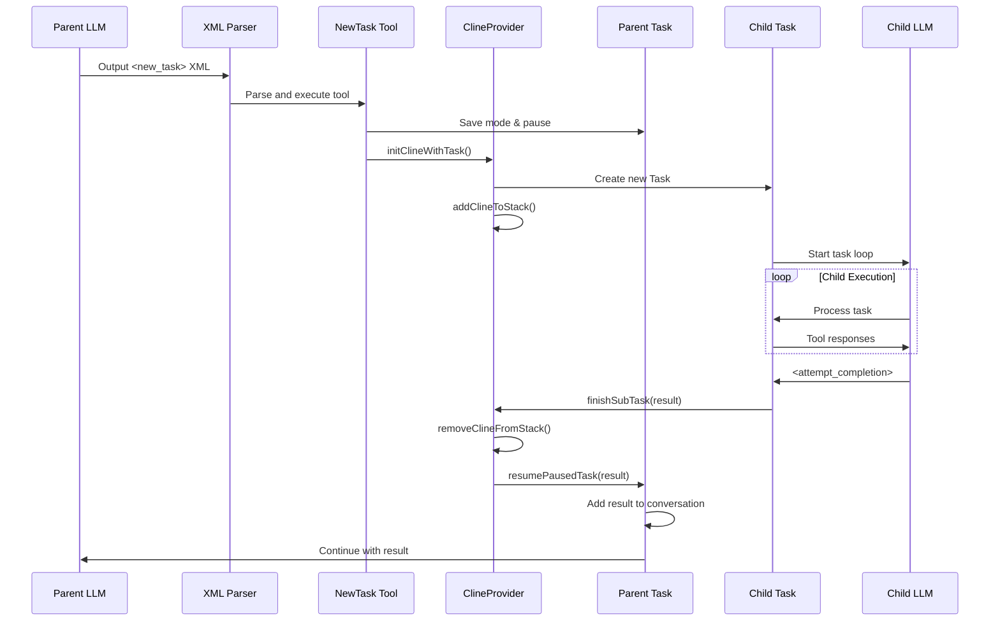

# NewTask Tool: Sequential Task Execution Documentation

## Table of Contents

1. [Overview](#overview)
2. [Tool Definition and Registration](#tool-definition-and-registration)
3. [LLM Tool Invocation](#llm-tool-invocation)
4. [Parent-Child Task Relationship](#parent-child-task-relationship)
5. [Child Task Execution](#child-task-execution)
6. [Result Return Flow](#result-return-flow)
7. [NewTask vs Subagent Comparison](#newtask-vs-subagent-comparison)
8. [Complete Sequence Diagram](#complete-sequence-diagram)
9. [Code Examples](#code-examples)

## Overview

The NewTask tool enables an AI assistant to spawn child tasks in different modes, creating a hierarchical task execution system with **sequential** execution (one task at a time). This contrasts with the Subagent tool which enables parallel execution. This document details the complete flow from when the LLM decides to use the NewTask tool until the child task completes and returns results to the parent.

**Key Characteristics:**

- Sequential execution using a LIFO stack
- Mode switching capability (code, architect, debug)
- Parent task pauses during child execution
- Immediate resumption upon child completion
- Deprecated in favor of subagents for most use cases

## Tool Definition and Registration

### Tool Definition (`src/core/prompts/tools/new-task.ts`)

The NewTask tool is defined with:

- **Required Parameters**:
    - `mode`: The mode to run the subtask in (e.g., "code", "architect", "debug")
    - `message`: The task description for the child
- **Restrictions**: Cannot be used by subagents (prevents recursive task spawning)
- **Status**: Considered deprecated - subagents are preferred for task decomposition

### Tool Registration

The tool is registered in multiple locations:

- `/packages/types/src/tool.ts` - In the `toolNames` array as `"new_task"`
- `/src/schemas/index.ts` - Duplicated for schema validation
- `/src/core/prompts/tools/index.ts` - Maps `"new_task"` to `getNewTaskDescription`

## LLM Tool Invocation

### 1. LLM Output Format

When the LLM decides to create a subtask, it outputs an XML block:

```xml
<new_task>
<mode>debug</mode>
<message>Debug the authentication issue in the login flow</message>
</new_task>
```

### 2. Streaming and Parsing Flow

```typescript
// src/core/task/Task.ts - During response streaming
case "text":
    assistantMessage += chunk.text
    this.assistantMessageContent = parseAssistantMessage(assistantMessage)
    presentAssistantMessage(this)
    break
```

### 3. XML Parsing (`src/core/assistant-message/parseAssistantMessage.ts`)

The parser:

1. Detects opening tag `<new_task>` by matching against `toolNames` array
2. Creates a `ToolUse` object with `partial: true`
3. Parses parameter tags (`<mode>`, `<message>`)
4. Marks as complete (`partial: false`) when closing tag `</new_task>` is found

### 4. Tool Execution (`src/core/assistant-message/presentAssistantMessage.ts`)

When a complete `new_task` block is detected:

```typescript
case "new_task":
    await newTaskTool(cline, block, askApproval, handleError, pushToolResult, removeClosingTag)
    break
```

## Parent-Child Task Relationship

### 1. Task Creation (`src/core/tools/newTaskTool.ts`)

```typescript
// Save parent's current mode
const pausedModeSlug = cline.modeSlug

// Switch to requested mode
await cline.switchMode(modeSlug)

// Create child task with parent reference
await provider.initClineWithTask(
	message,
	undefined,
	cline, // parent task reference
	false, // is_parallel = false (sequential execution)
	{ startTask: true, skipWritingFileForSubtask: skipWritingFile },
)

// Pause parent task
cline.isPaused = true
cline.emit("taskPaused")
```

### 2. Task Hierarchy (`src/core/webview/ClineProvider.ts`)

```typescript
const cline = new Task({
	// ... other config
	rootTask: this.clineStack.length > 0 ? this.clineStack[0] : undefined,
	parentTask, // Direct parent reference
	taskNumber: this.clineStack.length + 1,
})

// Add to stack (LIFO execution)
await this.addClineToStack(cline)
```

### 3. Stack Management

- **clineStack**: Array for sequential task execution (LIFO)
- **rootTask**: Always points to the first task in the stack
- **parentTask**: Points to the immediate parent
- **taskNumber**: Based on stack depth

## Child Task Execution

### 1. Task Initialization

The child task:

1. Inherits workspace path from parent
2. Gets its own unique `taskId` and `instanceId`
3. Has access to the same providers and configuration
4. Starts with empty conversation history

### 2. Independent Execution

```typescript
// Child task runs its own task loop
private async startTask(task?: string, images?: string[]): Promise<void> {
    this.clineMessages = []  // Fresh conversation
    this.apiConversationHistory = []

    await this.say("text", task, images)
    await this.initiateTaskLoop([
        { type: "text", text: `<task>\n${task}\n</task>` }
    ])
}
```

### 3. Parent Task Pausing

While child executes, parent waits:

```typescript
public async waitForResume() {
    await new Promise<void>((resolve) => {
        this.pauseInterval = setInterval(() => {
            if (!this.isPaused) {
                clearInterval(this.pauseInterval)
                resolve()
            }
        }, 1000)  // Check every second
    })
}
```

## Result Return Flow

### 1. Child Task Completion (`src/core/tools/attemptCompletionTool.ts`)

When the child task completes:

```typescript
// Child task outputs completion result
await cline.say("completion_result", result)
cline.emit("taskCompleted", cline.taskId, tokenUsage, toolUsage)

// If it has a parent, finish subtask
if (cline.parentTask) {
	const didApprove = await askFinishSubTaskApproval()
	if (didApprove) {
		await cline.providerRef.deref()?.finishSubTask(result)
	}
}
```

### 2. Provider Cleanup (`src/core/webview/ClineProvider.ts`)

```typescript
async finishSubTask(lastMessage: string, cline?: Task) {
    // Remove child from stack
    if (cline) {
        await this.removeClineFromSet(cline)  // For parallel tasks
    } else {
        await this.removeClineFromStack()      // For sequential tasks
    }

    // Resume parent with result
    await this.getCurrentCline()?.resumePausedTask(lastMessage)
}
```

### 3. Parent Task Resumption (`src/core/task/Task.ts`)

```typescript
public async resumePausedTask(lastMessage: string) {
    // Unpause
    this.isPaused = false
    this.emit("taskUnpaused")

    // Show result in UI
    await this.say("subtask_result", lastMessage)

    // Add to API conversation so parent AI knows the result
    await this.addToApiConversationHistory({
        role: "user",
        content: [{
            type: "text",
            text: `[new_task completed] Result: ${lastMessage}`
        }],
    })
}
```

### 4. Cleanup and Disposal

The child task is properly disposed:

- `abortTask(true)` sets `abandoned = true`
- `dispose()` cleans up all resources
- Conversation history is saved to disk
- Task object is removed from memory

## NewTask vs Subagent Comparison

### Execution Model Differences

| Feature             | NewTask (Sequential)           | Subagent (Parallel)            |
| ------------------- | ------------------------------ | ------------------------------ |
| **Execution**       | One at a time (LIFO stack)     | Multiple concurrent (Set)      |
| **Storage**         | `clineStack[]`                 | `clineSet`                     |
| **Parent State**    | Paused, waits for single child | Paused, waits for ALL children |
| **Mode Switching**  | Supports different modes       | Inherits parent mode           |
| **Result Handling** | Immediate single result        | Aggregated results             |
| **Use Case**        | Sequential dependent tasks     | Independent parallel tasks     |
| **Performance**     | Slower (sequential)            | Faster (parallel)              |
| **Context**         | Inherits some parent context   | Clean slate                    |
| **Restrictions**    | None                           | Cannot spawn subagents         |
| **Status**          | Deprecated                     | Preferred approach             |

### When to Use Each

**Use NewTask when:**

- Tasks must execute in a specific order
- Child task needs different mode (architect, debug)
- Legacy compatibility required

**Use Subagent when (preferred):**

- Tasks can run independently
- Need to maximize performance
- Want clean context isolation
- Decomposing complex work into parallel streams

## Complete Sequence Diagram



## Code Examples

### Example 1: Simple Subtask

**Parent LLM Output:**

```xml
I'll create a subtask to handle the database migration.

<new_task>
<mode>code</mode>
<message>Create a database migration script to add a 'last_login' timestamp field to the users table</message>
</new_task>
```

**Child Task Execution:**

- Switches to "code" mode
- Creates migration script
- Returns completion result

**Parent Receives:**

```
[new_task completed] Result: I've created the database migration script at migrations/add_last_login_to_users.sql that adds a 'last_login' timestamp field to the users table with a default value of NULL.
```

### Example 2: Debug Mode Subtask

**Parent LLM Output:**

```xml
I'll switch to debug mode to investigate this issue.

<new_task>
<mode>debug</mode>
<message>Debug why the authentication middleware is not properly validating JWT tokens on the /api/profile endpoint</message>
</new_task>
```

**Child Task Execution:**

- Switches to "debug" mode with specialized tools
- Sets breakpoints and inspects variables
- Identifies the issue

**Parent Receives:**

```
[new_task completed] Result: Found the issue: The JWT secret was not being properly loaded from environment variables in production. The middleware was using a default secret instead. Fixed by updating the config loader to properly read JWT_SECRET from process.env.
```

### Example 3: Hierarchical Subtasks

Tasks can be nested multiple levels deep:

```
Task A (root task, mode: architect)
  ├─ Task B (parent: A, mode: code)
  │   └─ Task C (parent: B, mode: debug)
  └─ Task D (parent: A, mode: code)
```

Each task maintains its own:

- Conversation history
- Token usage tracking
- Mode configuration
- Tool execution context

## Key Design Decisions

### 1. Result Isolation

Only the final result string is passed between tasks, not the full conversation. This:

- Keeps parent context focused
- Prevents token count explosion
- Maintains clear task boundaries

### 2. Mode Switching

Child tasks can run in different modes than their parents, enabling:

- Specialized tool access
- Mode-specific system prompts
- Targeted problem solving

### 3. Stack-Based Execution

Sequential execution via stack ensures:

- Predictable task ordering
- Simple parent-child relationships
- Easy resource cleanup

### 4. Approval Gates

User approval required at key points:

- Before creating subtask
- Before finishing subtask (optional)
- Maintains user control

## Performance Considerations

1. **Memory Management**: Child tasks are fully disposed after completion
2. **Token Efficiency**: Only result summaries passed between tasks
3. **Parallel Capability**: Infrastructure exists for parallel execution via `clineSet`
4. **History Persistence**: Each task's history saved to disk for debugging/resumption

## Error Handling

The system handles various error scenarios:

- Invalid mode selection
- Task creation failures
- Cleanup on abort
- Parent task recovery if child fails

## Future Enhancements

The architecture supports potential enhancements:

- Parallel subtask execution (already partially implemented)
- Inter-task communication beyond results
- Subtask result caching
- Advanced task scheduling algorithms
