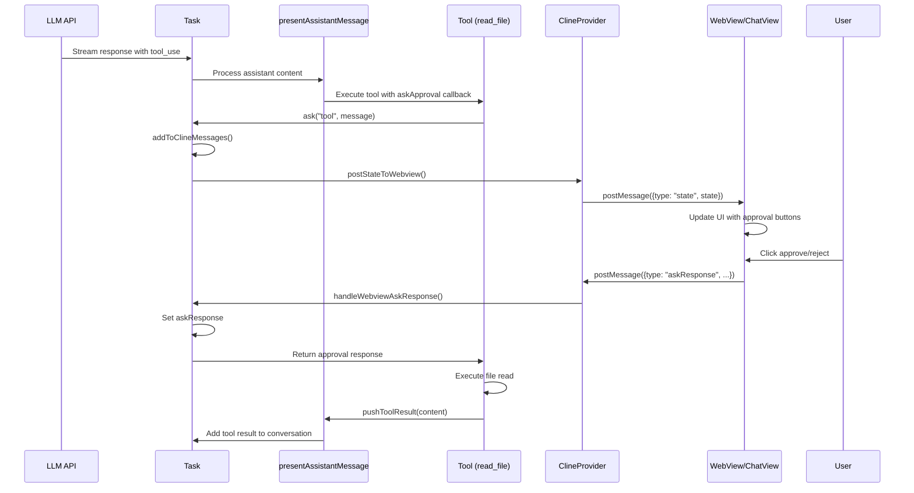
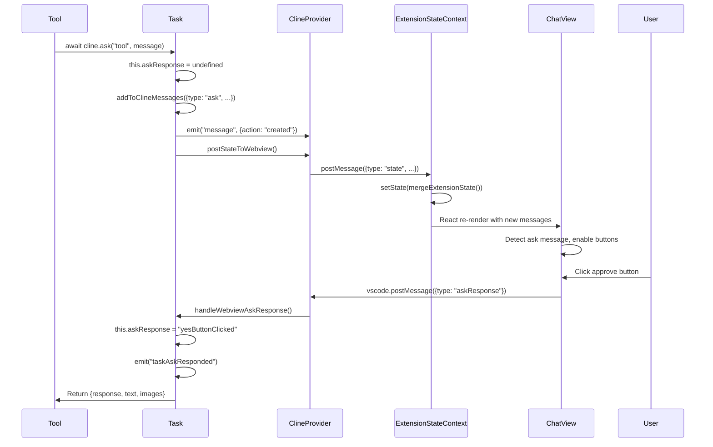

# Tool Invocation Flow in Sequential Tasks (NewTask)

## Overview

This document provides a comprehensive analysis of the data flow cycle when a tool (using `read_file` as an example) is invoked by the LLM in a sequential task session created via the NewTask tool. It covers the complete flow from LLM tool invocation through approval, execution, and response.

**Note:** This flow applies to sequential task execution. For parallel execution with subagents, see [SUBAGENT_TASK_TOOL_INVOCATION_FLOW.md](./SUBAGENT_TASK_TOOL_INVOCATION_FLOW.md).

## Table of Contents

1. [High-Level Flow Overview](#high-level-flow-overview)
2. [Detailed Flow Components](#detailed-flow-components)
3. [Message Passing Architecture](#message-passing-architecture)
4. [Tool Invocation Process](#tool-invocation-process)
5. [AskResponse Event Flow](#askresponse-event-flow)
6. [WebUI Update Process](#webui-update-process)
7. [Sequence Diagrams](#sequence-diagrams)
8. [Code Paths and Functions](#code-paths-and-functions)

## High-Level Flow Overview

The tool invocation flow follows this general pattern:

1. **LLM generates tool use request** → Parsed from streaming response
2. **Tool execution initiated** → `presentAssistantMessage` processes tool blocks
3. **Ask approval sent** → Task emits ask event to webview
4. **User responds** → WebUI sends askResponse back
5. **Tool executes** → Performs requested operation
6. **Result returned** → Tool result added to conversation

## Detailed Flow Components

### 1. LLM Streaming and Content Parsing

When the LLM responds with a tool use request, it arrives as part of a streaming response:

```typescript
// In Task.ts - recursivelyMakeClineRequests()
const stream = this.api.createMessage(systemPrompt, cleanConversationHistory, metadata)
const assistantMessage = await ApiStream.extractAssistantMessage(
	this.api.getModel().info.supportsReasoningBudget,
	stream,
	(chunk) => this.handleApiStreamChunk(chunk),
)
```

The stream contains content blocks that may include tool use requests:

```xml
<read_file>
<path>src/example.ts</path>
</read_file>
```

### 2. Assistant Message Processing

The `presentAssistantMessage` function in `/src/core/assistant-message/presentAssistantMessage.ts` is the core message handler:

```typescript
export async function presentAssistantMessage(cline: Task) {
	// Process content blocks sequentially
	const block = cline.assistantMessageContent[cline.currentStreamingContentIndex]

	switch (block.type) {
		case "text":
			// Display text to user
			await cline.say("text", content, undefined, block.partial)
			break

		case "tool_use":
			// Handle tool execution with proper dispatching
			const toolHandler = TOOL_HANDLERS[block.name]
			if (toolHandler) {
				await toolHandler(cline, block, askApproval, handleError, pushToolResult, removeClosingTag)
			}
			break
	}
}
```

### 3. Tool Execution Flow

Using `read_file` as an example, the tool execution follows this pattern:

```typescript
// In readFileTool.ts
export async function readFileTool(
	cline: Task,
	block: ToolUse,
	askApproval: AskApproval,
	handleError: HandleError,
	pushToolResult: PushToolResult,
	removeClosingTag: RemoveClosingTag,
) {
	// 1. Parse parameters
	const relPath = block.params.path
	const fullPath = path.resolve(cline.cwd, relPath)

	// 2. Check permissions and ask for approval
	const completeMessage = JSON.stringify({
		tool: "readFile",
		path: getReadablePath(cline.cwd, relPath),
		isOutsideWorkspace,
		content: fullPath,
	} satisfies ClineSayTool)

	// 3. Ask user for approval
	const { response, text, images } = await cline.ask("tool", completeMessage, false)

	// 4. Handle response
	if (response !== "yesButtonClicked") {
		pushToolResult(formatResponse.toolDenied())
		return
	}

	// 5. Execute tool operation
	const content = await extractTextFromFile(fullPath)

	// 6. Return result
	pushToolResult(`<file><path>${relPath}</path>\n<content>${content}</content>\n</file>`)
}
```

## Message Passing Architecture

### Communication Channels

1. **Extension → WebView**: Via `postMessageToWebview()`
2. **WebView → Extension**: Via `vscode.postMessage()`
3. **Task Events**: Via EventEmitter pattern

### Message Types

```typescript
// Extension to WebView messages
interface ExtensionMessage {
    type: "state" | "messageUpdated" | "action" | ...
    // Message-specific properties
}

// WebView to Extension messages
interface WebviewMessage {
    type: "askResponse" | "newTask" | "clearTask" | ...
    // Message-specific properties
}
```

## Tool Invocation Process

### Step 1: Tool Request Detection

When `presentAssistantMessage` encounters a tool_use block:

```typescript
const askApproval: AskApproval = async (type, text, partial, progressStatus) => {
	const isProtected = await cline.checkProtectedPaths(block, fullPath)
	const response = await cline.ask(type, text, partial, progressStatus, isProtected || false)
	return response !== "yesButtonClicked" ? false : true
}
```

### Step 2: Ask Method Implementation

The `ask` method in Task.ts handles approval requests:

```typescript
async ask(
    type: ClineAsk,
    text?: string,
    partial?: boolean,
    progressStatus?: ToolProgressStatus,
    isProtected?: boolean,
): Promise<{ response: ClineAskResponse; text?: string; images?: string[] }> {
    // 1. Clear previous response state
    this.askResponse = undefined
    this.askResponseText = undefined
    this.askResponseImages = undefined

    // 2. Add ask message to conversation
    const askTs = Date.now()
    this.lastMessageTs = askTs
    await this.addToClineMessages({ ts: askTs, type: "ask", ask: type, text, isProtected })

    // 3. Wait for user response
    await pWaitFor(() => this.askResponse !== undefined || this.lastMessageTs !== askTs)

    // 4. Emit event and return response
    this.emit("taskAskResponded")
    return { response: this.askResponse!, text: this.askResponseText, images: this.askResponseImages }
}
```

### Step 3: Message Addition and State Update

```typescript
private async addToClineMessages(message: ClineMessage) {
    // 1. Add to local message array
    this.clineMessages.push(message)

    // 2. Update WebView state
    const provider = this.providerRef.deref()
    await provider?.postStateToWebview()

    // 3. Emit message event
    this.emit("message", { action: "created", message })

    // 4. Persist to storage
    await this.saveClineMessages()
}
```

## AskResponse Event Flow

### WebView Side - ChatView Component

The ChatView component listens for state updates and renders approval UI:

```typescript
// In ChatView.tsx
useDeepCompareEffect(() => {
	const lastMessage = messages.at(-1)

	if (lastMessage?.type === "ask") {
		switch (lastMessage.ask) {
			case "tool":
				setClineAsk(lastMessage.ask)
				setEnableButtons(true)
				setPrimaryButtonText("Approve")
				setSecondaryButtonText("Reject")
				break
		}
	}
}, [lastMessage, secondLastMessage])
```

### User Interaction Handling

When user clicks approve/reject:

```typescript
const handlePrimaryButtonClick = useCallback(
	(text?: string, images?: string[]) => {
		switch (clineAsk) {
			case "tool":
				vscode.postMessage({
					type: "askResponse",
					askResponse: "yesButtonClicked",
					text: trimmedInput,
					images: images,
				})
				break
		}
		setEnableButtons(false)
	},
	[clineAsk],
)
```

### Extension Side - Response Handling

The webviewMessageHandler processes the response:

```typescript
// In webviewMessageHandler.ts
case "askResponse":
    provider.getCurrentCline()?.handleWebviewAskResponse(
        message.askResponse!,
        message.text,
        message.images
    )
    break
```

Which updates the Task's response state:

```typescript
async handleWebviewAskResponse(askResponse: ClineAskResponse, text?: string, images?: string[]) {
    this.askResponse = askResponse
    this.askResponseText = text
    this.askResponseImages = images
}
```

## WebUI Update Process

### State Broadcasting

The ClineProvider maintains and broadcasts state:

```typescript
async postStateToWebview() {
    const state = await this.getStateToPostToWebview()
    this.postMessageToWebview({ type: "state", state })
}
```

### State Merging in WebView

The ExtensionStateContext handles incoming state:

```typescript
const handleMessage = useCallback((event: MessageEvent) => {
	const message: ExtensionMessage = event.data
	switch (message.type) {
		case "state":
			const newState = message.state!
			setState((prevState) => mergeExtensionState(prevState, newState))
			break

		case "messageUpdated":
			const clineMessage = message.clineMessage!
			setState((prevState) => {
				const lastIndex = findLastIndex(prevState.clineMessages, (msg) => msg.ts === clineMessage.ts)
				if (lastIndex !== -1) {
					const newClineMessages = [...prevState.clineMessages]
					newClineMessages[lastIndex] = clineMessage
					return { ...prevState, clineMessages: newClineMessages }
				}
				return prevState
			})
			break
	}
}, [])
```

## Sequence Diagrams

### Complete Tool Invocation Flow



### Ask/Response Event Flow



## Code Paths and Functions

### Key Files and Functions

1. **Task Management**

    - `/src/core/task/Task.ts`
        - `ask()` - Requests user approval
        - `handleWebviewAskResponse()` - Receives user response
        - `addToClineMessages()` - Adds messages to conversation
        - `recursivelyMakeClineRequests()` - Main task loop

2. **Assistant Message Processing**

    - `/src/core/assistant-message/presentAssistantMessage.ts`
        - `presentAssistantMessage()` - Main message processor
        - Tool-specific handlers

3. **Tool Implementation**

    - `/src/core/tools/readFileTool.ts`
        - `readFileTool()` - File reading implementation
        - Approval flow and execution

4. **Provider Communication**

    - `/src/core/webview/ClineProvider.ts`
        - `postStateToWebview()` - Broadcasts state updates
        - `postMessageToWebview()` - Sends messages to WebView

5. **WebView Message Handling**

    - `/src/core/webview/webviewMessageHandler.ts`
        - Processes all WebView → Extension messages

6. **WebView Components**

    - `/webview-ui/src/components/chat/ChatView.tsx`
        - Renders chat interface and approval UI
        - Handles user interactions
    - `/webview-ui/src/context/ExtensionStateContext.tsx`
        - Manages WebView state
        - Handles Extension → WebView messages

### Event Flow Summary

1. **Tool Request**: LLM → Task → presentAssistantMessage → Tool
2. **Approval Request**: Tool → Task.ask() → Provider → WebView
3. **User Response**: WebView → Provider → Task.handleWebviewAskResponse()
4. **Tool Execution**: Tool executes with approval → Returns result
5. **Result Integration**: Tool result → Task conversation → WebView update

This architecture ensures:

- **Separation of concerns** between extension logic and UI
- **Async communication** via message passing
- **State consistency** through centralized state management
- **User control** over tool execution via approval flow
