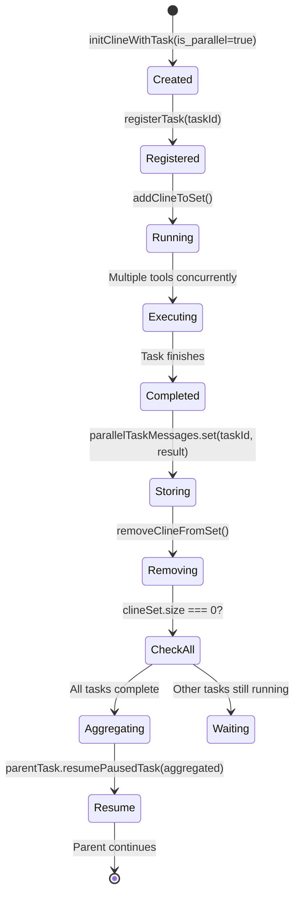
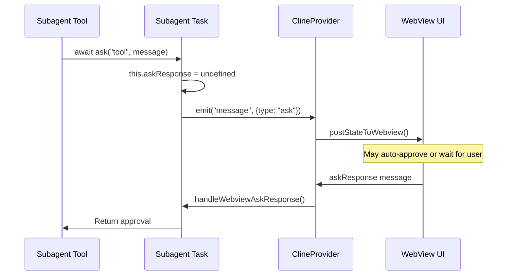
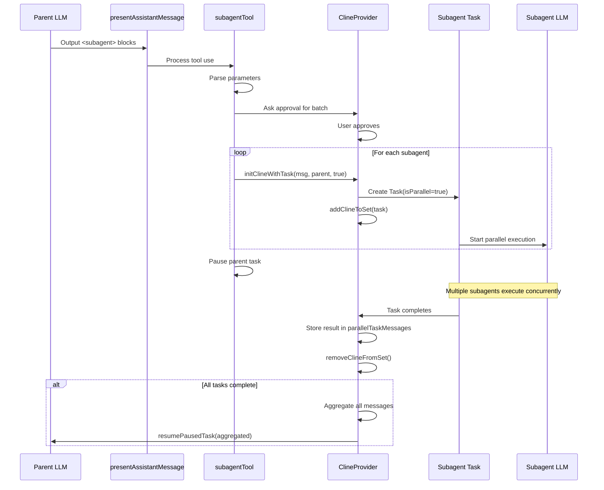
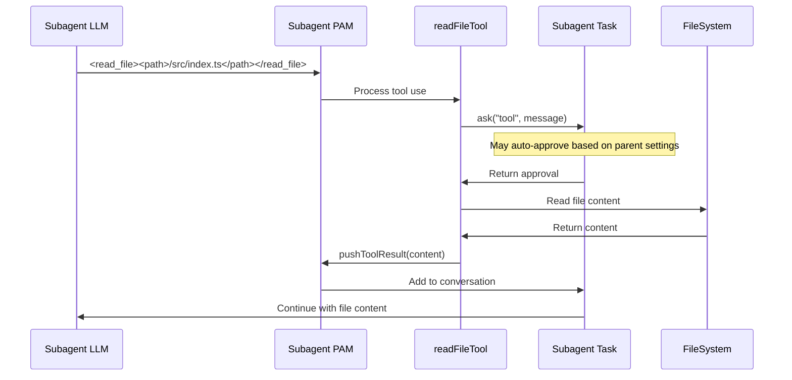
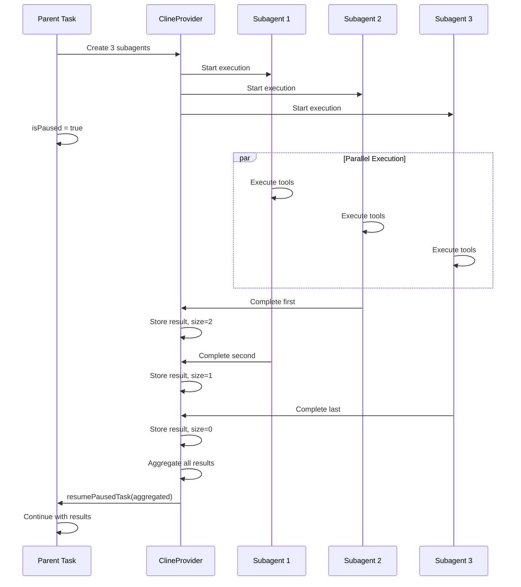

# Subagent Task Tool Invocation Flow Documentation

## Overview

This document provides comprehensive documentation about the data flow cycle when a tool is invoked by the LLM in a subagent Task session where `task.isParallel = true`. The subagent execution mode introduces parallel task execution capabilities, enabling multiple subagents to run concurrently while maintaining proper state management and communication.

**Current Implementation Status (2025):**

- Batch subagent creation fully supported
- Approval flow currently disabled (commented out in code)
- Staggered task creation with random delays (50-550ms)
- Task registry for O(1) lookup and lifecycle management
- Health monitoring logs every 30 seconds

## Table of Contents

1. [Architecture Overview](#architecture-overview)
2. [Subagent Creation Flow](#subagent-creation-flow)
3. [Tool Invocation in Subagent Context](#tool-invocation-in-subagent-context)
4. [Parallel Execution Mode](#parallel-execution-mode)
5. [Communication Channels](#communication-channels)
6. [Approval Process for Subagents](#approval-process-for-subagents)
7. [Message Handling and State Management](#message-handling-and-state-management)
8. [Key Differences from Sequential Execution](#key-differences-from-sequential-execution)
9. [Code Paths and Functions](#code-paths-and-functions)
10. [Sequence Diagrams](#sequence-diagrams)

## Architecture Overview

### Subagent vs NewTask

The system supports two task execution modes:

1. **Sequential (NewTask)**: Tasks are executed one after another using a stack (LIFO)
2. **Parallel (Subagent)**: Tasks can execute concurrently using a set

```typescript
// Sequential task management
private clineStack: Task[] = []        // LIFO stack for sequential tasks
getCurrentCline(): Task | undefined    // Returns top of stack

// Parallel task management
private clineSet: Set<Task> = new Set()     // Set for concurrent tasks
private parallelTaskMessages: Map<string, string> = new Map()  // Stores results

// Unified task registry for all tasks
private taskRegistry: Map<string, Task> = new Map()  // O(1) lookup by taskId
```

### Key Properties

The `is_parallel` parameter determines the execution mode:

```typescript
// In ClineProvider.ts
async initClineWithTask(
    task?: string,
    images?: string[],
    parentTask?: Task,
    is_parallel: boolean = false,  // Controls execution mode
    options: Partial<TaskOptions> = {}
)

// Task property
class Task {
    isParallel: boolean = false  // Set based on is_parallel parameter
}
```

## Subagent Creation Flow

### 1. Subagent Tool Invocation

When the LLM outputs a subagent tool use:

```xml
<subagent>
{
    "description": "Analyze file structure",
    "message": "Please analyze the project structure and provide a summary"
}
</subagent>
```

### 2. Tool Processing

The `subagentTool` in `/src/core/tools/subagentTool.ts` processes the request:

```typescript
export async function subagentTool(
	cline: Task,
	block: ToolUse,
	askApproval: AskApproval,
	handleError: HandleError,
	pushToolResult: PushToolResult,
	removeClosingTag: RemoveClosingTag,
) {
	// Check if current task is already a subagent (prevent nesting)
	if (cline.isParallel) {
		cline.consecutiveMistakeCount++
		cline.recordToolError("subagent")
		pushToolResult(
			formatResponse.toolError(
				"Subagents cannot launch other subagents or tasks. This operation is restricted to the main agent only.",
			),
		)
		return
	}

	// Parse parameters (supports both single and batch subagents)
	const subagentParams = JSON.parse(block.params._text)

	// Approval is currently disabled in implementation (as of 2025)
	// const didApprove = await askApproval("tool", toolMessage)
	// if (!didApprove) return

	// Add delay before creating tasks to avoid race conditions
	await delay(500)

	// Create parallel tasks
	for (const params of subagentParams) {
		// Add random delay to stagger task creation (50-550ms)
		await delay(Math.random() * 500 + 50)

		const newCline = await provider.initClineWithTask(
			params.message,
			undefined,
			cline, // parent reference
			true, // is_parallel = true
		)

		if (newCline) {
			cline.emit("taskSpawned", newCline.taskId)
			createdTasks.push(`'${params.description}' (ID: ${newCline.taskId})`)
		}
	}

	// Pause parent task
	cline.isPaused = true
	cline.emit("taskPaused")
}
```

### 3. Task Creation with Parallel Flag

In `ClineProvider.ts`:

```typescript
// Create new Task with isParallel flag
const cline = new Task({
	provider: this,
	apiConfiguration,
	task,
	images,
	rootTask: parentTask?.rootTask || rootTask,
	parentTask,
	taskNumber: this.clineStack.length + 1,
	isParallel: is_parallel, // Set parallel flag
	...options,
})

// Add to appropriate collection
if (is_parallel) {
	await this.addClineToSet(cline) // Parallel execution
} else {
	await this.addClineToStack(cline) // Sequential execution
}
```

## Tool Invocation in Subagent Context

### 1. Read File Tool Example

When a subagent invokes the `read_file` tool:

```typescript
// LLM output in subagent context
<read_file>
<path>/src/index.ts</path>
</read_file>
```

### 2. Tool Execution Flow

The flow remains similar to sequential execution but with key differences:

1. **Approval handling**: May be auto-approved based on parent's settings
2. **State updates**: Posted to webview but UI may not be visible
3. **Result handling**: Results are stored for later aggregation

```typescript
// In readFileTool.ts
export async function readFileTool(
	cline: Task, // This is the subagent task
	block: ToolUse,
	askApproval: AskApproval,
	handleError: HandleError,
	pushToolResult: PushToolResult,
) {
	// Ask for approval (may auto-approve in subagent context)
	const didApprove = await askApproval("tool", toolMessage)
	if (!didApprove) return

	// Execute file read
	const content = await fs.readFile(absolutePath, "utf-8")

	// Push result back to subagent's conversation
	pushToolResult(content)
}
```

## Parallel Execution Mode

### 1. Task State Management

Parallel tasks are managed differently:

```typescript
// In Task.ts
class Task extends EventEmitter<ClineEvents> {
	readonly taskId: string // Unique task identifier
	readonly instanceId: string // Additional instance ID for debugging
	isParallel: boolean = false // Tracks execution mode
	isPaused: boolean = false // Whether task is waiting for subtasks

	// Task hierarchy
	readonly rootTask: Task | undefined = undefined
	readonly parentTask: Task | undefined = undefined
	readonly taskNumber: number
}
```

### 2. Resource Management

The system tracks resources for parallel tasks:

- File locks to prevent conflicts
- Concurrent execution limits
- Resource usage monitoring

### 3. Task Lifecycle



## Communication Channels

### 1. Event Emission

Subagents emit events that bubble up:

```typescript
// Task events
cline.emit("taskSpawned", taskId)
cline.emit("taskPaused")
cline.emit("taskUnpaused")
cline.emit("message", { action: "created", message })
```

### 2. State Synchronization

State updates flow through the provider with task registry management:

```typescript
// State update flow
Task -> emit("message") -> Provider -> postStateToWebview() -> WebView

// Task registration flow
Task created -> registerTask(task) -> Added to taskRegistry
Task.on("disposed") -> unregisterTask(taskId) -> Removed from registry
```

### 3. Message Aggregation

Results from parallel tasks are collected:

```typescript
// In ClineProvider.ts
parallelTaskMessages: Map<string, string> = new Map()

// When subagent completes
this.parallelTaskMessages.set(cline.taskId, lastMessage)
```

## Approval Process for Subagents

### 1. Initial Approval

The parent task requests approval for creating subagents (currently commented out in implementation):

```typescript
// Initial batch approval preparation
const batchSubagents = subagentParams.map((params, index) => {
	const unescapedMessage = params.message!.replace(/\\\\@/g, "\\@")
	return {
		index: index + 1,
		description: params.description!,
		message: unescapedMessage,
		preview: unescapedMessage.substring(0, 100) + (unescapedMessage.length > 100 ? "..." : ""),
	}
})

const toolMessage = JSON.stringify({
	tool: "subagent",
	batchSubagents,
	count: subagentParams.length,
})

// Currently commented out:
// const didApprove = await askApproval("tool", toolMessage)
// if (!didApprove) return
```

### 2. Auto-Approval Settings

Subagents may inherit auto-approval settings:

```typescript
// Subagents can operate autonomously based on parent settings
if (parentTask.alwaysAllowReadOnly) {
	// Read operations may be auto-approved
}
```

### 3. Ask Response Flow for Subagents

The approval flow works similarly but with considerations for parallel execution:



## Message Handling and State Management

### 1. Message Flow

Messages in parallel execution flow through:

```typescript
// Subagent creates message
await this.addToClineMessages({
	ts: Date.now(),
	type: "ask",
	ask: type,
	text,
	isProtected,
})

// Provider receives via event
cline.on("message", ({ action, message }) => {
	// Update internal state
	// Post to webview if needed
})
```

### 2. State Updates

State updates are batched and efficient:

```typescript
async postStateToWebview() {
    const state = await this.getStateToPostToWebview()

    // Include all active tasks (stack + set)
    state.clineMessages = this.getCurrentCline()?.clineMessages || []
    state.parallelTasks = Array.from(this.clineSet).map(task => ({
        taskId: task.taskId,
        status: task.status
    }))

    this.view?.webview.postMessage({ type: "state", state })
}
```

### 3. Completion Handling

When a subagent completes:

```typescript
async finishSubTask(lastMessage: string, cline: Task | undefined = undefined) {
    console.log(`[subtasks] finishing subtask ${lastMessage}`)

    if (!cline) {
        // Fallback to old behavior if no cline provided
        await this.removeClineFromStack()
        await this.getCurrentCline()?.resumePausedTask(lastMessage)
        return
    }

    if (cline.isParallel) {
        // For parallel tasks (subagents), store the message and remove from set
        const parentTask = cline.parentTask
        this.parallelTaskMessages.set(cline.taskId, lastMessage)
        await this.removeClineFromSet(cline)

        // Only resume the parent task if all parallel tasks are finished (clineSet is empty)
        if (this.clineSet.size === 0) {
            // Concatenate all parallel task messages
            const allMessages = Array.from(this.parallelTaskMessages.values()).join("\n\n")
            // Clear the stored messages
            this.parallelTaskMessages.clear()
            // Resume parent with concatenated messages
            await parentTask?.resumePausedTask(allMessages, false)
        }
    } else {
        // For sequential tasks (new_task), remove from stack and resume current task
        await this.removeClineFromStack()
        // resume the last cline instance in the stack (if it exists - this is the 'parent' calling task)
        await this.getCurrentCline()?.resumePausedTask(lastMessage, true)
    }
}
```

## Key Differences from Sequential Execution

### 1. Task Management

| Aspect       | Sequential (NewTask) | Parallel (Subagent)      |
| ------------ | -------------------- | ------------------------ |
| Storage      | Stack (LIFO)         | Set                      |
| Execution    | One at a time        | Multiple concurrent      |
| Parent State | Paused               | Paused                   |
| Completion   | Immediate resume     | Wait for all to complete |
| Result       | Individual           | Aggregated               |

### 2. Execution Flow

**Sequential:**

```
Parent -> Pause -> Child executes -> Child completes -> Parent resumes
```

**Parallel:**

```
Parent -> Pause -> Multiple children execute concurrently -> All complete -> Aggregate results -> Parent resumes
```

### 3. State Management

```typescript
// Sequential - Simple stack management
getCurrentCline() // Returns stack top
removeClineFromStack() // Pop and resume

// Parallel - Complex set management
clineSet.size // Check completion
parallelTaskMessages // Aggregate results
```

## Code Paths and Functions

### Key Files

1. **Subagent Tool Implementation**

    - `/src/core/tools/subagentTool.ts`
        - `subagentTool()` - Main tool handler
        - Batch processing support
        - Parent task pausing

2. **Task Management**

    - `/src/core/task/Task.ts`
        - `isParallel` property
        - `resumePausedTask()` - Handles result integration
        - Event emission for state changes

3. **Provider Orchestration**

    - `/src/core/webview/ClineProvider.ts`
        - `initClineWithTask()` - Creates tasks with parallel flag
        - `addClineToSet()` / `removeClineFromSet()` - Set management
        - `finishSubTask()` - Completion handling with aggregation
        - `parallelTaskMessages` - Result storage

4. **Message Processing**

    - `/src/core/assistant-message/presentAssistantMessage.ts`
        - Tool dispatch including subagent
        - Special handling for parallel tools

5. **WebView Communication**
    - `/src/core/webview/webviewMessageHandler.ts`
        - `askResponse` handling
        - State synchronization

### Important Functions

```typescript
// Creating parallel tasks
initClineWithTask(message, images, parentTask, true)  // is_parallel = true

// Managing parallel tasks
addClineToSet(cline: Task)
removeClineFromSet(cline: Task)      // Includes cleanup and unregistration
removeAllClinesFromSet()             // Clear all parallel tasks

// Task registry management
registerTask(task: Task): void       // Add to registry and set up disposal
unregisterTask(taskId: string): void // Remove from registry and cleanup
findTaskById(taskId: string): Task | undefined

// Handling completion
finishSubTask(lastMessage: string, cline?: Task)

// Result aggregation
parallelTaskMessages: Map<string, string>

// Parent resumption
resumePausedTask(allMessages: string, say_subtask_result: boolean)

// Health monitoring
// Periodic health check logs every 30 seconds:
// - clineStack.length
// - taskRegistry.size
// - askQueue.length
// - parallelTaskMessages.size
```

## Sequence Diagrams

### 1. Complete Subagent Tool Flow



### 2. Tool Invocation Within Subagent



### 3. Parallel Execution and Result Aggregation



## Summary

The subagent parallel execution system enables:

1. **Concurrent task execution** - Multiple AI agents working simultaneously
2. **Proper state isolation** - Each subagent maintains its own conversation context
3. **Result aggregation** - All subagent outputs are combined for the parent
4. **Resource management** - Prevents conflicts between parallel operations
5. **Flexible approval** - Can inherit parent's approval settings (currently disabled)
6. **Race condition mitigation** - Staggered task creation with delays

The key architectural decisions:

- Using a Set for parallel tasks vs Stack for sequential
- Message aggregation via Map storage
- Event-driven communication between tasks
- Waiting for ALL parallel tasks before resuming parent
- Maintaining separate conversation contexts
- Task registry for O(1) lookup and proper cleanup
- Preventing recursive subagent spawning

### Current Implementation Notes (2025)

1. **Approval Flow**: The approval step for subagents is currently disabled (commented out in subagentTool.ts)
2. **Staggered Creation**: Tasks are created with random delays (50-550ms) to avoid API rate limits and race conditions
3. **Result Aggregation**: Parent receives concatenated results with "\n\n" separator from all completed subagents
4. **Checkpoint Support**: Parent task saves checkpoint before creating subagents if checkpointing is enabled
5. **Health Monitoring**: System logs health metrics every 30 seconds:
    - clineStack.length (sequential tasks)
    - clineSet.size (parallel tasks)
    - taskRegistry.size (all tasks)
    - askQueue.length (pending approvals)
    - parallelTaskMessages.size (stored results)
6. **Tool Restrictions**: Subagents cannot spawn other subagents or use new_task tool
7. **Write Permissions**: Subagents are read-only by default, require explicit writePermissions
8. **Execution Timeout**: Maximum 5 minutes (300,000ms) per subagent
9. **Glob Tool Integration**: Ultra-efficient file discovery replacing slower list_files approach
10. **UI Updates**: Granular message updates to avoid full state refreshes

This design allows for efficient parallel processing while maintaining the integrity of the overall task execution flow.
