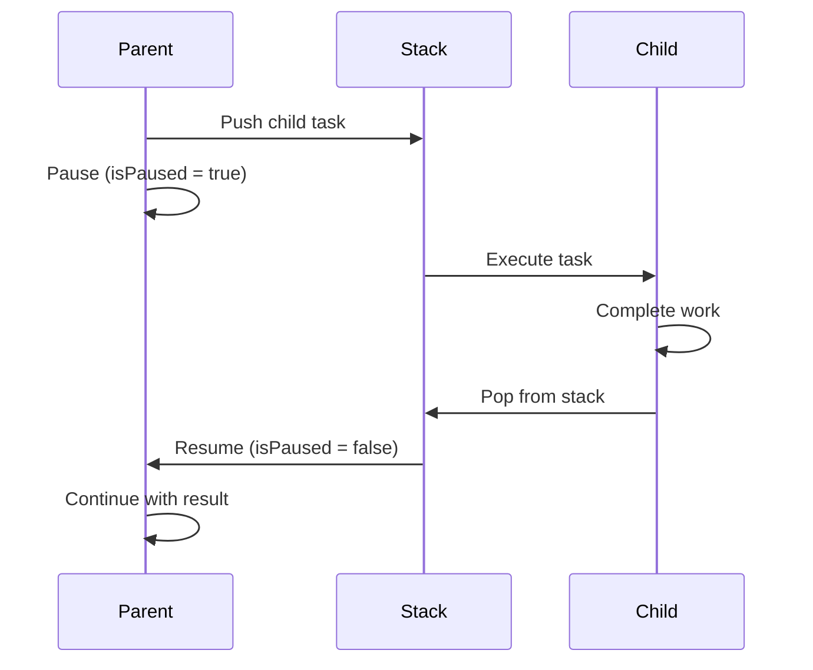
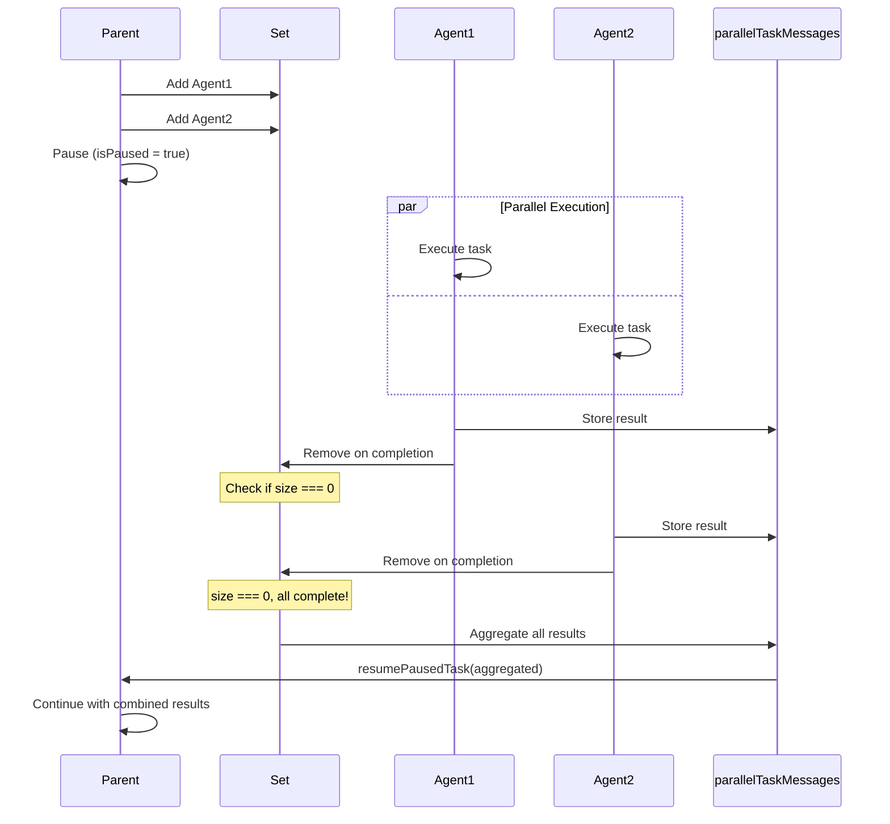

# SubAgent vs NewTask Tool: Comprehensive Comparison (2025)

## Table of Contents

1. [Overview](#overview)
2. [Architecture Comparison](#architecture-comparison)
3. [Implementation Differences](#implementation-differences)
4. [Execution Flow Comparison](#execution-flow-comparison)
5. [Code Examples](#code-examples)
6. [Current Status and Implementation Details](#current-status-and-implementation-details)
7. [Performance and Optimization](#performance-and-optimization)
8. [Best Practices](#best-practices)

## Overview

Both SubAgent and NewTask tools enable task delegation in Zentara Code, but they serve fundamentally different purposes:

- **NewTask**: Sequential, mode-switching subtasks with parent-child blocking (deprecated)
- **SubAgent**: Parallel, autonomous agents executing concurrently with parent blocking until all complete (preferred)

## Architecture Comparison

### Data Structures

| Feature           | NewTask                             | SubAgent                                   |
| ----------------- | ----------------------------------- | ------------------------------------------ |
| Storage           | `clineStack: Task[]` (Array)        | `clineSet: Set<Task>`                      |
| Execution         | Sequential (LIFO)                   | Parallel (unordered)                       |
| Concurrency       | One active task                     | Multiple active tasks                      |
| Parent Blocking   | Parent pauses until child completes | Parent pauses until ALL subagents complete |
| Result Handling   | Individual result passed back       | Results aggregated from all subagents      |
| Task Registry     | Registered in `taskRegistry`        | Registered in `taskRegistry`               |
| Context           | Inherits parent context             | Clean slate (no conversation history)      |
| Tool Restrictions | Full tool access                    | Cannot use subagent/new_task/debug tools   |

### Task Management

```typescript
// NewTask - Sequential execution
await this.addClineToStack(cline) // Push to stack
await this.removeClineFromStack() // Pop from stack

// SubAgent - Parallel execution
await this.addClineToSet(cline) // Add to set
await this.removeClineFromSet(cline) // Remove specific task
```

## Implementation Differences

### 1. Tool Parameters

**NewTask:**

```xml
<new_task>
<mode>architect</mode>
<message>Design the authentication system</message>
</new_task>
```

**SubAgent:**

```xml
<subagent>
{
  "description": "Research authentication methods",
  "message": "Research and compare OAuth2, JWT, and session-based authentication",
  "writePermissions": false,
  "maxExecutionTime": 300000,
  "priority": "high"
}
</subagent>
```

### 2. Task Creation

**NewTask Implementation:**

```typescript
// Preserve current mode for later restoration
cline.pausedModeSlug = (await provider.getState()).mode ?? defaultModeSlug

// Switch to requested mode FIRST
await provider.handleModeSwitch(mode)

// Delay to allow mode change to take effect
await delay(500)

// Create child task (sequential)
const newCline = await provider.initClineWithTask(
	unescapedMessage,
	undefined,
	cline, // parent reference
	false, // is_parallel = false (default)
)

// Pause parent
cline.isPaused = true
cline.emit("taskPaused")
```

**SubAgent Implementation:**

```typescript
// Check if caller is already a subagent (prevent nesting)
if (cline.isParallel) {
	pushToolResult(formatResponse.toolError("Subagents cannot launch other subagents or tasks."))
	return
}

// Save checkpoint if enabled
if (cline.enableCheckpoints) {
	await cline.checkpointSave(true)
}

// Add delays to mitigate race conditions
await delay(500)

// Create subagents with staggered delays
for (const params of subagentParams) {
	await delay(Math.random() * 500 + 50) // 50-550ms

	const newCline = await provider.initClineWithTask(
		unescapedMessage,
		undefined,
		cline, // parent reference
		true, // is_parallel = true
	)

	if (newCline) {
		cline.emit("taskSpawned", newCline.taskId)
	}
}

// Pause parent until ALL subagents complete
cline.isPaused = true
cline.emit("taskPaused")
```

### 3. Key Differences in `initClineWithTask`

```typescript
public async initClineWithTask(
    task?: string,
    images?: string[],
    parentTask?: Task,
    is_parallel: boolean = false,  // Key parameter
    options: Partial<TaskOptions> = {}
) {
    // Create task with hierarchy tracking
    const rootTask = parentTask?.rootTask || parentTask || this.clineStack[0]

    const cline = new Task({
        provider: this,
        apiConfiguration,
        task,
        images,
        rootTask,
        parentTask,
        taskNumber: this.clineStack.length + 1,
        isParallel: is_parallel,  // Set the parallel flag
        ...options
    })

    // Register in global task registry
    this.registerTask(cline)

    if (is_parallel) {
        await this.addClineToSet(cline)    // Parallel execution
    } else {
        await this.addClineToStack(cline)  // Sequential execution
    }

    // Start the task
    cline.startTask()

    return cline
}
```

## Execution Flow Comparison

### NewTask Flow (Sequential)



### SubAgent Flow (Parallel)



## Code Examples

### Example 1: Sequential Subtask with NewTask

**Master Agent:**

```typescript
// LLM decides to create a subtask in architect mode
<new_task>
<mode>architect</mode>
<message>Design the database schema for the user management system</message>
</new_task>
```

**Execution:**

1. Parent task pauses
2. Child switches to architect mode
3. Child completes design
4. Parent resumes with design result
5. Parent's mode is restored

### Example 2: Parallel Research with SubAgent

**Master Agent:**

```typescript
// LLM creates multiple parallel research agents (supports batch format)
<subagent>
[
  {
    "description": "Research authentication",
    "message": "Research OAuth2 implementation best practices",
    "writePermissions": false,
    "priority": "high"
  },
  {
    "description": "Research database options",
    "message": "Compare PostgreSQL vs MySQL for our use case",
    "writePermissions": false,
    "priority": "medium"
  }
]
</subagent>

// Master pauses and waits for ALL agents to complete
```

**Execution:**

1. Both agents start simultaneously (with staggered delays)
2. Parent pauses execution (isPaused = true)
3. Each agent result stored in parallelTaskMessages Map
4. When ALL agents complete (clineSet.size === 0):
    - Results aggregated with "\n\n" separator
    - Parent resumes with combined results
    - parallelTaskMessages cleared

### Example 3: Complex Task Decomposition

**Using NewTask (Sequential):**

```typescript
// Each subtask must complete before the next begins
Task A (Design) → Task B (Implement) → Task C (Test) → Task D (Deploy)
```

**Using SubAgent (Parallel):**

```typescript
// Independent tasks run concurrently
Parent Task
├─ Agent 1: Research libraries
├─ Agent 2: Analyze codebase
├─ Agent 3: Check documentation
└─ Agent 4: Review examples
```

## Current Status and Implementation Details

### Currently Implemented (2025)

| Feature                   | NewTask                 | SubAgent                             |
| ------------------------- | ----------------------- | ------------------------------------ |
| Basic execution           | ✅ Sequential via stack | ✅ Parallel via set                  |
| Mode switching            | ✅ Full support         | ❌ Not applicable                    |
| Parent-child relationship | ✅ Implemented          | ✅ Implemented                       |
| Result propagation        | ✅ Via resumePausedTask | ✅ Via resumePausedTask (aggregated) |
| User approval             | ✅ Required             | ❌ Disabled (commented out)          |
| Recursive spawning        | ✅ Allowed              | ❌ Blocked (subagents can't spawn)   |
| Batch creation            | ❌ One at a time        | ✅ Array of subagents                |
| Staggered delays          | ❌ Not needed           | ✅ 50-550ms random delays            |

### Advanced Features Implemented

**SubAgent Current Capabilities:**

1. **Batch Creation** - Create multiple subagents in single tool call
2. **Staggered Delays** - Prevents race conditions (50-550ms)
3. **Result Aggregation** - Automatic concatenation with "\n\n"
4. **Clean Context** - Each subagent starts fresh
5. **Tool Restrictions** - Prevents recursive spawning
6. **Health Monitoring** - Logs metrics every 30 seconds
7. **Task Registry** - O(1) lookup and lifecycle management
8. **Glob Tool Integration** - 10x faster file discovery

**Resource Coordination:**

```typescript
// Planned features from architecture doc
interface ParallelResourceTracker {
	fileLocks: Map<string, string> // File path -> task ID
	maxConcurrentTasks: number // Limit parallel execution
	resourceUsage: Map<string, number> // Track resource consumption
}
```

**File Access Control:**

```typescript
// Planned write permission system
interface SubAgentOptions {
	writePermissions: boolean
	allowedWritePaths?: string[]
	readOnlyPaths?: string[]
}
```

## Performance and Optimization

### Parallel Execution Benefits

1. **Speed Improvements:**

    - 3-5x faster for independent tasks
    - Reduced context switching overhead
    - Better API utilization

2. **Resource Management:**

    - Concurrent file reads limited to 5 per subagent
    - 5-minute timeout per subagent
    - Automatic cleanup on failure

3. **UI Optimizations:**
    - Granular message updates
    - Virtual scrolling for large outputs
    - Debounced interactions

## Best Practices

### When to Use Each Tool

**Use NewTask (Deprecated) when:**

- Legacy compatibility required
- Specific mode switching needed
- Sequential dependencies exist

**Use SubAgent (Preferred) when:**

- Tasks are independent
- Performance is critical
- Clean context isolation needed
- Parallel processing beneficial

### Subagent Design Patterns

1. **Research Pattern:**

```typescript
// Gather information from multiple sources
;[
	{ description: "Search docs", message: "Find relevant documentation" },
	{ description: "Check examples", message: "Look for code examples" },
	{ description: "Review tests", message: "Analyze test coverage" },
]
```

2. **Refactoring Pattern:**

```typescript
// Update multiple files independently
files.map((file) => ({
	description: `Refactor ${file}`,
	message: `Apply new patterns to ${file}`,
	writePermissions: true,
	allowedWritePaths: [file],
}))
```

3. **Testing Pattern:**

```typescript
// Run different test suites concurrently
;[
	{ description: "Unit tests", message: "Run jest tests" },
	{ description: "E2E tests", message: "Run Playwright tests" },
	{ description: "Lint", message: "Run ESLint checks" },
]
```

## Key Takeaways

1. **Use NewTask when:**

    - Tasks must execute in a specific order
    - Mode switching is required
    - Parent needs individual results immediately
    - Full tool access in different modes is needed
    - Tasks may need to spawn their own subtasks

2. **Use SubAgent when:**

    - Tasks can execute independently
    - Parallel execution improves performance
    - Parent needs aggregated results from all agents
    - Tasks are isolated and don't need mode context
    - Preventing recursive task spawning is desired

3. **Current State (2025):**

    - Full parallel execution implemented and production-ready
    - Result aggregation with "\n\n" separator
    - Subagent approval disabled for better UX
    - Staggered delays (50-550ms) prevent race conditions
    - Health monitoring every 30 seconds
    - Shared Task class ensures consistency
    - Glob tool integration for efficient file discovery
    - Task registry for proper lifecycle management

4. **Architecture Benefits:**

    - Reuses existing Task class (no code duplication)
    - Backward compatible
    - Flexible execution models
    - Proper cleanup via task registry
    - Foundation for future enhancements

5. **Key Implementation Details:**
    - Parent always pauses for both NewTask and SubAgent
    - NewTask: Parent resumes when single child completes
    - SubAgent: Parent resumes when ALL children complete
    - SubAgents cannot spawn other tasks (prevented by isParallel check)
    - Task IDs enable proper message routing in multi-task scenarios
