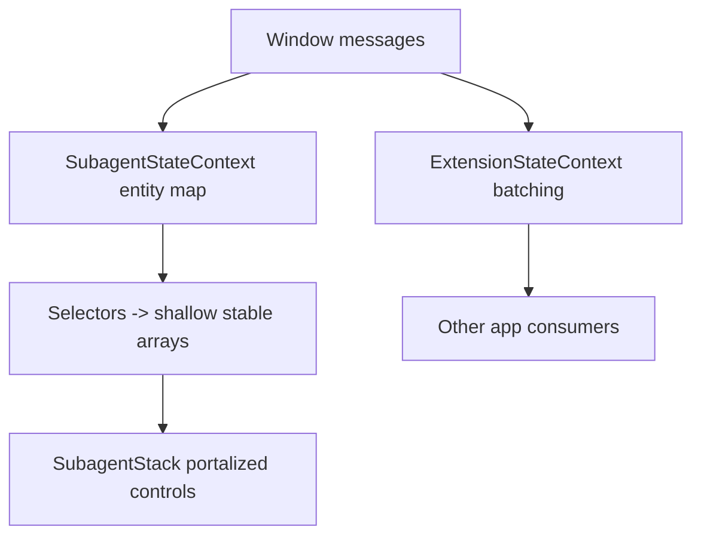

# New Implementation Plan: Stable, Click-Reliable Approval UI under Subagent Streaming

Summary
- Purpose: deliver a fresh, non-destructive plan that supersedes sequencing while preserving prior artifacts.
- Strategy: immediate stabilization + structural isolation + UX hardening + instrumentation.
- Do not overwrite earlier docs; this is the canonical plan moving forward.

Key principles
- Keep approval controls outside the streaming subtree (portalization) to prevent DOM churn.
- Isolate high-frequency subagent state from global app state.
- Avoid whole-array replacement; patch by id and keep derived arrays shallow-stable.
- Prefer urgent updates for user actions, non-urgent for cosmetic streaming.
- Optimistically acknowledge user clicks; reconcile on ack/error.

Scope
- Webview UI only; extension-side subagent orchestration remains unchanged unless noted.
- Files primarily impacted:
  - [webview-ui/src/App.tsx](webview-ui/src/App.tsx)
  - [webview-ui/src/context/ExtensionStateContext.tsx](webview-ui/src/context/ExtensionStateContext.tsx)
  - [webview-ui/src/context/SubagentStateContext.tsx](webview-ui/src/context/SubagentStateContext.tsx)
  - [webview-ui/src/components/chat/ChatView.tsx](webview-ui/src/components/chat/ChatView.tsx)
  - [webview-ui/src/components/chat/SubagentStack.tsx](webview-ui/src/components/chat/SubagentStack.tsx)
  - [webview-ui/src/components/chat/ToolDisplay.tsx](webview-ui/src/components/chat/ToolDisplay.tsx)

Phase 1 — Immediate stabilization (1–2 days)
1) Centralize batching of window message updates
- In [webview-ui/src/context/ExtensionStateContext.tsx](webview-ui/src/context/ExtensionStateContext.tsx):
  - Wrap all message-driven setState in a single batched section per event.
  - Optionally coalesce bursts via requestAnimationFrame.

2) Portalize approval controls
- Add a top-level portal host in [webview-ui/src/App.tsx](webview-ui/src/App.tsx).
- Render approval buttons/strips from [webview-ui/src/components/chat/SubagentStack.tsx](webview-ui/src/components/chat/SubagentStack.tsx) and [webview-ui/src/components/chat/ChatView.tsx](webview-ui/src/components/chat/ChatView.tsx) into that host.
- Keep the portal host props stable and decoupled from streaming text.

3) Optimistic acknowledgment for clicks
- On approve/deny click, immediately disable/hide the specific control, send postMessage, and reconcile on ack.
- Implement in [webview-ui/src/components/chat/SubagentStack.tsx](webview-ui/src/components/chat/SubagentStack.tsx) and [webview-ui/src/components/chat/ChatView.tsx](webview-ui/src/components/chat/ChatView.tsx).

4) Stabilize handler identities and context values
- useCallback with minimal deps for click handlers.
- useMemo for context value objects in [webview-ui/src/context/ExtensionStateContext.tsx](webview-ui/src/context/ExtensionStateContext.tsx).

5) Switch to keyed patching for subagent tasks
- Store tasks in Map<taskId, Task> internally; update only mutated entries.
- Derive a shallow-stable, memoized array for rendering order.

Phase 2 — Structural isolation (2–3 days)
1) Create a dedicated SubagentStateProvider
- New file: [webview-ui/src/context/SubagentStateContext.tsx](webview-ui/src/context/SubagentStateContext.tsx)
- Responsibilities:
  - Handle parallelTasksUpdate messages.
  - Maintain entity map and memoized selectors.
  - Provide derived arrays for consumers.

2) Decouple ExtensionStateContext
- Remove parallelTasks state and handlers from [webview-ui/src/context/ExtensionStateContext.tsx](webview-ui/src/context/ExtensionStateContext.tsx).
- Consumers that do not need subagent state should not re-render during streams.

3) Schedule non-urgent visual updates
- Where streaming text updates UI only, wrap updates in startTransition or coalesce via requestAnimationFrame.
- Never delay user action state.
- Apply to [webview-ui/src/components/chat/ToolDisplay.tsx](webview-ui/src/components/chat/ToolDisplay.tsx).

Phase 3 — Tests, metrics, guardrails (2 days)
1) Instrumentation
- Measure:
  - Click success ratio during 10 s streaming bursts with 3–5 subagents.
  - Click-to-UI-change latency for approval controls.
  - Commit counts and flamegraph snapshots via React Profiler.

2) Automated tests (Vitest)
- Add integration tests that simulate bursts of parallelTasksUpdate while performing approvals in:
  - [webview-ui/src/components/chat/SubagentStack.tsx](webview-ui/src/components/chat/SubagentStack.tsx)
  - [webview-ui/src/components/chat/ChatView.tsx](webview-ui/src/components/chat/ChatView.tsx)
- Ensure repo rules in [/.roo/rules/rules.md](.roo/rules/rules.md) are followed when running tests.

3) Guardrails
- Feature-flag the new provider and portalization.
- Alert thresholds:
  - Success ratio < 99% or latency > 150 ms triggers investigation.

Acceptance criteria
- Functionality:
  - 100/100 approval clicks succeed during active streaming with 3–5 subagents.
  - < 100 ms median click-to-UI-change for approval controls.
- Performance:
  - ≥ 50% reduction in total commits during a 10 s streaming burst.
  - Approval control subtree node identity remains stable over 30 s stress test.
- Non-regression:
  - Auto-approval toggles, follow-up flows, and history unaffected.

Risks and mitigations
- Focus management with portalized controls:
  - Programmatically move focus to portalized controls on mount; restore on close.
- Ordering drift with entity map:
  - Maintain stable sort keys; memoize derived arrays.
- Over-optimization harming readability:
  - Encapsulate patterns in small utilities and document them.

Minimal change list (PR checklist)
- App shell
  - Add portal host in [webview-ui/src/App.tsx](webview-ui/src/App.tsx).
- Contexts
  - Batch window message updates in [webview-ui/src/context/ExtensionStateContext.tsx](webview-ui/src/context/ExtensionStateContext.tsx).
  - Introduce [webview-ui/src/context/SubagentStateContext.tsx](webview-ui/src/context/SubagentStateContext.tsx) with entity map + selectors.
  - Remove parallelTasks from [webview-ui/src/context/ExtensionStateContext.tsx](webview-ui/src/context/ExtensionStateContext.tsx) when Phase 2 lands.
- Components
  - Portalize approval UI and add optimistic ack in:
    - [webview-ui/src/components/chat/SubagentStack.tsx](webview-ui/src/components/chat/SubagentStack.tsx)
    - [webview-ui/src/components/chat/ChatView.tsx](webview-ui/src/components/chat/ChatView.tsx)
  - Mark streaming text paths non-urgent in [webview-ui/src/components/chat/ToolDisplay.tsx](webview-ui/src/components/chat/ToolDisplay.tsx).
- Tests
  - Add integration tests for approvals under streaming.
- Metrics
  - Add simple measurement hooks for click success and latency.

Timeline (aggressive)
- Day 1: Phase 1 items (1–4)
- Day 2: Phase 1 item (5) and basic instrumentation
- Days 3–4: Phase 2 (provider split, consumer updates)
- Day 5: Phase 3 tests and guardrails

Mermaid overview

Out of scope
- Changing extension backend subagent orchestration.
- Auto-approval policy logic.

Final note
- This plan intentionally avoids click-guard hacks by making the DOM stable, isolating fast-cadence state, and acknowledging user intent immediately.