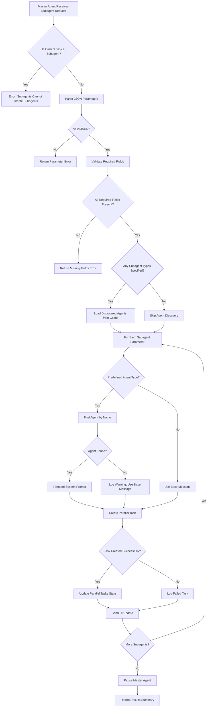

# Subagent Tool Architecture Analysis

## Executive Summary

The subagent tool is a sophisticated parallel task execution system that enables the main AI agent to decompose complex tasks into smaller, independent subtasks that run concurrently. This analysis provides a comprehensive overview of the subagent architecture, execution flow, security controls, and integration patterns.

## Core Architecture Components

### 1. Tool Description System (`src/core/prompts/tools/subagent.ts`)

**Key Functions:**
- `getSubagentDescription()`: Generates comprehensive tool documentation with dynamic predefined agent discovery
- `formatAgentsList()`: Formats discovered agents into markdown list
- `getAgentsList()`: Wrapper function for agent list formatting

**Purpose:** Provides runtime-generated tool documentation that includes currently available predefined agents, ensuring the tool description is always up-to-date with the system's capabilities.

### 2. Core Execution Engine (`src/core/tools/subagentTool.ts`)

**Key Components:**
- `SubAgentParams` interface: Defines parameter structure for subagent tasks
- `subagentTool()` function: Main execution logic for creating and managing parallel tasks
- `SUBAGENT_SYSTEM_MESSAGE`: Base system prompt for all subagents

**Execution Flow:**
1. **Security Validation**: Prevents subagents from creating nested subagents
2. **Parameter Parsing**: Validates JSON input and required fields
3. **Agent Discovery**: Loads predefined agents if `subagent_type` is specified
4. **Task Creation**: Spawns parallel tasks with staggered delays
5. **State Management**: Updates parallel task state and UI notifications

### 3. Agent Discovery System (`src/roo_subagent/src/agentDiscovery.ts`)

**Key Functions:**
- `discoverAgents()`: Main discovery function across all locations
- `loadSystemAgents()`: Loads hardcoded system agents
- `loadUserAgents()`: Loads user-defined agents from markdown files
- `findAgentByName()`: O(1) agent lookup using Map data structure
- `createAgentLoadingContext()`: Creates discovery context from VSCode environment

**Discovery Hierarchy:**
1. **System Agents**: Built-in agents (highest priority)
2. **Project Agents**: `.zentara/agents/` directory
3. **Global Agents**: `~/.zentara/agents/` directory (lowest priority)

### 4. Task Integration (`src/core/task/Task.ts`)

**Key Integration Points:**
- `getDiscoveredAgents()`: Cached agent discovery with promise deduplication
- `isParallel` property: Identifies subagent tasks
- `discoveredAgentsCache`: Performance optimization for repeated agent lookups
- `parallelTasksState`: Tracks active subagent tasks for UI updates

## Execution Flow Diagram



## Security Controls and Restrictions

### 1. Nested Subagent Prevention
```typescript
if (cline.isParallel) {
    // Prevent subagents from creating other subagents
    pushToolResult(formatResponse.toolError(
        "You are a subagent. Subagents cannot launch other subagents..."
    ));
    return;
}
```

### 2. Parameter Validation
- **Required Fields**: `description` and `message` are mandatory
- **JSON Validation**: Strict parsing with error handling
- **Type Safety**: Interface-based parameter structure

### 3. Resource Management
- **Staggered Creation**: Random delays (50-550ms) prevent API rate limiting
- **Error Isolation**: Failed subagent creation doesn't stop others
- **Memory Management**: Cached agent discovery with cleanup

### 4. System Message Isolation
```typescript
const SUBAGENT_SYSTEM_MESSAGE = 
    "You are a subagent. You work autonomously and return the result to the parent agent. " +
    "You cannot ask any questions to the user or parent agent.\n" +
    "You cannot ask follow up questions.";
```

## Predefined Agent System

### Agent Definition Structure
```typescript
interface AgentDefinition {
    name: string;
    description: string;
    systemPrompt: string;
    // Additional metadata...
}
```

### Discovery Process
1. **System Agents**: Hardcoded TypeScript imports
2. **Project Agents**: Markdown files with YAML frontmatter in `.zentara/agents/`
3. **Global Agents**: User-specific agents in `~/.zentara/agents/`

### Agent Composition
When a `subagent_type` is specified:
1. Find agent by name using O(1) Map lookup
2. Extract system prompt from agent definition
3. Prepend system prompt to user message
4. Create task with composed message

## Communication Patterns

### 1. Master → Subagent Communication
- **Task Creation**: Via `provider.createTask()` with composed message
- **System Prompt**: Injected automatically based on agent type
- **Context Isolation**: Each subagent starts with clean context

### 2. Subagent → Master Communication
- **Results**: Returned through task completion
- **Status Updates**: Via parallel task state management
- **UI Notifications**: Real-time updates to webview

### 3. Subagent Restrictions
- **No User Interaction**: Cannot use `ask_followup_question` tool
- **No Nested Tasks**: Cannot create other subagents
- **Autonomous Operation**: Must complete tasks independently

## Error Handling and Timeout Mechanisms

### 1. Creation-Time Errors
- **JSON Parsing Errors**: Detailed error messages with line information
- **Missing Parameters**: Specific field validation errors
- **Agent Discovery Failures**: Graceful fallback to base message

### 2. Runtime Error Handling
- **Task Creation Failures**: Individual failure tracking without stopping others
- **Agent Not Found**: Warning logs with fallback behavior
- **Resource Constraints**: Policy-based task creation restrictions

### 3. Timeout Management
- **5-Minute Execution Cap**: Hard timeout for all subagent tasks
- **Staggered Delays**: Prevents thundering herd problems
- **Graceful Degradation**: Partial success reporting

## Test Coverage Analysis

### Test Scenarios Covered
1. **Partial Block Handling**: Tests streaming/partial message scenarios
2. **Parameter Validation**: Missing description and message validation
3. **JSON Parsing**: Invalid JSON error handling
4. **Approval Flow**: User approval/denial scenarios
5. **Checkpoint Integration**: Checkpoint save functionality
6. **Error Isolation**: Individual subagent failure handling

### Test Structure
- **Mock Objects**: Comprehensive mocking of Task, Provider, and callback functions
- **Assertion Framework**: Custom assertion functions for validation
- **Result Tracking**: Detailed test result collection and reporting

## Performance Optimizations

### 1. Agent Discovery Caching
```typescript
// Task-level caching with promise deduplication
if (this.discoveredAgentsCache !== null) {
    return this.discoveredAgentsCache;
}
if (this.discoveredAgentsCachePromise !== null) {
    return await this.discoveredAgentsCachePromise;
}
```

### 2. Parallel Execution
- **Concurrent Task Creation**: All subagents created in parallel
- **Non-Blocking Operation**: Master agent pauses but doesn't block system
- **Resource Staggering**: Random delays prevent API bottlenecks

### 3. Memory Management
- **WeakRef Usage**: Provider references use WeakRef for garbage collection
- **Cache Cleanup**: Automatic cleanup of completed tasks
- **State Isolation**: Each subagent has isolated memory space

## Integration Points

### 1. VSCode Extension Integration
- **Webview Updates**: Real-time parallel task status updates
- **Terminal Management**: Isolated terminal processes per subagent
- **File System Access**: Shared workspace with conflict prevention

### 2. Provider System Integration
- **API Management**: Shared API configuration with rate limiting
- **Authentication**: Inherited authentication from parent task
- **Usage Tracking**: Consolidated usage metrics across all tasks

### 3. Checkpoint System Integration
- **State Persistence**: Automatic checkpoint saves before subagent creation
- **Recovery Support**: Ability to restore from checkpoints
- **Diff Tracking**: Changes tracked across parallel executions

## Architectural Strengths

1. **Scalability**: Parallel execution enables handling of complex, multi-faceted tasks
2. **Flexibility**: Predefined agents provide standardized workflows while allowing custom tasks
3. **Isolation**: Strong boundaries prevent interference between subagents
4. **Performance**: Caching and optimization strategies minimize overhead
5. **Extensibility**: Plugin-like agent system allows easy addition of new capabilities

## Potential Areas for Enhancement

1. **Inter-Subagent Communication**: Currently isolated; could benefit from controlled communication channels
2. **Dynamic Resource Allocation**: More sophisticated resource management based on task complexity
3. **Advanced Error Recovery**: Automatic retry mechanisms for transient failures
4. **Metrics and Monitoring**: Enhanced observability for subagent performance
5. **Load Balancing**: Intelligent distribution of subagents across available resources

## Conclusion

The subagent tool represents a sophisticated approach to parallel AI task execution, with robust security controls, comprehensive error handling, and efficient resource management. The architecture successfully balances flexibility with safety, enabling complex task decomposition while maintaining system stability and performance.

The system's strength lies in its clear separation of concerns, comprehensive validation, and extensible design that allows for both predefined workflows and custom task execution. The caching strategies and performance optimizations ensure the system scales effectively as the number of subagents increases.
