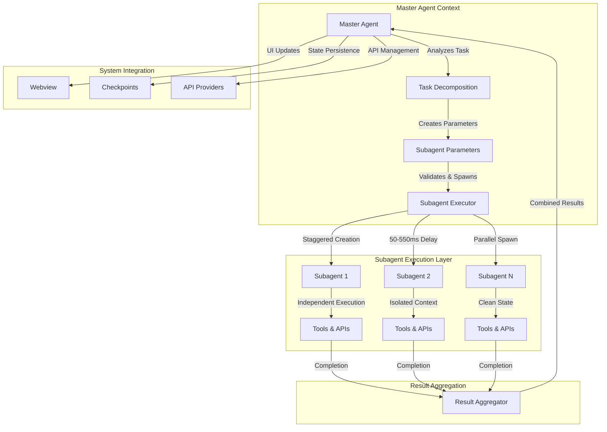
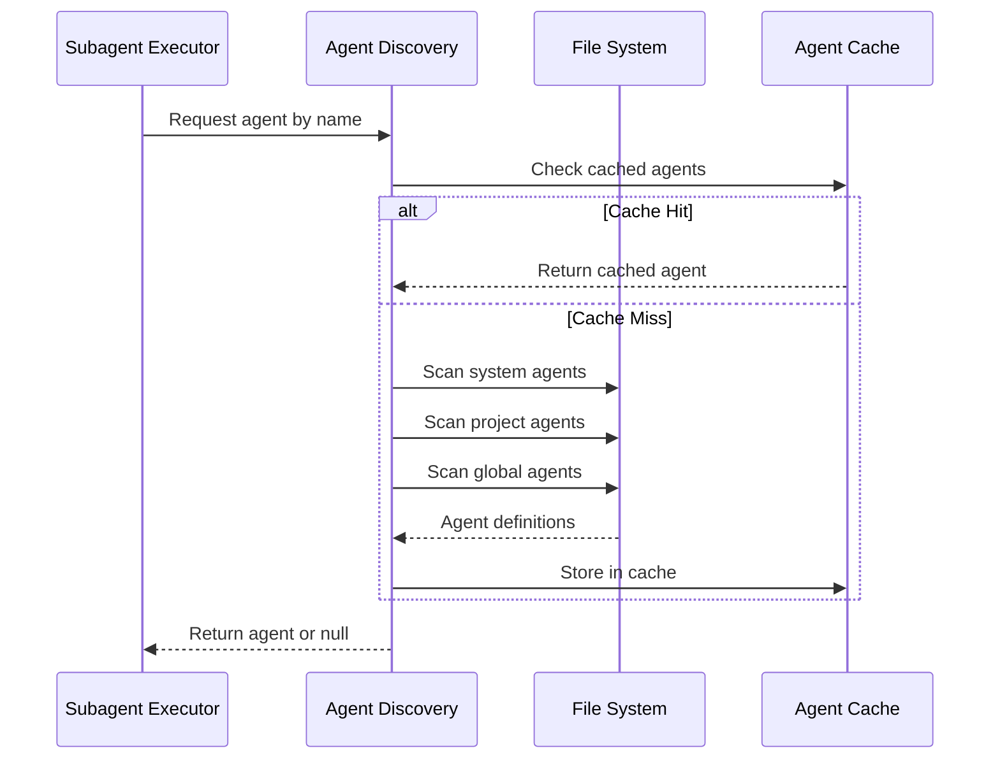
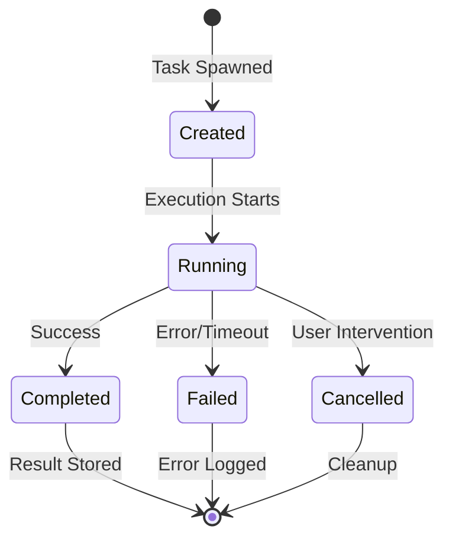
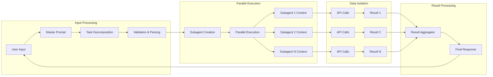

# Subagent System: Lifecycle, Dataflow, and Workflow

## Executive Summary

The Zentara Code subagent system is a sophisticated parallel task execution framework that transforms sequential AI operations into concurrent workflows. It enables a master agent to decompose complex tasks into multiple autonomous subagents that execute simultaneously, delivering 3-5x performance improvements while maintaining system stability and security.

## System Architecture Overview



## Detailed Lifecycle Analysis

### Phase 1: Task Decomposition and Validation

**Master Agent Responsibilities:**
1. **Task Analysis**: Evaluates incoming request for parallelization potential
2. **Scope Separation**: Ensures subtasks have zero overlap (different files/domains/layers)
3. **Parameter Creation**: Generates JSON objects with required fields:
   - `description`: 3-5 word task summary
   - `message`: Detailed instructions
   - `subagent_type`: Optional predefined agent selection

**Security Validation:**
```typescript
// Prevents recursive subagent creation
if (task.isParallel) {
    throw new Error("Subagents cannot create other subagents");
}

// Validates required parameters
if (!description || !message) {
    throw new Error("Missing required parameters");
}
```

### Phase 2: Agent Discovery and Initialization

**Three-Tier Discovery System:**
1. **System Level**: Built-in agents (highest priority)
2. **Project Level**: `.zentara/agents/` directory
3. **Global Level**: `~/.zentara/agents/` directory

**Discovery Process:**


### Phase 3: Parallel Task Creation

**Staggered Creation Pattern:**
- **Purpose**: Prevents API rate limiting and resource contention
- **Timing**: 50-550ms delays between spawns
- **Batch Support**: Multiple subagents in single call
- **Resource Management**: Concurrent execution limits

**Task Creation Flow:**
```typescript
// Simplified creation logic
for (const params of subagentParams) {
    await new Promise(resolve => setTimeout(resolve, getStaggerDelay()));
    const task = new Task(params, parentContext);
    this.clineSet.add(task);
    this.taskRegistry.set(task.id, task);
}
```

### Phase 4: Concurrent Execution

**Execution Characteristics:**
- **Stateless Design**: Each subagent has clean, isolated context
- **No Inter-Communication**: Subagents cannot communicate with each other
- **Tool Restrictions**: Prevented from using user interaction tools
- **Independent Completion**: Each subagent completes autonomously

**State Management:**


### Phase 5: Result Aggregation and Integration

**Aggregation Process:**
1. **Collection**: Master agent waits for all subagents to complete
2. **Ordering**: Results maintained in creation order
3. **Formatting**: Combined with "\n\n" separators
4. **Delivery**: Single consolidated response to user

**Integration Points:**
- **UI Updates**: Real-time progress via webview
- **State Persistence**: Checkpoint system integration
- **Error Handling**: Graceful degradation on partial failures

## Dataflow Architecture

### Data Flow Patterns



### Context Isolation Model

**Master Agent Context:**
- Full conversation history
- User preferences and settings
- Global state management
- Orchestration logic

**Subagent Context:**
- Clean slate initialization
- Task-specific instructions only
- Isolated tool access
- No conversation history

**Shared Resources:**
- API configuration and authentication
- File system access (with locks)
- Provider rate limiting
- System configuration

## Workflow Patterns

### 1. Research and Analysis Pattern

**Use Case**: Analyzing different aspects of a codebase
```json
[
  {
    "description": "Analyze API structure",
    "message": "Use glob to find API files, analyze with LSP tools. SCOPE: Backend API layer only."
  },
  {
    "description": "Analyze UI components", 
    "message": "Use glob to find components, analyze structure. SCOPE: Frontend UI layer only."
  },
  {
    "description": "Analyze data models",
    "message": "Use glob to find models, analyze schemas. SCOPE: Data layer only."
  }
]
```

### 2. Refactoring and Modification Pattern

**Use Case**: Making changes across multiple independent files
```json
[
  {
    "description": "Update user service",
    "message": "Refactor user-related functionality in src/services/user/. SCOPE: User service files only."
  },
  {
    "description": "Update auth middleware",
    "message": "Refactor authentication in src/middleware/auth/. SCOPE: Auth middleware only."
  }
]
```

### 3. Testing and Validation Pattern

**Use Case**: Running different test suites in parallel
```json
[
  {
    "description": "Run unit tests",
    "message": "Execute unit tests for core functionality. SCOPE: Unit test files only."
  },
  {
    "description": "Run integration tests",
    "message": "Execute integration tests for API endpoints. SCOPE: Integration test files only."
  }
]
```

## Performance Characteristics

### Execution Metrics
- **Parallelization Gain**: 3-5x faster for independent tasks
- **Context Efficiency**: Clean isolation prevents context pollution
- **Resource Utilization**: Optimal API usage through concurrent requests
- **Memory Management**: WeakRef usage for efficient cleanup

### Optimization Strategies
- **Staggered Creation**: Prevents API rate limiting
- **Cached Discovery**: O(1) agent lookup with promise deduplication
- **Batch Processing**: Multiple subagents in single operation
- **Granular Updates**: Real-time UI feedback without blocking

## Security and Safety Model

### Security Controls
1. **Recursive Prevention**: Subagents cannot spawn other subagents
2. **Tool Restrictions**: Limited access to system and user interaction tools
3. **Parameter Validation**: Strict validation of all input parameters
4. **Resource Limits**: Timeout controls and concurrent execution limits

### Safety Mechanisms
1. **Graceful Degradation**: System continues on partial failures
2. **Error Isolation**: Subagent failures don't affect master or siblings
3. **State Recovery**: Checkpoint integration for crash recovery
4. **Resource Cleanup**: Automatic cleanup on completion or failure

## Key Architectural Strengths

### 1. Scalability
- **Horizontal Scaling**: Easy to add more parallel tasks
- **Resource Efficiency**: Optimal utilization of available resources
- **Load Distribution**: Even distribution across API providers

### 2. Maintainability
- **Clean Separation**: Clear boundaries between components
- **Extensible Design**: Easy to add new agent types and capabilities
- **Comprehensive Testing**: Well-tested validation and execution paths

### 3. Reliability
- **Fault Tolerance**: Robust error handling and recovery
- **State Management**: Consistent state across all operations
- **Monitoring**: Health checks and performance tracking

## Future Enhancement Opportunities

### 1. Advanced Orchestration
- **Dependency Management**: Support for task dependencies
- **Dynamic Scaling**: Automatic scaling based on workload
- **Priority Queuing**: Task prioritization and scheduling

### 2. Enhanced Monitoring
- **Performance Analytics**: Detailed execution metrics
- **Resource Tracking**: Real-time resource utilization
- **Predictive Scaling**: Workload prediction and optimization

### 3. Extended Capabilities
- **Cross-Agent Communication**: Controlled inter-agent messaging
- **Persistent Agents**: Long-running agents for complex workflows
- **Custom Tool Sets**: Agent-specific tool restrictions and capabilities

## Conclusion

The Zentara Code subagent system represents a sophisticated approach to parallel AI task execution that successfully balances performance, security, and maintainability. Its architecture enables complex task decomposition while maintaining system stability through careful resource management, comprehensive security controls, and robust error handling.

The system's design patterns and execution model provide a solid foundation for scaling AI-powered development workflows, making it possible to accomplish complex multi-faceted tasks with unprecedented efficiency and reliability.