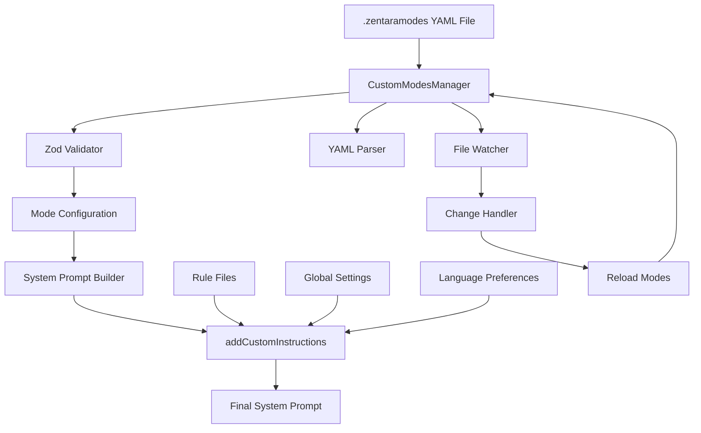

# .zentaramodes YAML File System - Complete Analysis

## Executive Summary

The .zentaramodes system is a sophisticated configuration mechanism that allows users to define custom AI modes through YAML files. The system provides a complete lifecycle from file creation to prompt injection, with robust validation, file watching, and integration with the broader Zentara Code system.

## System Architecture Overview



## Core Components

### 1. CustomModesManager (`src/core/config/CustomModesManager.ts`)

The central orchestrator of the .zentaramodes system with 1000+ lines of functionality:

**Key Methods:**
- `getWorkspaceZentaramodes()` - Loads and parses .zentaramodes files
- `handleZentaramodesChange()` - Handles file change events
- `loadModesFromFile()` - Parses YAML content and validates configurations
- `setupFileWatcher()` - Establishes VSCode FileSystemWatcher
- `exportMode()` / `importMode()` - Handles mode sharing functionality

**File Discovery Process:**
1. Searches for `.zentaramodes` files in workspace
2. Loads content using `yaml.parse()`
3. Validates structure using Zod schemas
4. Merges with global configurations (project takes precedence)

### 2. Validation Schema (`packages/types/src/mode.ts`)

**Complete .zentaramodes YAML Structure:**
```yaml
customModes:
  - slug: "my-custom-mode"           # Required: alphanumeric + dashes only
    name: "My Custom Mode"          # Required: display name
    roleDefinition: |               # Required: core AI behavior definition
      You are a specialized assistant that...
    whenToUse: "Use when..."        # Optional: usage guidance
    description: "This mode..."     # Optional: detailed description
    customInstructions: |           # Optional: additional instructions
      Follow these specific rules...
    groups:                         # Required: tool group configurations
      - "file-operations"           # Simple group name
      - ["lsp-operations", {        # Group with options
          "priority": "high",
          "enabled": true
        }]
    source: "project"               # Optional: "global" or "project"
```

**Validation Rules:**
- `slug`: Must match regex `/^[a-zA-Z0-9-]+$/`
- `name`: Minimum 1 character, required
- `roleDefinition`: Minimum 1 character, required
- `groups`: Array with no duplicates, supports both simple strings and tuples with options
- All other fields are optional

### 3. Prompt Integration System

**Complete Lifecycle: File → Prompt**

1. **File Detection**: VSCode FileSystemWatcher detects .zentaramodes changes
2. **Parsing**: YAML content parsed and validated against Zod schema
3. **Mode Registration**: Valid modes registered in CustomModesManager
4. **Prompt Building**: System prompt builder calls `addCustomInstructions()`
5. **Content Assembly**: Function assembles final prompt sections in order:
   - Language preferences
   - Global custom instructions
   - Mode-specific instructions (from `customInstructions` field)
   - Mode-specific rule files (`rules-{mode}` directories)
   - AGENTS.md content
   - Generic rule files
6. **Final Integration**: Content wrapped in "USER'S CUSTOM INSTRUCTIONS" section

**Integration Points:**
- `src/core/prompts/system.ts:176` - Main system prompt assembly
- `src/core/prompts/system.ts:237` - File-specific prompt assembly
- `src/shared/modes.ts:325` - Mode-specific prompt building

## File Structure and Organization

### .zentaramodes File Location
- **Project-level**: `{workspace}/.zentaramodes` (highest precedence)
- **Global**: `~/.zentara/.zentaramodes` (fallback)

### Associated Rule Files
- **New format**: `.zentara/rules-{mode}/` directories containing multiple .md files
- **Legacy format**: `.zentararules-{mode}` and `.clinerules-{mode}` files

### File Watching Mechanism
```typescript
// VSCode FileSystemWatcher setup
const watcher = vscode.workspace.createFileSystemWatcher(
  new vscode.RelativePattern(workspaceFolder, ROOMODES_FILENAME)
)

watcher.onDidCreate(uri => handleZentaramodesChange(uri))
watcher.onDidChange(uri => handleZentaramodesChange(uri))
watcher.onDidDelete(uri => handleZentaramodesChange(uri))
```

## Validation and Error Handling

### Schema Validation Process
1. **YAML Parsing**: Uses `yaml.parse()` with error catching
2. **Structure Validation**: Zod schema validates complete structure
3. **Duplicate Prevention**: Groups array checked for duplicates
4. **Slug Validation**: Regex ensures valid characters only
5. **Required Field Validation**: Ensures name and roleDefinition present

### Error Handling Patterns
- **Parse Errors**: YAML syntax errors caught and reported
- **Validation Errors**: Zod validation failures with detailed messages
- **File System Errors**: Safe file reading with fallback to empty content
- **Duplicate Handling**: Prevents duplicate group entries within single mode

## Advanced Features

### Import/Export Functionality
- **Export**: Packages mode configuration with associated rule files
- **Import**: Validates and installs mode configurations
- **Rule File Handling**: Automatically manages `rules-{mode}` directories
- **Conflict Resolution**: Handles naming conflicts during import

### Mode Merging and Precedence
1. **Global modes** (from `~/.zentara/.zentaramodes`)
2. **Project modes** (from `{workspace}/.zentaramodes`) - **HIGHEST PRECEDENCE**
3. **Built-in modes** (system defaults)

### Tool Group Configuration
Groups can be specified as:
- **Simple strings**: `"file-operations"`
- **Tuples with options**: `["lsp-operations", {"priority": "high"}]`
- **Validation**: Prevents duplicate group names within single mode

## Integration with Broader System

### System Prompt Assembly
The .zentaramodes content integrates into the system prompt at a specific location:
```typescript
basePrompt = `${roleDefinition}
${markdownFormattingSection()}
${getSubagentSection(subagent)}
${getSharedToolUseSection()}
${getOptimizedToolDescriptionsForMode(...)}
${getToolUseGuidelinesSection(...)}
${getCapabilitiesSection(...)}
${modesSection}
${getRulesSection(...)}
${getSystemInfoSection(...)}
${getObjectiveSection(...)}
${await addCustomInstructions(...)}`  // ← .zentaramodes content injected here
```

### Rule File Integration
The system supports multiple rule file sources in precedence order:
1. **Mode-specific rules**: `.zentara/rules-{mode}/` directories
2. **Legacy mode rules**: `.zentararules-{mode}` files
3. **AGENTS.md**: Project-specific agent rules
4. **Generic rules**: `.zentara/rules/` directory content

### File System Integration
- **VSCode Workspace API**: Uses workspace.findFiles() for discovery
- **File System Watcher**: Real-time change detection and reloading
- **Path Resolution**: Handles both absolute and relative paths
- **Directory Creation**: Automatically creates necessary directories

## Technical Implementation Details

### Key Constants and Types
```typescript
const ROOMODES_FILENAME = ".zentaramodes"

interface ModeConfig {
  slug: string                    // Unique identifier
  name: string                   // Display name
  roleDefinition: string         // Core AI behavior
  whenToUse?: string            // Usage guidance
  description?: string          // Detailed description
  customInstructions?: string   // Additional instructions
  groups: GroupEntry[]          // Tool group configurations
  source?: "global" | "project" // Configuration source
}

type GroupEntry = string | [string, GroupOptions]
```

### Performance Optimizations
- **Lazy Loading**: Modes loaded only when needed
- **Caching**: Parsed configurations cached until file changes
- **Debounced Reloading**: File changes debounced to prevent excessive reloads
- **Selective Validation**: Only changed modes re-validated

### Security Considerations
- **Path Validation**: Prevents directory traversal attacks
- **Content Sanitization**: YAML content validated before processing
- **File Permissions**: Respects file system permissions
- **Sandbox Isolation**: Mode execution isolated from system

## Usage Examples

### Basic Custom Mode
```yaml
customModes:
  - slug: "documentation-writer"
    name: "📝 Documentation Writer"
    roleDefinition: |
      You are a technical documentation specialist focused on creating
      clear, comprehensive documentation for software projects.
    whenToUse: "Use when creating or updating project documentation"
    groups:
      - "file-operations"
      - "search-tools"
```

### Advanced Mode with Custom Instructions
```yaml
customModes:
  - slug: "security-auditor"
    name: "🔒 Security Auditor"
    roleDefinition: |
      You are a cybersecurity expert specializing in code security audits
      and vulnerability assessments.
    customInstructions: |
      Always prioritize security best practices:
      1. Check for SQL injection vulnerabilities
      2. Validate input sanitization
      3. Review authentication mechanisms
      4. Assess data encryption practices
    groups:
      - "file-operations"
      - ["lsp-operations", {"priority": "high"}]
      - "search-tools"
```

## Conclusion

The .zentaramodes system provides a robust, extensible framework for custom AI mode configuration. Its integration with the broader Zentara Code system ensures seamless operation while maintaining flexibility for user customization. The system's architecture supports both simple use cases and complex enterprise scenarios through its comprehensive validation, file watching, and prompt integration mechanisms.